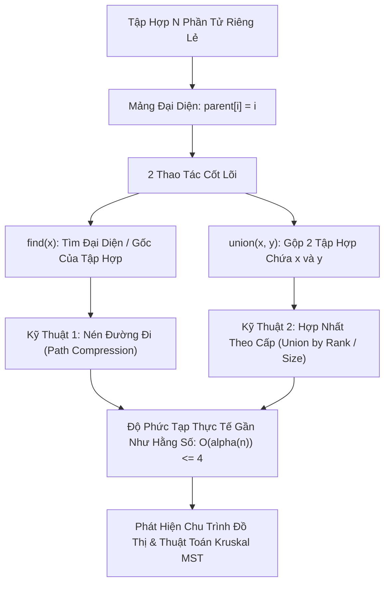

# 🔗 Tập Hợp Rời Rạc (Disjoint Set Union - DSU / Union-Find)

> [[00 - Master Dashboard|🧭 Dashboard]] / [[Master MOC|🗺️ Master MOC]] / [[Roadmap|📋 Roadmap]]

---

## 1. Bản Đồ Khái Niệm (Mermaid DAG)



---

## 2. Chân Lý Vô Điều Kiện (First Principles)

> [!NOTE] Tiên Đề Hàm Ngược Ackermann $\alpha(n)$
> **Khi kết hợp đồng thời cả hai kỹ thuật Nén Đường Đi (Path Compression) và Hợp Nhất Theo Cấp (Union by Rank), độ phức tạp thời gian cho mỗi thao tác `find` hoặc `union` là:**
> $$ T = O(\alpha(n)) $$
>
> Trong đó $\alpha(n)$ là **Hàm ngược Ackermann**. Hàm này tăng trưởng chậm đến mức kỳ dị: Với mọi giá trị $n$ lên tới số lượng nguyên tử trong toàn bộ vũ trụ quan sát được ($n = 10^{80}$), ta luôn có **$\alpha(n) \le 4$**.
>
> $\implies$ Trên thực tế công nghiệp, mỗi thao tác của DSU được coi là chạy trong **thời gian hằng số $O(1)$ tuyệt đối**.

---

## 3. Trực Giác Motivated Discovery

> [!TIP] Động Lực 3Blue1Brown: Bang Hội & Vị Bang Chủ
> Làm thế nào để biết hai người bất kỳ trong một trường học có thuộc cùng một câu lạc bộ hay không mà không cần lưu danh sách thành viên cồng kềnh?
>
> - Mỗi thành viên chỉ cần nhớ một điều duy nhất: **"Người dẫn dắt trực tiếp của mình là ai?"**.
> - Người đứng đầu toàn bộ nhóm được gọi là **Đại diện (Bang chủ)**, tự trỏ vào chính mình (`parent[root] = root`).
> - Khi A gặp B: A hỏi bang chủ của mình là ai, B hỏi bang chủ của mình là ai. Nếu hai người có **cùng một Bang chủ** $\to$ Họ chắc chắn thuộc cùng một nhóm!
> - **Nén đường đi (Path Compression):** Sau lần đầu tiên A phải leo 10 cấp để tìm Bang chủ, A lập tức lưu luôn số điện thoại của Bang chủ và nối thẳng dây lên Bang chủ. Lần sau A chỉ mất đúng 1 bước chân!

---

## 4. Phân Tích Kỹ Thuật & Đa Miền Hệ Thống

### Bảng Độ Phức Tạp (Complexity Sheet)

| Thao Tác | DSU Ngây Ngô (Chưa tối ưu) | Có Nén Đường Đi + Union by Rank | Ý Nghĩa Thực Tế |
| :--- | :--- | :--- | :--- |
| **`find(x)` (Tìm đại diện)** | $O(n)$ (cây bị thoái hóa) | [[O(1) - Constant Time|$O(\alpha(n)) \approx O(1)$]] | Gần như tức thời |
| **`union(x, y)` (Gộp nhóm)** | $O(n)$ | [[O(1) - Constant Time|$O(\alpha(n)) \approx O(1)$]] | Đổi con trỏ gốc |
| **Không gian (Space)** | [[O(n) - Linear Time|$O(n)$]] | [[O(n) - Linear Time|$O(n)$]] | Chỉ tốn 2 mảng số nguyên `parent` và `rank` |

### 🌐 Ứng Dụng Trong Mạng Máy Tính & Hạ Tầng (CCNA)
- **Chống Loop Lớp 2 (Loop Prevention & Spanning Tree):** DSU là nền tảng giải thuật để phát hiện vòng lặp (Cycle Detection) khi xây dựng cây bao trùm tối thiểu trong giao thức **Spanning Tree Protocol (STP)** của thiết bị Switch mạng Cisco, ngăn chặn cơn bão Broadcast Storm làm sập hệ thống mạng doanh nghiệp.

---

## 5. Cài Đặt Chuẩn Mực (TypeScript - DisjointSet)

```typescript
export class DisjointSet {
  private parent: number[];
  private rank: number[];

  constructor(size: number) {
    this.parent = new Array(size);
    this.rank = new Array(size).fill(0);

    // Ban đầu mỗi phần tử là cha của chính nó
    for (let i = 0; i < size; i++) {
      this.parent[i] = i;
    }
  }

  // Tìm đại diện của x kèm Nén đường đi (Path Compression)
  find(x: number): number {
    if (this.parent[x] !== x) {
      // Đệ quy gán thẳng cha của x vào gốc cao nhất
      this.parent[x] = this.find(this.parent[x]);
    }
    return this.parent[x];
  }

  // Hợp nhất hai tập hợp theo cấp (Union by Rank)
  union(x: number, y: number): boolean {
    const rootX = this.find(x);
    const rootY = this.find(y);

    // Đã cùng thuộc một tập hợp -> Phát hiện chu trình (Cycle)!
    if (rootX === rootY) return false;

    // Gắn cây có độ cao nhỏ hơn vào gốc cây có độ cao lớn hơn
    if (this.rank[rootX] < this.rank[rootY]) {
      this.parent[rootX] = rootY;
    } else if (this.rank[rootX] > this.rank[rootY]) {
      this.parent[rootY] = rootX;
    } else {
      this.parent[rootY] = rootX;
      this.rank[rootX]++;
    }

    return true; // Hợp nhất thành công
  }

  // Kiểm tra 2 phần tử có liên thông với nhau không
  isConnected(x: number, y: number): boolean {
    return this.find(x) === this.find(y);
  }
}
```

---

## 🧠 Thẻ Ghi Nhớ Nhanh (Spaced Repetition)

Hai kỹ thuật tối ưu sống còn giúp DSU đạt độ phức tạp $O(\alpha(n))$ là gì? #card
?
1. **Nén đường đi (Path Compression):** Trong thao tác `find(x)`, nối thẳng tất cả các nút trên đường đi trực tiếp vào gốc (Root).
2. **Hợp nhất theo cấp (Union by Rank):** Trong thao tác `union(x, y)`, luôn gắn cây có độ cao nhỏ hơn làm con của cây có độ cao lớn hơn để tránh cây bị mọc dài.

Làm thế nào để phát hiện chu trình (Cycle Detection) trên đồ thị vô hướng bằng DSU? #card
?
Duyệt qua từng cạnh `(u, v)` của đồ thị. Trước khi thêm cạnh, gọi `find(u)` và `find(v)`. Nếu `find(u) === find(v)`, nghĩa là `u` và `v` vốn đã cùng thuộc một thành phần liên thông $\to$ Cạnh `(u, v)` tạo thành một chu trình khép kín!
