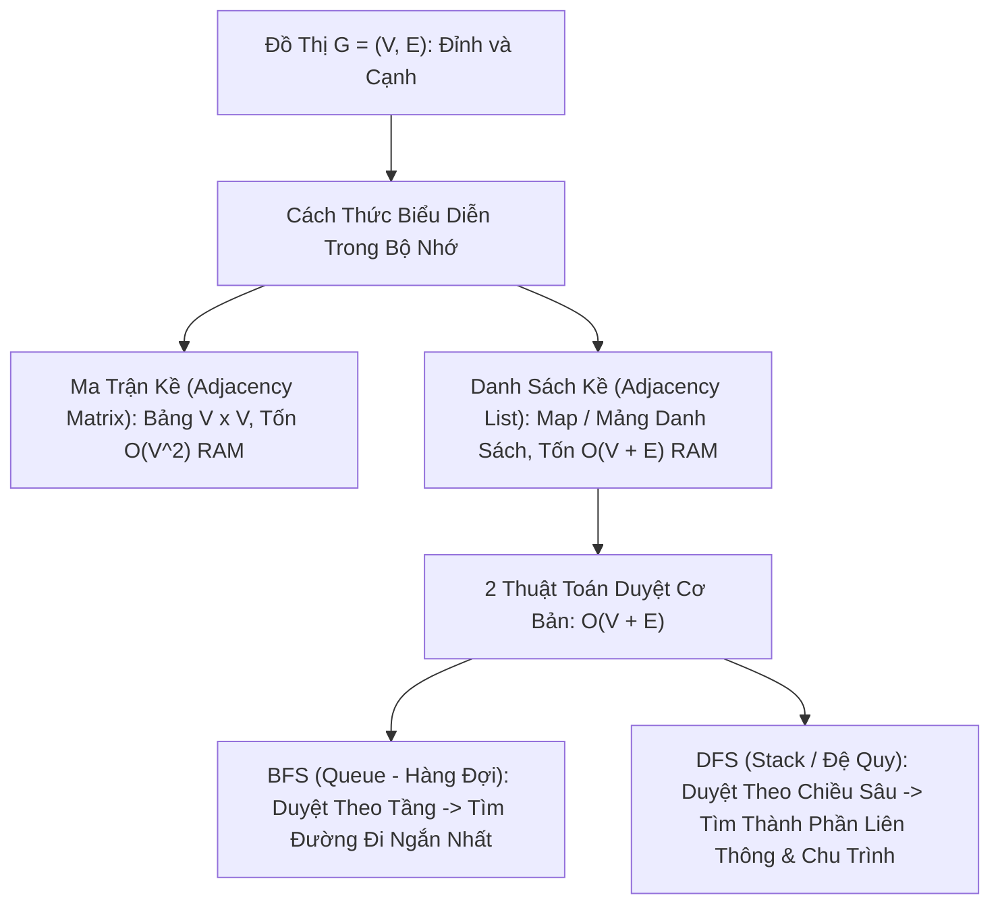

# 🕸️ Biểu Diễn Đồ Thị & Các Thuật Toán Duyệt (Graph Representations & Traversal)

> [[00 - Master Dashboard|🧭 Dashboard]] / [[Master MOC|🗺️ Master MOC]] / [[Roadmap|📋 Roadmap]]

---

## 1. Bản Đồ Khái Niệm (Mermaid DAG)



---

## 2. Chân Lý Vô Điều Kiện (First Principles)

> [!NOTE] Tiên Đề Bắt Tay (Handshaking Lemma) & Giới Hạn Duyệt $\Theta(V + E)$
> **Tổng bậc của tất cả các đỉnh trong đồ thị vô hướng luôn bằng hai lần số cạnh:**
> $$ \sum_{v \in V} \text{degree}(v) = 2|E| $$
>
> 1. **Hiệu quả tối thượng của Danh Sách Kề (Adjacency List):** Trên các đồ thị thưa thớt trong thực tế ($|E| \ll |V|^2$), Danh sách kề chỉ tiêu tốn **$O(V + E)$** bộ nhớ RAM. Ma trận kề lãng phí $O(V^2)$ bộ nhớ để lưu các số 0 vô nghĩa.
> 2. **Chân lý đường đi ngắn nhất của BFS:** Trên đồ thị không có trọng số, thuật toán duyệt theo chiều rộng (**BFS**) luôn luôn tìm ra **đường đi ngắn nhất tuyệt đối** (số cạnh ít nhất) từ đỉnh xuất phát tới mọi đỉnh khác.

---

## 3. Trực Giác Motivated Discovery

> [!TIP] Động Lực 3Blue1Brown: Sóng Nước Lan Tỏa vs Người Thám Hiểm Hang Động
> Hãy tưởng tượng cách khám phá một mê cung ngầm:
>
> - **BFS (Breadth-First Search - Giống như thả nước tràn vào mê cung):** Nước sẽ lan đều ra tất cả các ngóc ngách cách cửa 1 mét, sau đó mới lan tới các ngóc ngách cách cửa 2 mét. Điểm nào nước chạm tới đầu tiên thì đó chắc chắn là **con đường ngắn nhất**! Cần dùng [[Queue & Deque|Queue (Hàng đợi)]] để ghi nhận các điểm đến theo thứ tự gần $\to$ xa.
> - **DFS (Depth-First Search - Giống như người leo núi liều lĩnh):** Bạn đi theo một lối mòn duy nhất cho đến khi đâm vào ngõ cụt thì mới quay lui (Backtrack) lại ngã ba gần nhất để thử đường khác. Hoàn hảo để tìm xem hai điểm có thông nhau hay không, dùng [[Stack|Stack hoặc Đệ quy]].

---

## 4. Phân Tích Kỹ Thuật & Đa Miền Hệ Thống

### Bảng Ma Trận So Sánh: Adjacency Matrix vs Adjacency List

| Tiêu Chí | Ma Trận Kề (Adjacency Matrix) | Danh Sách Kề (Adjacency List) |
| :--- | :--- | :--- |
| **Không gian bộ nhớ (Space)** | 🔴 $O(V^2)$ (Bất kể số cạnh ít hay nhiều) | 🟢 **$O(V + E)$** (Tối ưu cho đồ thị thực tế) |
| **Kiểm tra 2 đỉnh kề nhau: `(u, v)`?** | 🟢 **$O(1)$** (Đọc `matrix[u][v]`) | 🟡 $O(\text{deg}(u))$ (Phải duyệt danh sách kề của $u$) |
| **Tìm toàn bộ láng giềng của đỉnh $u$** | 🔴 $O(V)$ (Phải quét hết 1 hàng) | 🟢 **$O(\text{deg}(u))$** (Chỉ quét đúng số láng giềng) |
| **Thêm đỉnh mới** | 🔴 $O(V^2)$ (Phải cấp phát lại ma trận mới) | 🟢 $O(1)$ |

### 🌐 Ứng Dụng Trong Mạng Máy Tính & Hạ Tầng (CCNA)
- **Giao thức định tuyến OSPF (Open Shortest Path First):** Các Router chia sẻ bảng trạng thái liên kết (Link-State Advertisement) để tái hiện lại toàn bộ bản đồ mạng dưới dạng **Danh Sách Kề**, sau đó chạy thuật toán Dijkstra (dựa trên BFS có trọng số) để tìm đường truyền gói tin tối ưu nhất.

---

## 5. Cài Đặt Chuẩn Mực (TypeScript - Graph BFS & DFS)

```typescript
export class Graph {
  private adjacencyList: Map<string, string[]> = new Map();

  addVertex(vertex: string): void {
    if (!this.adjacencyList.has(vertex)) {
      this.adjacencyList.set(vertex, []);
    }
  }

  // Thêm cạnh vô hướng giữa u và v
  addEdge(u: string, v: string): void {
    this.addVertex(u);
    this.addVertex(v);
    this.adjacencyList.get(u)!.push(v);
    this.adjacencyList.get(v)!.push(u);
  }

  // Duyệt theo chiều rộng (BFS) sử dụng Queue: O(V + E)
  bfs(startVertex: string): string[] {
    const visited = new Set<string>();
    const queue: string[] = [startVertex];
    const result: string[] = [];

    visited.add(startVertex);

    while (queue.length > 0) {
      const current = queue.shift()!;
      result.push(current);

      const neighbors = this.adjacencyList.get(current) || [];
      for (const neighbor of neighbors) {
        if (!visited.has(neighbor)) {
          visited.add(neighbor);
          queue.push(neighbor);
        }
      }
    }

    return result;
  }

  // Duyệt theo chiều sâu (DFS) sử dụng Đệ quy: O(V + E)
  dfs(startVertex: string): string[] {
    const visited = new Set<string>();
    const result: string[] = [];

    const traverse = (vertex: string) => {
      if (!vertex) return;
      visited.add(vertex);
      result.push(vertex);

      const neighbors = this.adjacencyList.get(vertex) || [];
      for (const neighbor of neighbors) {
        if (!visited.has(neighbor)) {
          traverse(neighbor);
        }
      }
    };

    traverse(startVertex);
    return result;
  }
}
```

---

## 🧠 Thẻ Ghi Nhớ Nhanh (Spaced Repetition)

Khi nào nên dùng Ma Trận Kề thay vì Danh Sách Kề để biểu diễn đồ thị? #card
?
Khi đồ thị là **Đồ thị dày đặc (Dense Graph)**, tức số lượng cạnh xấp xỉ $|E| \approx |V|^2$, hoặc khi ứng dụng đòi hỏi thao tác kiểm tra xem hai đỉnh có nối trực tiếp với nhau hay không trong thời gian tức thì $O(1)$.

Tại sao BFS luôn tìm được đường đi ngắn nhất trên đồ thị không trọng số còn DFS thì không? #card
?
Vì BFS duyệt theo từng tầng khoảng cách tăng dần ($k = 1, 2, 3\dots$). Đỉnh đích được phát hiện ở tầng nhỏ nhất chắc chắn là con đường có số bước đi ít nhất. DFS lao thẳng theo một nhánh sâu ngẫu nhiên nên có thể tìm ra một con đường vòng vo rất dài trước khi tới đích.
