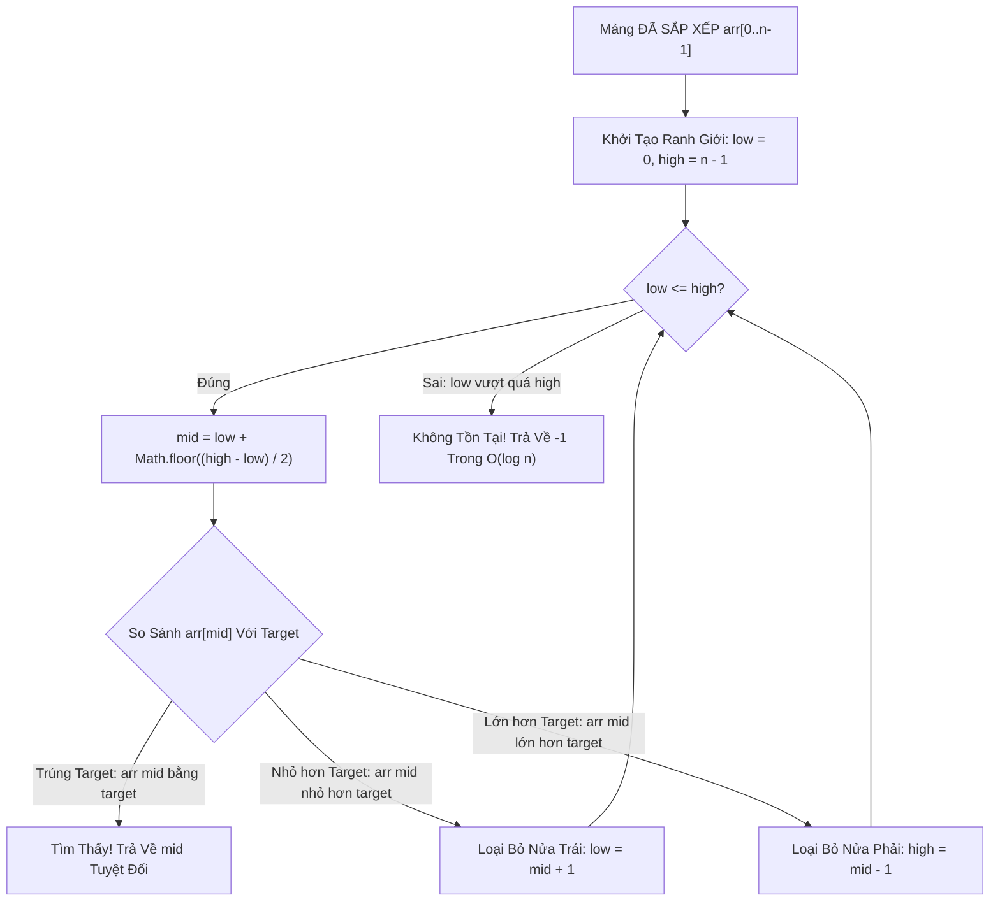

# 🎯 Tìm Kiếm Nhị Phân (Binary Search)

> [[00 - Master Dashboard|🧭 Dashboard]] / [[Master MOC|🗺️ Master MOC]] / [[Roadmap|📋 Roadmap]]

---

## 1. Bản Đồ Khái Niệm (Mermaid DAG)



---

## 2. Chân Lý Vô Điều Kiện (First Principles)

> [!NOTE] Tiên Đề Giảm Không Gian Tìm Kiếm Theo Cấp Số Nhân & Lỗi Tràn Số
> **Sau mỗi lần so sánh, Binary Search loại bỏ chính xác 50% số lượng phần tử còn lại trong không gian tìm kiếm:**
> $$ N \to \frac{N}{2} \to \frac{N}{4} \to \dots \to 1 \implies \text{Số bước lặp tối đa là } \lceil \log_2 N \rceil + 1 $$
>
> 1. **Điều kiện tiên quyết tuyệt đối:** Mảng bắt buộc phải được **sắp xếp theo thứ tự đơn điệu** và hỗ trợ **truy cập ngẫu nhiên $O(1)$** (như [[Array & Dynamic Array|Mảng]]). Không áp dụng được trên [[Linked List]].
> 2. **Lỗi Tràn Số Nguyên Kinh Điển (Integer Overflow Bug):** Công thức ngây thơ `mid = (low + high) / 2` từng tồn tại 20 năm trong thư viện chuẩn Java. Khi `low + high > 2^{31} - 1`, kết quả bị tràn số thành số âm $\to$ crash hệ thống! Công thức bất biến chuẩn mực luôn là:
>    $$ \text{mid} = \text{low} + \lfloor (\text{high} - \text{low}) / 2 \rfloor $$

---

## 3. Trực Giác Motivated Discovery

> [!TIP] Động Lực 3Blue1Brown: Trò Chơi Đoán Số & Sức Mạnh $O(\log N)$
> Bạn yêu cầu người bạn nghĩ một số từ 1 đến 100. Mỗi lần bạn đoán, người đó chỉ được trả lời *"Lớn hơn"* hoặc *"Nhỏ hơn"*:
>
> - Bạn đoán: **50** $\to$ "Nhỏ hơn" $\to$ Bạn gạt bỏ ngay lập tức 50 số từ 51 đến 100!
> - Bạn đoán tiếp: **25** $\to$ "Lớn hơn" $\to$ Bạn gạt tiếp các số từ 1 đến 24!
>
> Chỉ cần tối đa **7 câu hỏi**, bạn đoán trúng bất kỳ số nào trong 100 số ($2^7 = 128$).
> Và với **30 câu hỏi**, bạn có thể định vị chính xác một người bất kỳ giữa **1 tỷ dân số thế giới** ($2^{30} \approx 1.07 \times 10^9$)!

---

## 4. Phân Tích Kỹ Thuật & Đa Miền Hệ Thống

### Bảng Độ Phức Tạp (Complexity Sheet)

| Trường Hợp | Thời Gian (Time) | Không Gian (Space - Dạng Vòng Lặp) | Không Gian (Space - Đệ Quy) |
| :--- | :--- | :--- | :--- |
| **Tốt nhất (Best Case)** | [[O(1) - Constant Time|$O(1)$]] (Trúng `mid` ngay lần 1) | [[O(1) - Constant Time|$O(1)$]] | $O(1)$ |
| **Trung bình (Average)** | [[O(log n) - Logarithmic Time|$O(\log n)$]] | [[O(1) - Constant Time|$O(1)$]] | $O(\log n)$ (Call stack) |
| **Xấu nhất (Worst Case)** | [[O(log n) - Logarithmic Time|$O(\log n)$]] | [[O(1) - Constant Time|$O(1)$]] | $O(\log n)$ |

### 🌐 Ứng Dụng Trong Cơ Sở Dữ Liệu & DevOps
- **Database [[Database-knowledge/01 - Core Concepts/Index Seek|Index Seek]]:** Khi Database duyệt qua các nút lá (Leaf Page) của [[Database-knowledge/01 - Core Concepts/Index|B+Tree Index]], các bản ghi trong một Page (8KB) được sắp xếp sẵn $\to$ Database Engine áp dụng Binary Search trực tiếp trong Page để tìm kiếm dòng dữ liệu trong nano-giây.
- **Git Bisect:** Lệnh `git bisect` trong Git sử dụng Binary Search trên đồ thị commit để tìm commit chính xác gây ra lỗi bug phần mềm giữa hàng ngàn commit chỉ trong 10-12 lần test!

---

## 5. Cài Đặt Chuẩn Mực (TypeScript)

### 1. Binary Search cơ bản (Dạng Vòng Lặp - Iterative $O(1)$ Space)

```typescript
export function binarySearch(nums: number[], target: number): number {
  let low = 0;
  let high = nums.length - 1;

  while (low <= high) {
    // Tránh Integer Overflow tuyệt đối
    const mid = low + Math.floor((high - low) / 2);

    if (nums[mid] === target) {
      return mid; // Tìm thấy mục tiêu
    } else if (nums[mid] < target) {
      low = mid + 1; // Thu hẹp sang nửa phải
    } else {
      high = mid - 1; // Thu hẹp sang nửa trái
    }
  }

  return -1; // Không tìm thấy
}
```

### 2. Biến thể Thực chiến: Lower Bound (Tìm vị trí đầu tiên $\ge \text{target}$)

```typescript
export function lowerBound(nums: number[], target: number): number {
  let low = 0;
  let high = nums.length; // high ở ngoài mảng

  while (low < high) {
    const mid = low + Math.floor((high - low) / 2);
    if (nums[mid] >= target) {
      high = mid; // Có thể mid là kết quả, giữ lại
    } else {
      low = mid + 1;
    }
  }

  return low; // Chỉ số đầu tiên >= target
}
```

---

## 🧠 Thẻ Ghi Nhớ Nhanh (Spaced Repetition)

Tại sao công thức tính vị trí giữa `mid = (low + high) / 2` lại là một lỗi nguy hiểm? #card
?
Trong các ngôn ngữ có kiểu số nguyên kích thước cố định 32-bit (như Java, C++, C#), khi `low` và `high` đều lớn, tổng `low + high` có thể vượt quá $2^{31} - 1$, dẫn đến hiện tượng tràn số nguyên (Integer Overflow) sinh ra số âm và gây lỗi `ArrayIndexOutOfBoundsException`. Công thức chuẩn là: `mid = low + Math.floor((high - low) / 2)`.

Tại sao không thể áp dụng Binary Search hiệu quả trên Singly Linked List dù các phần tử đã sắp xếp? #card
?
Vì Singly Linked List không hỗ trợ truy xuất ngẫu nhiên trong $O(1)$. Để nhảy tới vị trí phần tử giữa (`mid`), ta buộc phải duyệt tuần tự mất $O(n/2) = O(n)$ thời gian, làm độ phức tạp tổng thể suy biến về $O(n)$, mất đi lợi thế $O(\log n)$ của Binary Search.
