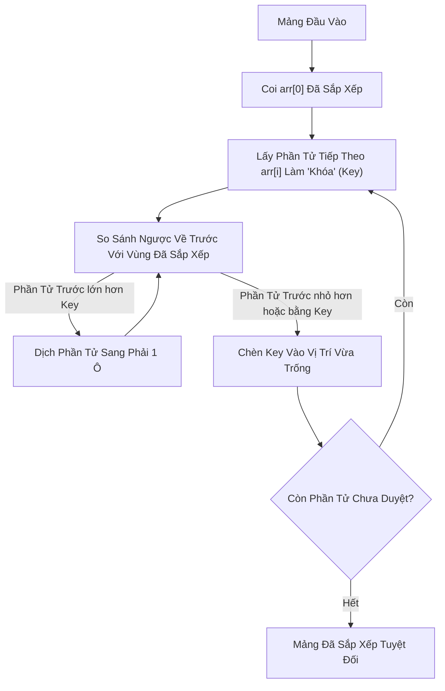

# 🃏 Sắp Xếp Chèn (Insertion Sort)

> [[00 - Master Dashboard|🧭 Dashboard]] / [[Master MOC|🗺️ Master MOC]] / [[Roadmap|📋 Roadmap]]

---

## 1. Bản Đồ Khái Niệm (Mermaid DAG)



---

## 2. Chân Lý Vô Điều Kiện (First Principles)

> [!NOTE] Tiên Đề Bất Biến
> **Thời gian chạy của Insertion Sort tỷ lệ thuận với số lượng cặp nghịch thế (Inversions) trong mảng: $T(n) = \Theta(n + I)$, với $I$ là số nghịch thế.**
>
> 1. **Thuật toán Thích Ứng Cao (Highly Adaptive):** Nếu mảng đã sắp xếp gần hết ($I \approx 0$), Insertion Sort chỉ mất đúng $O(n)$ thời gian.
> 2. **Hiệu Quả Nhất Cho Tập Nhỏ ($n \le 16-64$):** Do hệ số hằng số (Constant Factor) cực nhỏ và thân thiện với CPU L1/L2 Cache, Insertion Sort chạy **nhanh hơn cả Quick Sort và Merge Sort** trên các mảng kích thước nhỏ.

---

## 3. Trực Giác Motivated Discovery

> [!TIP] Động Lực 3Blue1Brown: Xếp Bài Tây Trong Lòng Bàn Tay
> Khi chơi bài, tay trái bạn cầm các lá bài đã được xếp theo thứ tự tăng dần. Khi bốc thêm một lá mới từ bàn lên:
>
> Bạn không xáo tung toàn bộ bộ bài. Bạn chỉ cần cầm lá bài mới, quét mắt từ phải qua trái trên xấp bài đang cầm, dịch chuyển các lá to hơn sang phải một khoảng trống, rồi nhẹ nhàng **"nhét"** lá bài mới vào đúng khe của nó.
>
> Đây chính là lý do các thư viện chuẩn công nghiệp như **Timsort** (trong Python `sort()` và Java `Arrays.sort()`) hay **Introsort** (trong C++ `std::sort`) đều chuyển sang dùng Insertion Sort khi chia nhỏ bài toán xuống dưới 16-32 phần tử!

---

## 4. Phân Tích Kỹ Thuật & Độ Phức Tạp

### Bảng Độ Phức Tạp (Complexity Sheet)

| Trường Hợp | Thời Gian (Time) | Không Gian (Space) | Tính Ổn Định (Stability) |
| :--- | :--- | :--- | :--- |
| **Tốt nhất (Best Case - Đã Sort)** | [[O(n) - Linear Time|$O(n)$]] | [[O(1) - Constant Time|$O(1)$]] | 🟢 Stable (Bảo toàn thứ tự) |
| **Trung bình (Average)** | [[O(n^2) - Quadratic Time|$O(n^2)$]] | [[O(1) - Constant Time|$O(1)$]] | 🟢 Stable |
| **Xấu nhất (Worst Case - Đảo Ngược)** | [[O(n^2) - Quadratic Time|$O(n^2)$]] | [[O(1) - Constant Time|$O(1)$]] | 🟢 Stable |

---

## 5. Cài Đặt Chuẩn Mực (TypeScript)

```typescript
export function insertionSort(arr: number[]): number[] {
  const n = arr.length;

  for (let i = 1; i < n; i++) {
    const key = arr[i]; // Lá bài cần chèn
    let j = i - 1;

    // Dịch chuyển các phần tử của arr[0..i-1] lớn hơn key sang phải 1 vị trí
    while (j >= 0 && arr[j] > key) {
      arr[j + 1] = arr[j];
      j--;
    }

    // Đặt key vào vị trí trống tìm được
    arr[j + 1] = key;
  }

  return arr;
}
```

---

## 🧠 Thẻ Ghi Nhớ Nhanh (Spaced Repetition)

Tại sao Insertion Sort chạy trong $O(n)$ ở trường hợp tốt nhất? #card
?
Khi mảng đã sắp xếp sẵn, điều kiện vòng lặp `while (j >= 0 && arr[j] > key)` sẽ thất bại ngay ở lần kiểm tra đầu tiên với mọi $i$. Thuật toán chỉ thực hiện đúng $n-1$ phép so sánh và $0$ phép dịch chuyển.

Tại sao các thuật toán sắp xếp hiện đại (Timsort, Introsort) lại tích hợp Insertion Sort cho mảng nhỏ? #card
?
Vì trên mảng nhỏ ($N \le 32-64$), chi phí phân chia đệ quy của Quick Sort / Merge Sort lớn hơn chi phí chạy vòng lặp đơn giản của Insertion Sort. Insertion Sort không tốn bộ nhớ đệm, có tính ổn định (Stable) và tận dụng tối đa CPU Cache Locality.
