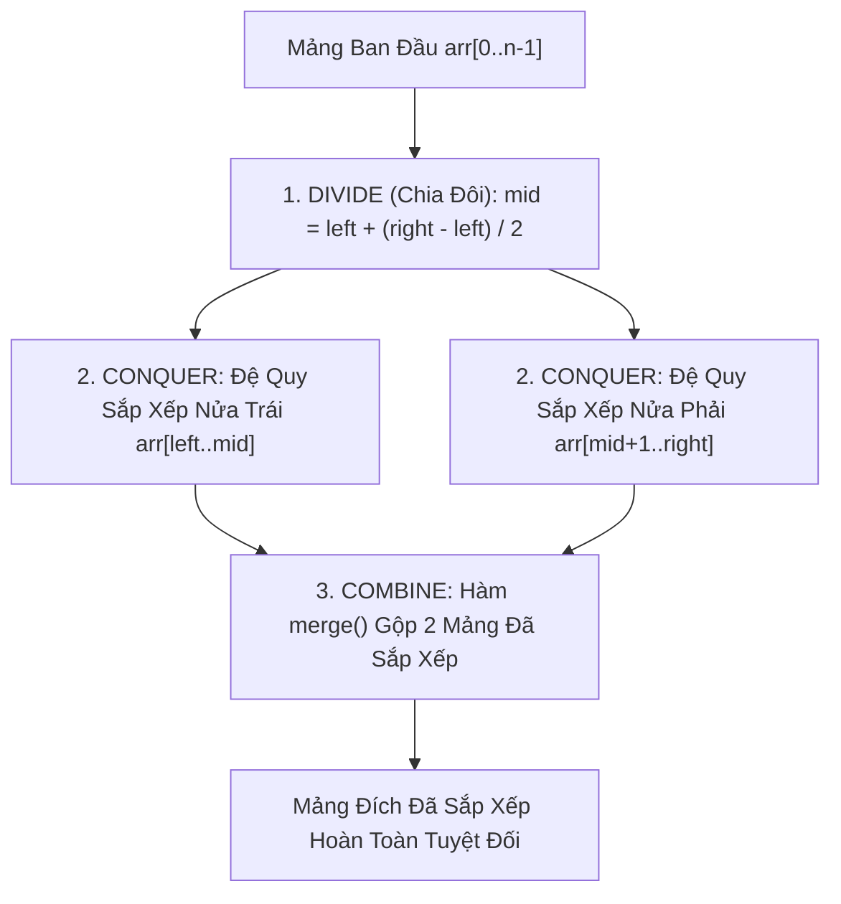

# ⚔️ Sắp Xếp Trộn (Merge Sort)

> [[00 - Master Dashboard|🧭 Dashboard]] / [[Master MOC|🗺️ Master MOC]] / [[Roadmap|📋 Roadmap]]

---

## 1. Bản Đồ Khái Niệm (Mermaid DAG)



---

## 2. Chân Lý Vô Điều Kiện (First Principles)

> [!NOTE] Tiên Đề Bất Biến & Phương Trình Truy Hồi
> **Merge Sort luôn luôn đảm bảo thời gian chạy tiệm cận $O(n \log n)$ trong MỌI trường hợp (Best, Average, Worst).**
>
> Theo Định lý Thợ (Master Theorem):
> $$ T(n) = 2T\left(\frac{n}{2}\right) + \Theta(n) \implies T(n) = \Theta(n \log n) $$
>
> 1. **Sự Đánh Đổi Bắt Buộc (Space Trade-off):** Merge Sort trên mảng bắt buộc phải cấp phát thêm **$O(n)$ bộ nhớ RAM phụ trợ (Auxiliary Space)** để làm vùng đệm trộn hai nửa.
> 2. **Bảo Toàn Thứ Tự Tuyệt Đối (Stable):** Khi hai phần tử bằng nhau ở nửa trái và nửa phải, thuật toán luôn ưu tiên chọn phần tử nửa trái trước (`left[i] <= right[j]`), đảm bảo tính ổn định.

---

## 3. Trực Giác Motivated Discovery

> [!TIP] Động Lực 3Blue1Brown: Gộp Hai Chồng Bài Thi Đã Sắp Xếp
> Sắp xếp một mảng lộn xộn 1 triệu phần tử là bài toán cực kỳ đau đầu. Nhưng gộp (merge) **hai mảng ĐÃ ĐƯỢC SẮP XẾP SẴN** thì lại dễ đến kinh ngạc:
>
> Hãy tưởng tượng bạn có 2 chồng bài thi đã được xếp theo thứ tự điểm số tăng dần: Bạn chỉ cần nhìn vào **2 lá bài trên cùng** của mỗi chồng, bốc lá bài nhỏ hơn đặt vào chồng kết quả, và tiếp tục lặp lại. Bạn chỉ tốn đúng $O(n)$ phép so sánh tuyến tính để gộp xong cả triệu phần tử!
>
> Merge Sort biến bài toán lớn thành bài toán gộp mảng đơn giản này bằng cách liên tục bẻ đôi danh sách xuống tới khi mỗi mảng chỉ còn 1 phần tử (mảng 1 phần tử thì hiển nhiên đã sắp xếp).

---

## 4. Phân Tích Kỹ Thuật & Đa Miền Hệ Thống

### Bảng Độ Phức Tạp (Complexity Sheet)

| Trường Hợp | Thời Gian (Time) | Không Gian (Space) | Tính Ổn Định (Stability) |
| :--- | :--- | :--- | :--- |
| **Tốt nhất (Best Case)** | [[O(n log n) - Linearithmic Time|$O(n \log n)$]] | [[O(n) - Linear Time|$O(n)$]] | 🟢 Stable |
| **Trung bình (Average)** | [[O(n log n) - Linearithmic Time|$O(n \log n)$]] | [[O(n) - Linear Time|$O(n)$]] | 🟢 Stable |
| **Xấu nhất (Worst Case)** | [[O(n log n) - Linearithmic Time|$O(n \log n)$]] | [[O(n) - Linear Time|$O(n)$]] | 🟢 Stable |

### 🌐 Ứng Dụng Trong Cơ Sở Dữ Liệu: External Merge Sort
Khi một câu lệnh SQL chạy `ORDER BY` trên bảng dữ liệu 100GB trong khi máy chủ chỉ có 8GB RAM, Database Engine (PostgreSQL / MySQL) không thể nạp toàn bộ vào RAM để chạy Quick Sort. Hệ thống sẽ áp dụng **External Merge Sort**:
1. Đọc từng khối 8GB vào RAM, sắp xếp bằng Quick Sort rồi ghi tạm ra đĩa thành các file Runs đã sort.
2. Dùng kỹ thuật Merge nhiều đường (K-way Merge) để đọc tuần tự (Sequential I/O) từng phần của các file này vào bộ nhớ đệm và gộp lại thành kết quả cuối cùng. (Xem thêm: [[Database-knowledge/01 - Core Concepts/Join Methods|Merge Join trong SQL Optimizer]]).

---

## 5. Cài Đặt Chuẩn Mực (TypeScript)

```typescript
export function mergeSort(arr: number[]): number[] {
  if (arr.length <= 1) return arr;

  const mid = Math.floor(arr.length / 2);
  const left = mergeSort(arr.slice(0, mid));
  const right = mergeSort(arr.slice(mid));

  return merge(left, right);
}

function merge(left: number[], right: number[]): number[] {
  const result: number[] = [];
  let i = 0;
  let j = 0;

  // So sánh 2 con trỏ ở đầu mỗi nửa
  while (i < left.length && j < right.length) {
    if (left[i] <= right[j]) {
      result.push(left[i]);
      i++;
    } else {
      result.push(right[j]);
      j++;
    }
  }

  // Nạp nốt các phần tử còn dư thừa
  while (i < left.length) result.push(left[i++]);
  while (j < right.length) result.push(right[j++]);

  return result;
}
```

---

## 🧠 Thẻ Ghi Nhớ Nhanh (Spaced Repetition)

Tại sao Merge Sort lại được ưu tiên sử dụng để sắp xếp Danh sách liên kết (Linked List)? #card
?
Vì Linked List cho phép gộp (merge) hai danh sách chỉ bằng cách điều chỉnh lại các con trỏ `next` mà không cần cấp phát thêm mảng phụ, giúp giảm Space Complexity từ $O(n)$ xuống chỉ còn $O(1)$ Extra Space!

Sự đánh đổi lớn nhất của Merge Sort so với Quick Sort là gì? #card
?
Merge Sort luôn đảm bảo $O(n \log n)$ và Stable, nhưng phải đánh đổi bằng $O(n)$ bộ nhớ RAM phụ trợ để trộn dữ liệu; trong khi Quick Sort sắp xếp tại chỗ (In-place) chỉ tốn $O(\log n)$ Call Stack.
