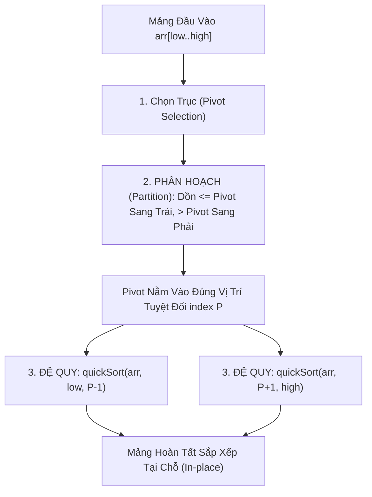

# ⚡ Sắp Xếp Nhanh (Quick Sort)

> [[00 - Master Dashboard|🧭 Dashboard]] / [[Master MOC|🗺️ Master MOC]] / [[Roadmap|📋 Roadmap]]

---

## 1. Bản Đồ Khái Niệm (Mermaid DAG)



---

## 2. Chân Lý Vô Điều Kiện (First Principles)

> [!NOTE] Tiên Đề Bất Biến & Phương Trình Phân Hoạch
> **Sau mỗi bước Phân hoạch (Partition), phần tử Chốt (Pivot) luôn luôn nằm vào chính xác vị trí cuối cùng của nó trong mảng đã sắp xếp.**
>
> 1. **Vua Tốc Độ Thực Tế:** Dù cùng có độ phức tạp trung bình $\Theta(n \log n)$ như [[Merge Sort]], Quick Sort chạy **nhanh gấp 2-3 lần** trong thực tế vì sắp xếp tại chỗ (In-place), tối ưu tuyệt đối bộ đệm CPU Cache (L1/L2 Cache Locality).
> 2. **Cạm Bẫy Phân Hoạch Lệch ($O(n^2)$ Worst-Case):** Nếu chọn Pivot kém (ví dụ luôn chọn phần tử đầu/cuối trên mảng đã sắp xếp sẵn), phương trình truy hồi suy biến thành:
>    $$ T(n) = T(n-1) + \Theta(n) \implies T(n) = \Theta(n^2) $$

---

## 3. Trực Giác Motivated Discovery

> [!TIP] Động Lực 3Blue1Brown: Kẻ Vạch Phấn Ranh Giới (Pivot)
> Hãy tưởng tượng một lớp học thể thao hỗn loạn. Huấn luyện viên vẽ một vạch phấn giữa sân và gọi một học sinh bất kỳ ra đứng trên vạch (làm Chốt - Pivot):
>
> Huấn luyện viên ra lệnh: *"Tất cả những ai thấp hơn bạn chốt, chạy sang bên trái vạch phấn. Ai cao hơn bạn chốt, chạy sang bên phải vạch phấn!"*
>
> Sau một lượt di chuyển ngắn, dù hai bên trái/phải vẫn chưa được xếp thứ tự, nhưng **bản thân bạn chốt đã đứng chính xác 100% vị trí của mình trong toàn trường**. Thầy giáo chỉ cần lặp lại mệnh lệnh này độc lập cho nhóm bên trái và nhóm bên phải.

---

## 4. Phân Tích Kỹ Thuật & Tối Ưu Hóa Công Nghiệp

### Bảng Độ Phức Tạp (Complexity Sheet)

| Trường Hợp | Thời Gian (Time) | Không Gian (Call Stack Space) | Tính Ổn Định (Stability) |
| :--- | :--- | :--- | :--- |
| **Tốt nhất (Best Case - Chia Đôi)** | [[O(n log n) - Linearithmic Time|$O(n \log n)$]] | [[O(log n) - Logarithmic Time|$O(\log n)$]] | 🔴 Unstable |
| **Trung bình (Average Case)** | [[O(n log n) - Linearithmic Time|$O(n \log n)$]] | [[O(log n) - Logarithmic Time|$O(\log n)$]] | 🔴 Unstable |
| **Xấu nhất (Worst Case - Lệch Cực Đại)** | [[O(n^2) - Quadratic Time|$O(n^2)$]] | [[O(n) - Linear Time|$O(n)$]] | 🔴 Unstable |

### 🛠️ Kỹ Thuật Tối Ưu Trong Ngôn Ngữ Lập Trình Thực Tế
1. **Median-of-Three (Chốt Trung Vị Của 3):** Lấy 3 phần tử ở đầu, giữa và cuối mảng; chọn giá trị trung vị làm Pivot. Kỹ thuật này triệt tiêu hoàn toàn trường hợp suy biến trên mảng đã sắp xếp sẵn.
2. **Introsort (C++ `std::sort`):** Bắt đầu bằng Quick Sort. Nếu độ sâu đệ quy vượt quá $2 \log_2 n$, thuật toán tự động chuyển sang **Heapsort** để đảm bảo chặn trần $O(n \log n)$, và chuyển sang **Insertion Sort** khi mảng con nhỏ hơn 16 phần tử.
3. **Dual-Pivot Quicksort (Java `Arrays.sort(int[])`):** Sử dụng 2 chốt chia mảng làm 3 vùng, tăng tốc độ đọc bộ nhớ và giảm số phép so sánh.

---

## 5. Cài Đặt Chuẩn Mực (TypeScript - Lomuto Partition)

```typescript
export function quickSort(arr: number[], low = 0, high = arr.length - 1): number[] {
  if (low < high) {
    // pivotIndex là vị trí chính xác của chốt sau phân hoạch
    const pivotIndex = partition(arr, low, high);

    // Đệ quy sắp xếp 2 nửa độc lập
    quickSort(arr, low, pivotIndex - 1);
    quickSort(arr, pivotIndex + 1, high);
  }
  return arr;
}

function partition(arr: number[], low: number, high: number): number {
  // Chọn phần tử cuối cùng làm Pivot
  const pivot = arr[high];
  let i = low - 1; // Con trỏ ranh giới cho các phần tử <= pivot

  for (let j = low; j < high; j++) {
    if (arr[j] <= pivot) {
      i++;
      [arr[i], arr[j]] = [arr[j], arr[i]];
    }
  }

  // Đưa Pivot về giữa ranh giới
  [arr[i + 1], arr[high]] = [arr[high], arr[i + 1]];
  return i + 1;
}
```

---

## 🧠 Thẻ Ghi Nhớ Nhanh (Spaced Repetition)

Khi nào Quick Sort bị rơi vào độ phức tạp thời gian xấu nhất $O(n^2)$? #card
?
Khi mỗi bước phân hoạch chia mảng thành một bên có $0$ phần tử và bên còn lại có $n-1$ phần tử (mảng bị lệch tối đa). Thường xảy ra khi mảng đã sắp xếp sẵn (hoặc ngược) và ta luôn chọn phần tử đầu hoặc cuối làm Pivot.

Làm thế nào để phòng chống trường hợp xấu nhất $O(n^2)$ của Quick Sort trong thực tế? #card
?
Sử dụng kỹ thuật **Randomized Pivot** (chọn ngẫu nhiên) hoặc **Median-of-Three** (lấy trung vị của đầu, giữa, cuối) làm Pivot; hoặc sử dụng kiến trúc lai **Introsort** (tự động chuyển sang Heapsort khi đệ quy quá sâu).
