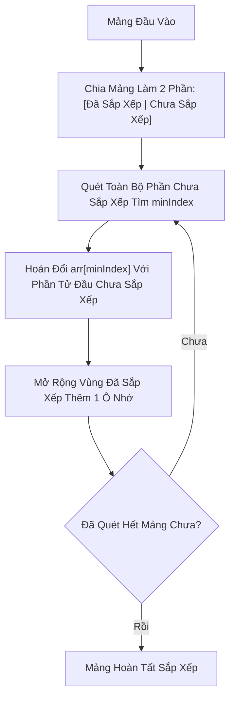

# 🎯 Sắp Xếp Chọn (Selection Sort)

> [[00 - Master Dashboard|🧭 Dashboard]] / [[Master MOC|🗺️ Master MOC]] / [[Roadmap|📋 Roadmap]]

---

## 1. Bản Đồ Khái Niệm (Mermaid DAG)



---

## 2. Chân Lý Vô Điều Kiện (First Principles)

> [!NOTE] Tiên Đề Bất Biến
> **Selection Sort thực hiện tối đa đúng $n - 1$ phép hoán đổi bộ nhớ (Swaps), ít nhất trong tất cả các thuật toán sắp xếp cơ sở $O(n^2)$.**
>
> 1. **Số phép so sánh là bất biến:** Dù mảng đã sắp xếp hoàn hảo hay lộn xộn, Selection Sort **luôn luôn** tốn chính xác $\frac{n(n-1)}{2}$ phép so sánh (Không có cơ chế dừng sớm).
> 2. **Tính Không Ổn Định (Unstable):** Phép hoán đổi khoảng cách xa (Long-distance swap) có thể làm đảo lộn thứ tự tương đối của các phần tử có giá trị bằng nhau.

---

## 3. Trực Giác Motivated Discovery

> [!TIP] Động Lực 3Blue1Brown: Chọn Bạn Thấp Nhất Hàng
> Hãy tưởng tượng giáo viên thể dục cần xếp một hàng học sinh theo chiều cao từ thấp đến cao:
>
> Thay vì liên tục đổi chỗ hai bạn đứng cạnh nhau làm náo loạn hàng ngũ (như Bubble Sort), thầy giáo quét mắt từ đầu đến cuối hàng để tìm ra **bạn thấp nhất tuyệt đối**, sau đó chỉ định bạn này đổi chỗ với bạn đang đứng ở vị trí số 1. Quá trình lặp lại cho vị trí số 2, số 3...
>
> **Kết quả:** Học sinh di chuyển cực ít (tối đa $n$ lần đổi chỗ), rất phù hợp với các thiết bị nhớ Flash hoặc EEPROM nơi thao tác ghi (Write/Erase) cực kỳ đắt đỏ và làm hao mòn phần cứng.

---

## 4. Phân Tích Kỹ Thuật & Độ Phức Tạp

### Bảng Độ Phức Tạp (Complexity Sheet)

| Trường Hợp | Thời Gian (Time) | Không Gian (Space) | Số Lần Hoán Đổi (Swaps) |
| :--- | :--- | :--- | :--- |
| **Tốt nhất (Best Case)** | [[O(n^2) - Quadratic Time|$O(n^2)$]] | [[O(1) - Constant Time|$O(1)$]] | $0$ lần swap |
| **Trung bình (Average)** | [[O(n^2) - Quadratic Time|$O(n^2)$]] | [[O(1) - Constant Time|$O(1)$]] | $\le n - 1$ lần swap |
| **Xấu nhất (Worst Case)** | [[O(n^2) - Quadratic Time|$O(n^2)$]] | [[O(1) - Constant Time|$O(1)$]] | $n - 1$ lần swap |

---

## 5. Cài Đặt Chuẩn Mực (TypeScript)

```typescript
export function selectionSort(arr: number[]): number[] {
  const n = arr.length;

  for (let i = 0; i < n - 1; i++) {
    let minIndex = i;

    // Tìm phần tử nhỏ nhất trong đoạn chưa sắp xếp [i+1 .. n-1]
    for (let j = i + 1; j < n; j++) {
      if (arr[j] < arr[minIndex]) {
        minIndex = j;
      }
    }

    // Chỉ hoán đổi nếu tìm thấy phần tử nhỏ hơn ở phía sau
    if (minIndex !== i) {
      [arr[i], arr[minIndex]] = [arr[minIndex], arr[i]];
    }
  }

  return arr;
}
```

---

## 🧠 Thẻ Ghi Nhớ Nhanh (Spaced Repetition)

Ưu điểm vượt trội nhất của Selection Sort so với Bubble Sort và Insertion Sort là gì? #card
?
Selection Sort tối ưu hóa số lượng phép ghi bộ nhớ (Memory Writes): nó chỉ thực hiện tối đa đúng $O(n)$ phép hoán đổi (swap), rất thích hợp khi chi phí ghi dữ liệu lên phần cứng (như Flash memory) đắt hơn nhiều so với chi phí đọc.

Tại sao Selection Sort là thuật toán không ổn định (Unstable)? #card
?
Vì nó thực hiện hoán đổi tầm xa. Ví dụ với mảng `[4a, 4b, 2]`: Ở bước 1, số `2` nhỏ nhất được hoán đổi với `4a` $\to$ mảng thành `[2, 4b, 4a]`. Thứ tự tương đối của `4a` và `4b` đã bị đảo lộn.
