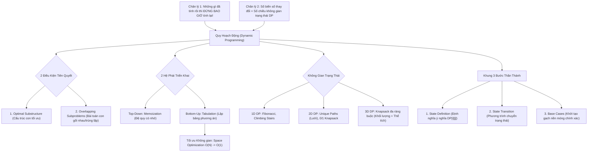

# 🧩 Quy Hoạch Động Toàn Diện (Dynamic Programming - DP)

> [[00 - Master Dashboard|🧭 Dashboard]] / [[Master MOC|🗺️ Master MOC]] / [[Roadmap|📋 Roadmap]] / [[Recursion & Memoization|🔁 Recursion & Memoization]] / [[Greedy Algorithm|🪙 Greedy Algorithm]]

---

## 🗺️ 1. Sơ Đồ Mermaid DAG (Alvar Knowledge Graph)



---

## ⚖️ 2. Chân Lý Vô Điều Kiện (Unconditional Truths)

> [!NOTE]
>
> 1. **Triết lý chống lãng phí:** _"Những gì đã tính rồi thì tuyệt đối không bao giờ tính lại!"_ Quy hoạch động đánh đổi bộ nhớ (RAM/Cache) để bẻ gãy sự bùng nổ hàm mũ $O(2^N)$ của đệ quy ngây thơ xuống độ phức tạp đa thức $O(N)$ hoặc $O(N \times W)$.
> 2. **Điều kiện áp dụng bắt buộc:** Một bài toán chỉ có thể giải bằng Quy hoạch động khi và chỉ khi thỏa mãn đồng thời:
>    - **Cấu trúc con tối ưu (Optimal Substructure):** Lời giải tối ưu của bài toán lớn được kiến tạo từ lời giải tối ưu của các bài toán con (ví dụ: đường ngắn nhất $A \to C$ đi qua $B$ phải gồm đường ngắn nhất $A \to B$ và $B \to C$).
>    - **Bài toán con gối nhau (Overlapping Subproblems):** Quá trình chia nhỏ bài toán làm xuất hiện cùng một bài toán con lặp đi lặp lại vô số lần.
> 3. **Quy tắc chiều không gian:** Số chiều của mảng trạng thái $DP$ bắt buộc phải bằng đúng số lượng biến số tự do thay đổi trong quá trình ra quyết định.

---

## 💡 3. Trực Giác Motivated Discovery (Tư Duy 3Blue1Brown)

> [!TIP]
> **Thảm họa đệ quy 3 dòng vs Phép màu chiếc hộp nhớ:**
>
> Hãy nhìn vào đoạn code đệ quy Fibonacci ngây thơ: `fib(n) = fib(n-1) + fib(n-2)`. Nó thanh lịch, toán học và ngắn gọn đến mê hoặc. Nhưng khi gọi `fib(50)`:
>
> - Cây đệ quy phân nhánh nhân đôi ở mỗi tầng, sinh sôi theo cấp số nhân $\to$ **$O(2^N)$ phép tính** ($2^{50} \approx 1.12 \times 10^{15}$ bước, máy tính treo cứng hoặc văng lỗi `Stack Overflow`).
> - Soi kính lúp vào cây nhị phân: `fib(3)` bị tính lại 2 lần, `fib(2)` bị tính lại 3 lần... Toàn bộ công sức của CPU bị tiêu tán vào việc giải đi giải lại những bài toán giống hệt nhau!
> - **Cứu tinh:** Cấy vào một mảng ghi nhớ (**Lookup Table**). Khi gặp `fib(3)` lần đầu, tính rồi lưu lại. Lần thứ hai đụng phải, bắn tia sáng tra cứu ngay trong $O(1)$, lập tức **cắt phăng toàn bộ cành đệ quy khổng lồ** phía dưới. Thuật toán biến từ rùa bò thành tên lửa siêu thanh $O(N)$!

---

## 🔬 4. Hai Hệ Phái: Top-Down (Memoization) vs Bottom-Up (Tabulation)

| Tiêu Chí                | Top-Down (Memoization)                            | Bottom-Up (Tabulation)                          |
| :---------------------- | :------------------------------------------------ | :---------------------------------------------- |
| **Bản chất**            | Đệ quy từ đỉnh cây xuống đáy + Lưu cache          | Xây từ móng lên đỉnh bằng vòng lặp `for`        |
| **Cách tư duy**         | Rất tự nhiên, công thức toán sao code y vậy       | Cần nhìn ra thứ tự giải quyết bài toán con      |
| **Bộ nhớ Call Stack**   | 🔴 Tốn $O(N)$ Call Stack (nguy cơ Stack Overflow) | 🟢 Không dùng Call Stack ($O(1)$ stack frame)   |
| **Khả năng tối ưu RAM** | Khó tối ưu sâu về $O(1)$                          | 🟢 **Dễ dàng ép không gian từ $O(N) \to O(1)$** |
| **Khuyên dùng thực tế** | Khi phỏng vấn cần viết nhanh ý tưởng ban đầu      | Khi thi đấu thuật toán hoặc production tải cao  |

### 🚀 Cảnh Giới Tối Thượng: Space Optimization ($O(N) \to O(1)$)

- Trong bài toán Fibonacci, để tính $F(5)$, ta có thực sự cần nhớ $F(0), F(1), F(2)$ không? **Không!** Ta chỉ cần đúng 2 giá trị liền trước là $F(3)$ và $F(4)$.
- **Kỹ thuật Cửa sổ trượt (Sliding Variables):** Thay vì duy trì mảng `dp[N]` tốn $O(N)$ RAM, ta chỉ cần 3 biến số `prev2`, `prev1`, `curr`. Đẩy giá trị tịnh tiến qua từng vòng lặp $\to$ Không gian bộ nhớ đạt [[O(1) - Constant Time|$O(1)$]].

---

## 🧱 5. Các Không Gian Bài Toán Kinh Điển

### 5.1. Quy Hoạch Động 2D: Lưới Đường Đi (Unique Paths)

- **Bài toán:** Robot xuất phát từ ô $(0,0)$ cần đi đến góc $(m-1, n-1)$ của lưới $m \times n$. Tại mỗi bước chỉ được đi **Sang phải (Right)** hoặc **Xuống dưới (Down)**. Hỏi có bao nhiêu cách đi?
- **Bước 1 (Trạng thái):** $DP[i][j]$ là tổng số cách đi từ $(0,0)$ đến ô $(i,j)$.
- **Bước 2 (Base Case):** Mọi ô trên hàng đầu tiên $DP[0][j] = 1$ và cột đầu tiên $DP[i][0] = 1$ (chỉ có 1 cách duy nhất là đi thẳng một lèo).
- **Bước 3 (Chuyển trạng thái):** Để bước vào ô $(i,j)$, chỉ có thể đến từ ô bên trên $(i-1, j)$ hoặc ô bên trái $(i, j-1)$:
  $$DP[i][j] = DP[i-1][j] + DP[i][j-1]$$
- **Độ phức tạp:** Thời gian $O(M \times N)$, Không gian $O(M \times N)$ (có thể tối ưu thành $O(N)$ bằng mảng 1D).

---

### 5.2. Trùm Cuối: Bài Toán Ba Lô 0/1 (0/1 Knapsack Problem)

```
                       MA TRẬN QUYẾT ĐỊNH DP[i][w]
                       (Hàng: Vật phẩm 1..N | Cột: Sức chứa 0..W)

               Tại ô DP[i][w], đứng trước ngã ba đường:
                              ┌─────────┴─────────┐
                              ▼                   ▼
                      BỎ VẬT PHẨM i          LẤY VẬT PHẨM i (w >= w_i)
                      DP[i-1][w]             v_i + DP[i-1][w - w_i]
                              │                   │
                              └─────────┬─────────┘
                                        ▼
                           max( Bỏ qua, Lấy thêm )
```

- **Quy tắc 0/1:** Hoặc lấy nguyên khối ($1$), hoặc không lấy ($0$). Không được bẻ vụn vật phẩm như trong [[Greedy Algorithm|Fractional Knapsack]].
- **Định nghĩa trạng thái:** $DP[i][w]$ là giá trị lớn nhất thu được khi chỉ xét từ vật phẩm $1$ đến $i$ với sức chứa ba lô hiện tại là $w$.
- **Phương trình chuyển trạng thái:**
  $$DP[i][w] = \begin{cases} DP[i-1][w] & \text{nếu } w < w_i \\ \max(DP[i-1][w],\; v_i + DP[i-1][w - w_i]) & \text{nếu } w \ge w_i \end{cases}$$
- **Độ phức tạp:** Thời gian $O(N \times W)$, Không gian $O(N \times W)$ (hoặc $O(W)$ khi duyệt ngược từ $W \to 0$ trên mảng 1D).

---

## ⚠️ 6. Ba Cạm Bẫy Thực Chiến Chí Mạng (DP Traps & Debugging)

1. **Bẫy 1: Quên khởi tạo Base Case.**
   - Để mảng trống rỗng hoặc rác khiến phương trình chuyển trạng thái nhân bản giá trị sai/NaN trên toàn bộ bảng. Luôn gạch những viên nền móng đầu tiên (như $F[0]=0, F[1]=1$ hoặc $DP[0][j]=1$).
2. **Bẫy 2: Sai chiều không gian trạng thái (State Dimension Mismatch).**
   - Nếu bài toán phát sinh thêm ràng buộc (ví dụ: ngoài khối lượng $W$, ba lô còn bị giới hạn bởi **thể tích $V$**), tuyệt đối không thể ép vào mảng 2D cũ.
   - **Quy tắc vàng:** Thêm 1 ràng buộc độc lập = Bung nở thêm 1 chiều không gian $\to$ Chuyển sang mảng 3D $DP[i][w][v]$.
3. **Bẫy 3: Khởi tạo toàn bộ mảng bằng 0 khi giải bài toán Cực Tiểu (MIN).**
   - Với bài toán tìm giá trị nhỏ nhất (như Coin Change: đổi số lượng đồng xu ít nhất), nếu khởi tạo bảng bằng `0`, phép tính $\min(0, \text{phương\_án})$ sẽ **luôn luôn trả về 0**, làm sai lệch toàn bộ thuật toán.
   - **Cách sửa chuẩn:** Khởi tạo toàn bộ mảng bằng $\infty$ (`Infinity` hoặc `1e9`), riêng ô gốc `DP[0] = 0`.

---

## 🧭 7. Bản Đồ Ra Quyết Định: Chọn Thuật Toán Nào?

```
                               BÀI TOÁN TỐI ƯU HÓA
                                        │
             ┌──────────────────────────┼──────────────────────────┐
             ▼                          ▼                          ▼
Các bài toán con ĐỘC LẬP?    Tối ưu cục bộ suy ra      Bài toán con GỐI NHAU &
(Không phụ thuộc lẫn nhau)    Tối ưu toàn cục?          phụ thuộc dữ liệu quá khứ?
             │                          │                          │
             ▼                          ▼                          ▼
     CHIA ĐỂ TRỊ (D&C)           THAM LAM (GREEDY)            QUY HOẠCH ĐỘNG (DP)
     (Ví dụ: Merge Sort)     (Ví dụ: Huffman, Dijkstra)    (Ví dụ: 0/1 Knapsack, LCS)
```

---

## 💻 8. Code Triển Khai Chuẩn (TypeScript)

### 8.1. 0/1 Knapsack tối ưu bộ nhớ 1D ($O(W)$ Space)

```typescript
interface Item {
  weight: number;
  value: number;
}

/**
 * Giải bài toán Ba lô 0/1 tối ưu không gian bằng mảng 1D.
 *
 * Time Complexity: O(N * W)
 * Space Complexity: O(W) (thay vì O(N * W) của bảng 2D)
 */
function knapsack01(items: Item[], capacity: number): number {
  // dp[w] lưu giá trị lớn nhất đạt được với sức chứa w
  const dp: number[] = new Array(capacity + 1).fill(0);

  for (const item of items) {
    // Duyệt NGƯỢC từ capacity về item.weight để tránh dùng lại cùng 1 vật phẩm nhiều lần
    for (let w = capacity; w >= item.weight; w--) {
      dp[w] = Math.max(dp[w], item.value + dp[w - item.weight]);
    }
  }

  return dp[capacity];
}

// Test case từ video
const treasures: Item[] = [
  { weight: 5, value: 10 }, // Cúp vàng
  { weight: 2, value: 50 }, // Kim cương
  { weight: 10, value: 30 }, // Máy tính
];
console.log(knapsack01(treasures, 15)); // Output: 80 (Kim cương 2kg + Máy tính 10kg = 12kg <= 15kg, Giá trị 80$)
```

### 8.2. Unique Paths (2D Grid DP)

```typescript
/**
 * Đếm số đường đi duy nhất trên lưới m x n.
 * Time Complexity: O(m * n)
 * Space Complexity: O(n) (ép từ mảng 2D xuống 1 hàng)
 */
function uniquePaths(m: number, n: number): number {
  const dp: number[] = new Array(n).fill(1); // Base case: Hàng đầu tiên toàn số 1

  for (let i = 1; i < m; i++) {
    for (let j = 1; j < n; j++) {
      dp[j] = dp[j] + dp[j - 1]; // dp[j] cũ là ô trên, dp[j-1] là ô bên trái
    }
  }

  return dp[n - 1];
}

console.log(uniquePaths(3, 7)); // Output: 28
```

---

## 🧠 9. Thẻ Ghi Nhớ Nhanh (Spaced Repetition)

Hai điều kiện bắt buộc để bài toán áp dụng được Quy hoạch động (DP) là gì? #card
?

1. **Optimal Substructure (Cấu trúc con tối ưu):** Lời giải tối ưu của bài toán lớn được tạo thành từ lời giải tối ưu của các bài toán con.
2. **Overlapping Subproblems (Bài toán con gối nhau):** Khi chia nhỏ, các bài toán con giống nhau bị lặp đi lặp lại nhiều lần.

Sự khác biệt cốt lõi giữa Top-Down (Memoization) và Bottom-Up (Tabulation) là gì? #card
?

- **Top-Down (Memoization):** Bắt đầu từ bài toán lớn đi xuống bằng Đệ quy + Cache mảng/bảng băm. Trực quan nhưng tốn bộ nhớ Call Stack, dễ bị Stack Overflow.
- **Bottom-Up (Tabulation):** Bắt đầu từ bài toán cơ sở nhỏ nhất xây lên bằng Vòng lặp `for`. Chạy nhanh hơn, an toàn cho bộ nhớ, dễ tối ưu không gian về $O(1)$.

Tại sao trong bài toán Ba lô 0/1 khi tối ưu mảng 1D bắt buộc phải duyệt sức chứa $w$ từ lớn về nhỏ ($W \to w_i$)? #card
?
Để đảm bảo **mỗi vật phẩm chỉ được chọn tối đa một lần**. Nếu duyệt xuôi ($w_i \to W$), giá trị của bước $w$ sẽ sử dụng kết quả vừa được cập nhật ở bước $w - w_i$ của chính vật phẩm đó ở cùng vòng lặp, biến bài toán thành **Unbounded Knapsack** (được chọn một vật vô hạn lần).

Khi bài toán tìm giá trị nhỏ nhất (MIN) bằng DP, lỗi khởi tạo phổ biến nhất là gì và cách khắc phục? #card
?
**Lỗi:** Khởi tạo toàn bộ mảng bằng 0. Khi đó hàm `min(0, option)` luôn trả về 0 khiến toàn bộ kết quả bị sai vụn.  
**Khắc phục:** Khởi tạo mọi ô (trừ base case) bằng giá trị vô cực $\infty$ (`Infinity` hoặc $10^9$) để phép so sánh `min` luôn ưu tiên phương án hợp lệ đầu tiên.
