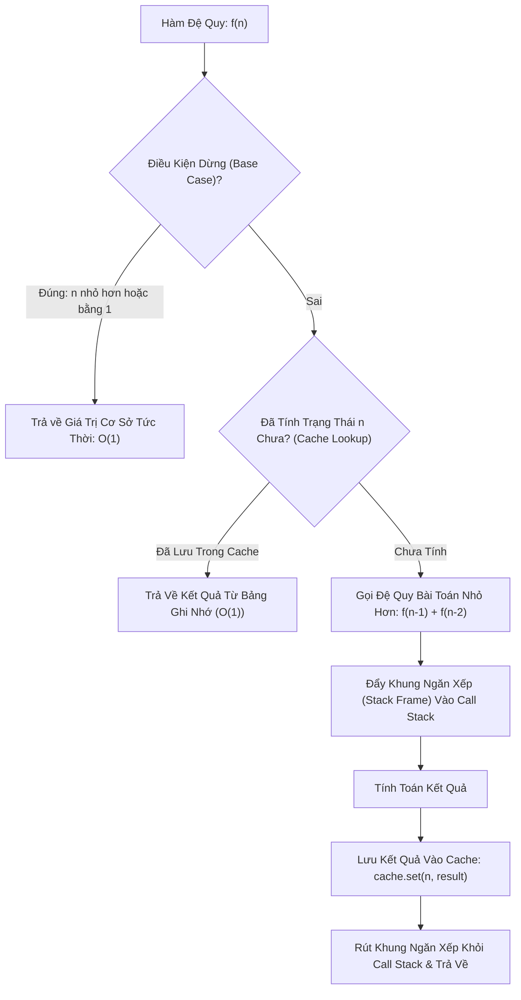

# 🔁 Đệ Quy & Ghi Nhớ (Recursion & Memoization)

> [[00 - Master Dashboard|🧭 Dashboard]] / [[Master MOC|🗺️ Master MOC]] / [[Roadmap|📋 Roadmap]]

---

## 1. Bản Đồ Khái Niệm (Mermaid DAG)



---

## 2. Chân Lý Vô Điều Kiện (First Principles)

> [!NOTE] Tiên Đề Khung Ngăn Xếp (Call Stack Frame) & Bài Toán Con Chồng Chéo
> **Mọi lời gọi hàm trong kiến trúc phần cứng Von Neumann đều tiêu tốn một vùng nhớ Stack Frame trên RAM để lưu trữ địa chỉ trả về (Return Address), biến cục bộ và tham số.**
>
> 1. **Hiểm họa tràn ngăn xếp (Stack Overflow):** Nếu thiếu **Base Case** hoặc độ sâu đệ quy vượt quá giới hạn cấp phát của Thread Stack (thường từ $1\text{MB}$ đến $8\text{MB}$ trên Linux, hoặc $\approx 10.000$ frames trong V8 JavaScript Engine), tiến trình sẽ bị hệ điều hành bắn tín hiệu `SIGSEGV` kết liễu ngay lập tức.
> 2. **Bùng nổ cấp số nhân do trùng lặp:** Trong các bài toán đệ quy nhánh (như Fibonacci), cùng một trạng thái $f(k)$ bị tính toán lặp lại vô số lần $\to$ hình thành cây đệ quy có độ sâu $n$ với tổng số nút là $2^n - 1 \implies O(2^n)$.
> 3. **Tiên đề Memoization:** Biến đổi cây đệ quy từ cấu trúc Cây Mũ (Exponential Tree) thành Đồ Thị Vô Hướng Một Chiều (Linear DAG) bằng cách ghi nhận kết quả ngay lần đầu tính toán $\implies$ Hạ độ phức tạp từ $O(2^n)$ xuống **$\Theta(n)$**.

---

## 3. Trực Giác Motivated Discovery

> [!TIP] Động Lực 3Blue1Brown: Câu Chuyện Người Thư Ký Lười Biếng
> Bạn là người chấm thi, có 100 bài thi cần tính điểm trung bình:
>
> - **Cách đệ quy ngây thơ:** Để biết điểm bài 100, bạn hỏi điểm bài 99 và 98. Người tính bài 99 lại chạy đi hỏi bài 98 và 97. Cả phòng thi chạy qua chạy lại hỏi nhau những câu hỏi giống hệt nhau hàng triệu lần. Đến tối mịt vẫn chưa ai có kết quả!
> - **Cách Ghi Nhớ (Memoization):** Bạn đặt một **cuốn sổ tay (Lookup Table)** ở cửa. Bất kỳ ai tính xong điểm của bài nào, lập tức ghi điểm đó vào cuốn sổ. Người tiếp theo cần điểm chỉ việc ngó vào sổ tay mất đúng 1 giây ($O(1)$) thay vì tính lại từ đầu!

---

## 4. Phân Tích Kỹ Thuật & Đa Miền Hệ Thống

### Bảng So Sánh 3 Cấp Độ Triển Khai

| Chiến Lược | Thời Gian (Time) | Không Gian RAM (Space) | Rủi Ro Vận Hành |
| :--- | :--- | :--- | :--- |
| **1. Đệ quy thuần (Naive Recursion)** | ☠️ [[O(2^n) - Exponential Time\|$O(2^n)$]] | [[O(n) - Linear Time\|$O(n)$]] (Call Stack) | Chết máy khi $n \ge 45$ |
| **2. Đệ quy có Memoization (Top-Down DP)** | 🟢 [[O(n) - Linear Time\|$O(n)$]] | [[O(n) - Linear Time\|$O(n)$]] (Stack + Cache) | Tràn Call Stack nếu $n > 10.000$ |
| **3. Quy hoạch động lặp (Bottom-Up DP)** | 🟢 [[O(n) - Linear Time\|$O(n)$]] | 🟢 [[O(1) - Constant Time\|$O(1)$]] (2 biến số) | Tối ưu tuyệt đối, không rủi ro Stack |

### 🌐 Ứng Dụng Trong Hệ Thống & DevOps
- **Linux Kernel & Process Stack:** Mỗi thread của hệ điều hành có một Stack kích thước cố định (`ulimit -s` mặc định $8192\text{KB}$). Đệ quy quá sâu gây ra lỗi `Stack Overflow (SIGSEGV)`.
- **Tail Call Optimization (TCO):** Một số compiler tối ưu các hàm đệ quy đuôi (lời gọi hàm đệ quy là thao tác cuối cùng) thành vòng lặp `while` để tái sử dụng Stack Frame hiện tại, biến đệ quy thành $O(1)$ Space.

---

## 5. Cài Đặt Chuẩn Mực (TypeScript)

### 1. Đệ quy thuần (Naive - $O(2^n)$)
```typescript
export function fibNaive(n: number): number {
  if (n <= 1) return n; // Base case
  return fibNaive(n - 1) + fibNaive(n - 2); // Bùng nổ 2^n
}
```

### 2. Đệ quy có Memoization (Top-Down DP - $O(n)$ Time, $O(n)$ Space)
```typescript
export function fibMemo(n: number, memo: Map<number, number> = new Map()): number {
  if (n <= 1) return n; // Base case

  // 1. Kiểm tra cache trong O(1)
  if (memo.has(n)) {
    return memo.get(n)!;
  }

  // 2. Tính toán và lưu ngay vào cache
  const result = fibMemo(n - 1, memo) + fibMemo(n - 2, memo);
  memo.set(n, result);

  return result;
}
```

### 3. Quy hoạch động lặp khử đệ quy (Bottom-Up Tabulation - $O(n)$ Time, $O(1)$ Space)
```typescript
export function fibBottomUp(n: number): number {
  if (n <= 1) return n;

  let prev2 = 0; // f(i-2)
  let prev1 = 1; // f(i-1)
  let current = 0;

  for (let i = 2; i <= n; i++) {
    current = prev1 + prev2;
    prev2 = prev1;
    prev1 = current;
  }

  return current;
}
```

---

## 🧠 Thẻ Ghi Nhớ Nhanh (Spaced Repetition)

Hai điều kiện bắt buộc để áp dụng kỹ thuật Memoization là gì? #card
?
1. **Bài toán con gối nhau (Overlapping Subproblems):** Cùng một bài toán con được gọi lại nhiều lần trong quá trình tính toán.
2. **Cấu trúc con tối ưu (Optimal Substructure):** Lời giải tối ưu của bài toán lớn được ghép thành từ lời giải tối ưu của các bài toán con.

Sự khác biệt cốt lõi giữa Top-Down DP (Memoization) và Bottom-Up DP (Tabulation) là gì? #card
?
- **Top-Down (Memoization):** Đi từ bài toán lớn xuống các bài toán con bằng đệ quy, lưu kết quả trên đường về; tốn bộ nhớ Call Stack ($O(n)$).
- **Bottom-Up (Tabulation):** Đi từ các bài toán con nhỏ nhất (`base case`) lên bài toán lớn bằng vòng lặp, có thể tối ưu không gian bộ nhớ về $O(1)$ và loại bỏ hoàn toàn rủi ro Stack Overflow.
