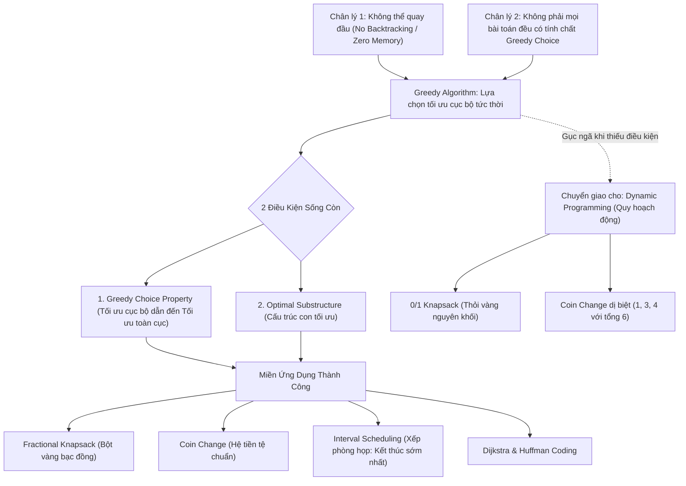

# 🪙 Thuật Toán Tham Lam (Greedy Algorithm)

> [[00 - Master Dashboard|🧭 Dashboard]] / [[Master MOC|🗺️ Master MOC]] / [[Roadmap|📋 Roadmap]] / [[Recursion & Memoization|🔁 Recursion & DP]]

---

## 🗺️ 1. Sơ Đồ Mermaid DAG (Alvar Knowledge Graph)



---

## ⚖️ 2. Chân Lý Vô Điều Kiện (Unconditional Truths)

> [!NOTE]
>
> 1. **Bản chất thiển cận và một chiều (No Backtracking):** Thuật toán Tham lam đưa ra quyết định dựa duy nhất vào **lợi ích lớn nhất ngay tại thời điểm hiện tại**, tuyệt đối không quay đầu sửa sai (`no backtracking`) và không xem xét viễn cảnh tương lai.
> 2. **Điều kiện tối ưu toàn cục:** Quyết định tham lam **chỉ** đảm bảo tìm được nghiệm tối ưu toàn cục khi và chỉ khi bài toán thỏa mãn đồng thời:
>    - **Tính chất lựa chọn tham lam (Greedy Choice Property):** Quyết định tối ưu cục bộ ở mỗi bước luôn nằm trong một lời giải tối ưu toàn cục.
>    - **Cấu trúc con tối ưu (Optimal Substructure):** Lời giải tối ưu của bài toán lớn được ghép nối từ lời giải tối ưu của các bài toán con sau khi đã thực hiện bước tham lam.

---

## 💡 3. Trực Giác Motivated Discovery (Tư Duy 3Blue1Brown)

> [!TIP]
> **Nghịch lý: Tại sao "tầm nhìn ngắn hạn" lại tạo ra thành công tuyệt đối?**
>
> Trong đời sống, tầm nhìn ngắn hạn thường dẫn đến thất bại. Nhưng trong Khoa học Máy tính, nếu bài toán có cấu trúc hình học hoặc đại số đặc biệt (như Matroid hay Greedy Choice Property), **việc chộp lấy cái lợi trước mắt lại là con đường ngắn nhất dẫn đến đỉnh vinh quang**:
>
> - **Khi bạn thối tiền 68 đồng** (hệ mệnh giá: 50, 20, 10, 5, 2, 1): Bộ não bạn tự động vồ lấy đồng to nhất không vượt quá 68 $\to$ Đồng 50 (còn 18) $\to$ Đồng 10 (còn 8) $\to$ Đồng 5 (còn 3) $\to$ Đồng 2 (còn 1) $\to$ Đồng 1. Kết quả: Đúng 5 đồng xu, hoàn hảo và chớp nhoáng!
> - **Khi luật chơi thay đổi (Hệ dị biệt: 1, 3, 4 thối 6 đồng):**
>   - _Tham lam hành động:_ Vồ ngay đồng 4 $\to$ còn 2 $\to$ lấy hai đồng 1 $\to$ Tổng **3 đồng xu** ($4 + 1 + 1$).
>   - _Thực tế tối ưu:_ Lấy hai đồng 3 $\to$ Tổng chỉ **2 đồng xu** ($3 + 3$).
>   - _Bài học:_ Khi không thể chứng minh tính chất lựa chọn tham lam, sự thiển cận sẽ biến thành cái bẫy chết người!

---

## 🔬 4. Phân Tích Kỹ Thuật & Các Tình Huống Thực Chiến

### 4.1. Ba Lô Phân Số (Fractional Knapsack) vs Ba Lô 0/1 (0/1 Knapsack)

| Tiêu Chí               | Fractional Knapsack (Bột vàng)                                   | 0/1 Knapsack (Thỏi vàng nguyên khối)                           |
| :--------------------- | :--------------------------------------------------------------- | :------------------------------------------------------------- | --------------------- |
| **Bản chất vật phẩm**  | Dạng bột, chất lỏng $\to$ **Có thể bẻ vụn, chia nhỏ**            | Dạng khối cứng $\to$ **Hoặc lấy toàn bộ, hoặc không lấy gì**   |
| **Tiêu chí tham lam**  | Tỷ suất lợi nhuận: $\rho_i = \frac{v_i}{w_i}$ (Value per Weight) | Lấy $\rho_i$ cao nhất trước                                    |
| **Kết quả giải thuật** | 🟢 **Greedy TỐI ƯU TUYỆT ĐỐI**                                   | ❌ **Greedy THẤT BẠI** (tạo ra khoảng trống lỡ cỡ trong ba lô) |
| **Cách giải quyết**    | Tham lam theo tỷ suất $\rho_i$ giảm dần                          | Bắt buộc dùng [[Recursion & Memoization                        | Quy hoạch động (DP)]] |
| **Độ phức tạp**        | $O(N \log N)$ (chỉ tốn bước sắp xếp tỷ suất)                     | $O(N \times W)$ (tốn bảng quy hoạch động)                      |

### 4.2. Xếp Lịch Sự Kiện / Phòng Họp (Interval Scheduling)

- **Bài toán:** Cho một phòng họp duy nhất và $N$ cuộc họp với thời gian $[start_i, end_i]$. Làm sao tổ chức được **nhiều cuộc họp nhất**?
- **Tiêu chí tham lam đúng:**
  - ❌ _Sai lầm 1:_ Chọn cuộc họp ngắn nhất $\to$ Dễ rơi vào giữa hai cuộc họp dài, chặn cả hai.
  - ❌ _Sai lầm 2:_ Chọn cuộc họp bắt đầu sớm nhất $\to$ Một cuộc họp kéo dài từ sáng đến tối sẽ chiếm trọn phòng.
  - 🟢 **Chân lý Tham lam:** Luôn chọn cuộc họp có **thời gian kết thúc sớm nhất ($end_i$ nhỏ nhất)**!
  - _Chứng minh trực giác:_ Kết thúc càng sớm $\to$ Phòng họp được giải phóng càng nhanh $\to$ Dành tối đa không gian thời gian cho các cuộc họp phía sau.

### 4.3. Các Trụ Cột Công Nghệ Tỷ Đô Dựa Trên Greedy

1. **Google Maps / Định tuyến GPS ([[Binary Heap & Priority Queue|Dijkstra's Algorithm]]):**
   - Tại mỗi bước, thuật toán luôn "tham lam" chọn đỉnh chưa thăm có khoảng cách ngắn nhất tính từ điểm gốc.
2. **Nén File Zip / Rar ([[Trie (Prefix Tree)|Huffman Coding]]):**
   - Luôn "tham lam" gộp 2 ký tự có tần suất xuất hiện ít nhất lại với nhau, đẩy chúng xuống đáy cây nhị phân để các ký tự xuất hiện nhiều nhất nhận mã bit ngắn nhất.

---

## ⚖️ 5. Ma Trận Đánh Đổi: Greedy Algorithm vs Dynamic Programming (DP)

```
                            BÀI TOÁN TỐI ƯU HÓA
                                     │
                 Có thỏa mãn Greedy Choice Property không?
                                ┌────┴────┐
                               CÓ        KHÔNG
                                │           │
                                ▼           ▼
                        GREEDY ALGORITHM   DYNAMIC PROGRAMMING
```

| Đặc Trưng                    | Thuật Toán Tham Lam (Greedy)                                   | Quy Hoạch Động (Dynamic Programming)                       |
| :--------------------------- | :------------------------------------------------------------- | :--------------------------------------------------------- |
| **Tư duy tiếp cận**          | Đi một lèo từ đầu đến cuối, không ngoái lại                    | Chia để trị, lưu vết toàn bộ bài toán con                  |
| **Tốc độ (Time Complexity)** | ⚡ Siêu nhanh (thường là $O(N)$ hoặc $O(N \log N)$ do sắp xếp) | 🐢 Chậm hơn (thường là $O(N^2), O(N \times W)$)            |
| **Bộ nhớ phụ (Space)**       | 🟢 Tối thiểu ($O(1)$ hoặc $O(N)$)                              | 🔴 Tốn kém ($O(N)$ hoặc $O(N \times W)$ cho bảng DP Table) |
| **Độ an toàn**               | ⚠️ Nguy hiểm (dễ ra nghiệm cục bộ sai nếu thiếu chứng minh)    | 🛡️ Đảm bảo 100% tìm ra nghiệm tối ưu toàn cục              |

---

## 💻 6. Code Mẫu Chuẩn: Interval Scheduling (TypeScript)

```typescript
interface Interval {
  start: number;
  end: number;
}

/**
 * Thuật toán Tham lam chọn số lượng cuộc họp tối đa không trùng nhau.
 * Tiêu chí Greedy: Luôn chọn cuộc họp kết thúc sớm nhất.
 *
 * Time Complexity: O(N log N) do bước Sort theo end time
 * Space Complexity: O(1) nếu sort in-place (hoặc O(N) bộ nhớ kết quả)
 */
function maxEvents(intervals: Interval[]): Interval[] {
  if (intervals.length === 0) return [];

  // Bước 1: Sắp xếp các cuộc họp theo thời gian KẾT THÚC tăng dần
  intervals.sort((a, b) => a.end - b.end);

  const schedule: Interval[] = [];
  let lastEndTime = -Infinity;

  // Bước 2: Quét tham lam
  for (const meeting of intervals) {
    // Nếu cuộc họp bắt đầu sau hoặc đúng thời điểm cuộc họp trước kết thúc
    if (meeting.start >= lastEndTime) {
      schedule.push(meeting);
      lastEndTime = meeting.end; // Khóa phòng đến thời điểm này
    }
  }

  return schedule;
}

// Test case
const meetings: Interval[] = [
  { start: 1, end: 4 },
  { start: 3, end: 5 },
  { start: 0, end: 6 },
  { start: 5, end: 7 },
  { start: 3, end: 9 },
  { start: 5, end: 9 },
  { start: 6, end: 10 },
  { start: 8, end: 11 },
];

console.log(maxEvents(meetings));
// Kết quả: [ { start: 1, end: 4 }, { start: 5, end: 7 }, { start: 8, end: 11 } ] (3 cuộc họp)
```

---

## 🧠 7. Thẻ Ghi Nhớ Nhanh (Spaced Repetition)

Hai điều kiện bắt buộc để một bài toán giải được tối ưu bằng Thuật toán Tham Lam (Greedy) là gì? #card
?

1. **Tính chất lựa chọn tham lam (Greedy Choice Property):** Lựa chọn tối ưu cục bộ ở bước hiện tại dẫn tới giải pháp tối ưu toàn cục.
2. **Cấu trúc con tối ưu (Optimal Substructure):** Nghiệm tối ưu của bài toán lớn chứa nghiệm tối ưu của các bài toán con sau khi thực hiện bước tham lam.

Tại sao bài toán Fractional Knapsack giải được bằng Greedy còn 0/1 Knapsack lại thất bại? #card
?

- **Fractional Knapsack:** Các món hàng có thể bẻ vụn/chia nhỏ, nên luôn nhồi được 100% dung lượng ba lô theo tỷ suất lợi nhuận cao nhất ($\frac{\text{value}}{\text{weight}}$).
- **0/1 Knapsack:** Vật phẩm nguyên khối không thể chia cắt. Chọn món có tỷ suất cao nhất có thể gây thừa một khoảng trống lỡ cỡ không thể lấp đầy, dẫn tới tổng giá trị thấp hơn cách phối hợp các vật phẩm nhỏ hơn. Do đó bắt buộc dùng Quy hoạch động (DP).

Trong bài toán xếp lịch sự kiện (Interval Scheduling), tiêu chí tham lam nào luôn dẫn đến số lượng sự kiện tối đa? #card
?
**Luôn chọn sự kiện có thời gian KẾT THÚC sớm nhất (Earliest Finish Time).** Điều này giúp giải phóng tài nguyên sớm nhất có thể, để lại khoảng trống lớn nhất cho các sự kiện tiếp theo.
