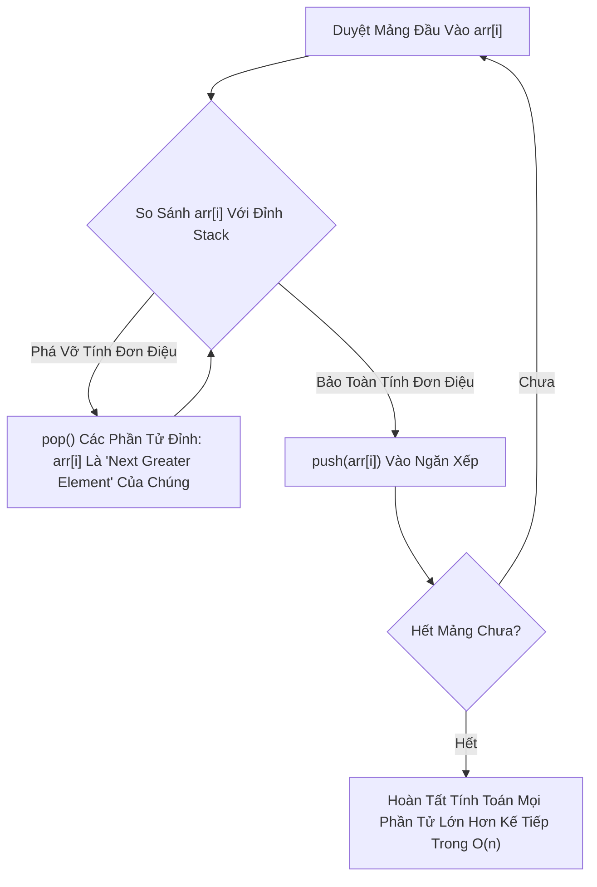

# 🏔️ Kỹ Thuật Ngăn Xếp Đơn Điệu (Monotonic Stack Pattern)

> [[00 - Master Dashboard|🧭 Dashboard]] / [[Master MOC|🗺️ Master MOC]] / [[Roadmap|📋 Roadmap]]

---

## 1. Bản Đồ Khái Niệm (Mermaid DAG)



---

## 2. Chân Lý Vô Điều Kiện (First Principles)

> [!NOTE] Tiên Đề Bất Biến & Độ Phức Tạp Khấu Hao
> **Mỗi phần tử trong mảng chỉ được đưa vào (push) đúng 1 lần và lấy ra (pop) tối đa đúng 1 lần khỏi Stack $\implies$ Tổng thời gian chạy của thuật toán luôn là $O(n)$ tuyến tính tuyệt đối.**
>
> 1. **Ngăn xếp đơn điệu tăng (Monotonic Increasing Stack):** Các phần tử từ đáy lên đỉnh luôn tăng dần $\to$ dùng để tìm **Phần tử nhỏ hơn gần nhất (Next Smaller Element)**.
> 2. **Ngăn xếp đơn điệu giảm (Monotonic Decreasing Stack):** Các phần tử từ đáy lên đỉnh luôn giảm dần $\to$ dùng để tìm **Phần tử lớn hơn gần nhất (Next Greater Element)**.

---

## 3. Trực Giác Motivated Discovery

> [!TIP] Động Lực 3Blue1Brown: Đường Chân Trời Của Các Tòa Nhà Chọc Trời
> Hãy tưởng tượng bạn đứng nhìn dãy nhà phố cao tầng từ trái sang phải:
>
> Một tòa nhà cao chọc trời 80 tầng sẽ ngay lập tức **che khuất tầm nhìn** của tất cả những ngôi nhà cấp bốn 1-2 tầng nằm ngay phía trước nó. Các ngôi nhà thấp bé này từ nay về sau sẽ không bao giờ có thể trở thành "tòa nhà cao nhất kế tiếp" cho bất kỳ ai đứng ở xa hơn nữa!
>
> Do đó, khi gặp một phần tử lớn hơn, ta mạnh dạn **loại bỏ (pop)** toàn bộ các phần tử nhỏ hơn đang nằm ở đỉnh Stack, vì chúng đã tìm thấy "kẻ cao lớn hơn gần nhất" của đời mình.

---

## 4. Khuôn Mẫu Code Chuẩn (TypeScript - Next Greater Element)

```typescript
export function nextGreaterElements(nums: number[]): number[] {
  const n = nums.length;
  const result: number[] = new Array(n).fill(-1);
  const stack: number[] = []; // Lưu trữ chỉ số (indices) của các phần tử

  for (let i = 0; i < n; i++) {
    // Khi phần tử hiện tại lớn hơn phần tử ở đỉnh Stack:
    // Ta đã tìm thấy Next Greater Element cho đỉnh Stack!
    while (stack.length > 0 && nums[i] > nums[stack[stack.length - 1]]) {
      const topIndex = stack.pop()!;
      result[topIndex] = nums[i];
    }

    // Đẩy index hiện tại vào stack để duy trì tính đơn điệu giảm dần
    stack.push(i);
  }

  return result;
}
```

---

## 5. Danh Sách Bài Tập LeetCode Kinh Điển

| Bài Tập | Độ Khó | Dạng Áp Dụng |
| :--- | :--- | :--- |
| **LeetCode 739: Daily Temperatures** | 🟡 Medium | Tìm số ngày phải chờ để có nhiệt độ ấm hơn |
| **LeetCode 496: Next Greater Element I** | 🟢 Easy | Tìm phần tử lớn hơn đầu tiên bên phải |
| **LeetCode 84: Largest Rectangle in Histogram** | 🔴 Hard | Tìm ranh giới trái/phải nhỏ hơn của từng cột |

---

## 🧠 Thẻ Ghi Nhớ Nhanh (Spaced Repetition)

Dấu hiệu nhận biết bài toán cần dùng Monotonic Stack là gì? #card
?
Khi bài toán yêu cầu tìm **phần tử lớn hơn đầu tiên (Next Greater)** hoặc **nhỏ hơn đầu tiên (Next Smaller)** ở phía bên trái hoặc bên phải của từng vị trí trong mảng trong thời gian tối ưu $O(n)$ thay vì duyệt 2 vòng lặp $O(n^2)$.

Tại sao vòng lặp `while` lồng bên trong vòng lặp `for` của Monotonic Stack vẫn có độ phức tạp thời gian $O(n)$? #card
?
Vì mỗi phần tử của mảng được `push` vào Stack đúng 1 lần và bị `pop` ra khỏi Stack tối đa 1 lần trong suốt toàn bộ chương trình. Tổng số thao tác trên Stack tối đa là $2n \implies$ Phân tích khấu hao đạt $O(n)$.
