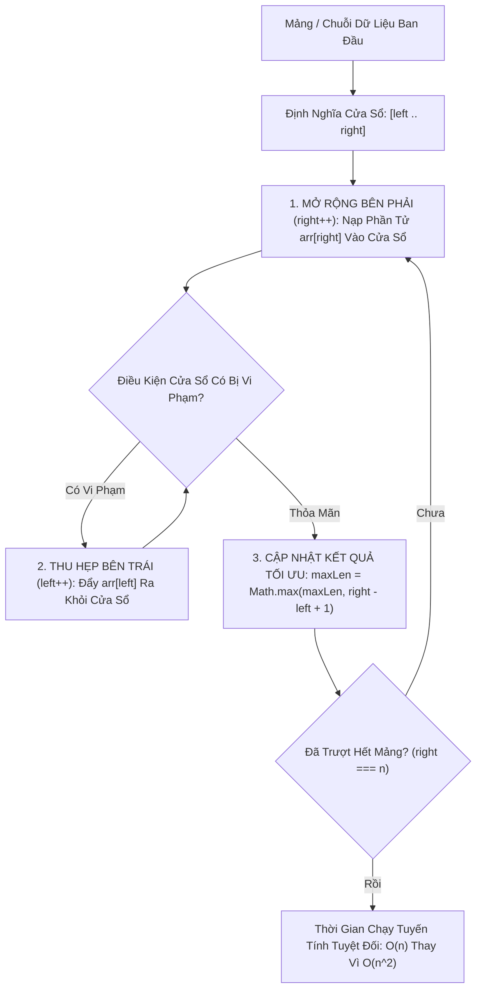

# 🪟 Kỹ Thuật Cửa Sổ Trượt (Sliding Window Pattern)

> [[00 - Master Dashboard|🧭 Dashboard]] / [[Master MOC|🗺️ Master MOC]] / [[Roadmap|📋 Roadmap]]

---

## 1. Bản Đồ Khái Niệm (Mermaid DAG)



---

## 2. Chân Lý Vô Điều Kiện (First Principles)

> [!NOTE] Tiên Đề Tính Toán Gia Tăng (Incremental Computation)
> **Khi cửa sổ dịch chuyển 1 bước, trạng thái mới luôn được tính toán trực tiếp từ trạng thái cũ trong thời gian hằng số $O(1)$ mà không cần duyệt lại các phần tử bên trong:**
> $$ \text{Sum}_{\text{new}} = \text{Sum}_{\text{old}} + \text{IncomingElement} - \text{OutgoingElement} $$
>
> 1. **Triệt tiêu lãng phí tính toán:** Thuật toán ngây thơ tính tổng từng cửa sổ kích thước $K$ tốn $O(N \cdot K)$ hoặc $O(N^2)$. Sliding Window hạ chi phí xuống đúng **$\Theta(N)$**.
> 2. **Phân tích khấu hao con trỏ:** Mỗi phần tử trong mảng chỉ được con trỏ `right` thêm vào đúng 1 lần và con trỏ `left` loại bỏ tối đa 1 lần $\implies$ Tổng số thao tác trên mảng tối đa là $2N = O(N)$.

---

## 3. Trực Giác Motivated Discovery

> [!TIP] Động Lực 3Blue1Brown: Khung Cửa Sổ Trên Toa Tàu
> Bạn ngồi bên cửa sổ một đoàn tàu đang chuyển bánh:
>
> Tầm mắt của bạn qua khung cửa sổ luôn bao quát một khoảng phong cảnh rộng 5 mét. Khi tàu chạy nhích lên 1 mét:
>
> Bạn không cần phải nhắm mắt lại rồi mở mắt ra vẽ lại toàn bộ khung cảnh 5 mét từ đầu! Bạn chỉ nhận thấy: **Một cái cây ở bên trái vừa trượt ra khỏi tầm nhìn (-1), và một ngọn núi ở bên phải vừa bước vào tầm nhìn (+1)**. Phần phong cảnh 4 mét ở giữa hoàn toàn giữ nguyên!

---

## 4. Phân Tích Kỹ Thuật & Đa Miền Hệ Thống

### Bảng Phân Biệt 2 Dạng Cửa Sổ Trượt

| Tiêu Chí | Cửa Sổ Kích Thước Cố Định (Fixed Window) | Cửa Sổ Kích Thước Động (Dynamic Window) |
| :--- | :--- | :--- |
| **Kích thước cửa sổ** | Luôn cố định bằng $K$ (`right - left + 1 === K`) | Co giãn linh hoạt tùy thuộc điều kiện đề bài |
| **Hành vi con trỏ** | `left` và `right` cùng tịnh tiến song song 1 bước | `right` mở rộng liên tục, `left` chỉ co lại khi vi phạm |
| **Bài toán điển hình** | Tìm tổng lớn nhất của $K$ phần tử liên tiếp | Tìm chuỗi con dài nhất không chứa ký tự trùng lặp |

### 🌐 Ứng Dụng Trong Giao Thức Mạng & Hệ Thống (Backend)
- **Kiểm Soát Luồng [[Backend-full-course/Part 1 - Core Foundations/01 - Computer Networks & Protocols/Core Transport & Routing/TCP - IP|TCP Flow Control]]:** TCP sử dụng cửa sổ trượt (Receive Window - `rwnd`) để điều tiết tốc độ truyền byte giữa máy gửi và máy nhận, đảm bảo máy gửi không bao giờ gửi nhanh hơn tốc độ máy nhận có thể đọc từ Socket Buffer (Xem thêm: [[Backend-full-course/Part 1 - Core Foundations/01 - Computer Networks & Protocols/Core Transport & Routing/QUIC|QUIC Flow Control]]).
- **Thuật Toán Rate Limiting:** API Gateway áp dụng **Sliding Window Counter** để giới hạn số lượt request/phút của người dùng chính xác theo thời gian thực mà không bị hiện tượng bùng nổ lưu lượng tại ranh giới phút như Fixed Window.

---

## 5. Cài Đặt Chuẩn Mực (TypeScript)

### 1. Dạng Cửa Sổ Cố Định (Fixed Size $K$): Max Sum Subarray of Size K

```typescript
export function maxSubarraySum(nums: number[], k: number): number {
  if (nums.length < k) return 0;

  let windowSum = 0;
  // 1. Tính tổng của cửa sổ đầu tiên
  for (let i = 0; i < k; i++) {
    windowSum += nums[i];
  }

  let maxSum = windowSum;

  // 2. Trượt cửa sổ từ vị trí k tới cuối mảng: O(1) mỗi bước
  for (let right = k; right < nums.length; right++) {
    windowSum += nums[right] - nums[right - k]; // + vào - ra
    maxSum = Math.max(maxSum, windowSum);
  }

  return maxSum;
}
```

### 2. Dạng Cửa Sổ Động: Chuỗi con dài nhất không trùng ký tự (LeetCode 3)

```typescript
export function lengthOfLongestSubstring(s: string): number {
  let left = 0;
  let maxLen = 0;
  const charIndexMap = new Map<string, number>();

  for (let right = 0; right < s.length; right++) {
    const char = s[right];

    // Nếu gặp ký tự trùng lặp nằm trong phạm vi cửa sổ hiện tại
    if (charIndexMap.has(char) && charIndexMap.get(char)! >= left) {
      // Nhảy thẳng con trỏ left qua vị trí trùng lặp cũ
      left = charIndexMap.get(char)! + 1;
    }

    charIndexMap.set(char, right);
    maxLen = Math.max(maxLen, right - left + 1);
  }

  return maxLen;
}
```

---

## 6. Danh Sách Bài Tập LeetCode Kinh Điển

| Bài Tập | Dạng Cửa Sổ | Độ Khó |
| :--- | :--- | :--- |
| **LeetCode 643: Maximum Average Subarray I** | Cố định ($K$) | 🟢 Easy |
| **LeetCode 3: Longest Substring Without Repeating Characters** | Động (Dynamic) | 🟡 Medium |
| **LeetCode 209: Minimum Size Subarray Sum** | Động (Tìm min length $\ge S$) | 🟡 Medium |
| **LeetCode 76: Minimum Window Substring** | Động (Cần khớp chuỗi ký tự) | 🔴 Hard |

---

## 🧠 Thẻ Ghi Nhớ Nhanh (Spaced Repetition)

Dấu hiệu nhận biết bài toán cần áp dụng Sliding Window là gì? #card
?
Khi bài toán yêu cầu tìm kiếm, đếm hoặc tính toán trên một **dãy con liên tiếp (Contiguous Subarray / Substring)** đạt giá trị lớn nhất, nhỏ nhất hoặc thỏa mãn một điều kiện số lượng.

Nguyên lý Tính toán gia tăng (Incremental Computation) giúp Sliding Window đạt $O(n)$ như thế nào? #card
?
Mỗi khi cửa sổ dịch chuyển sang phải 1 bước, tổng hoặc trạng thái mới được tính bằng công thức: `Trạng thái mới = Trạng thái cũ + Phần tử mới nạp vào - Phần tử cũ trượt ra`. Phép toán này chỉ tốn đúng $O(1)$ thay vì phải duyệt lại toàn bộ các phần tử trong cửa sổ.
