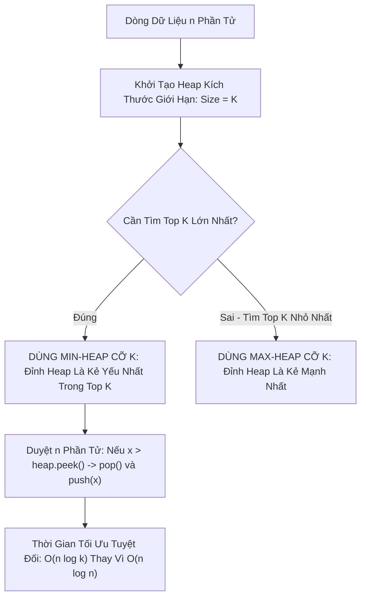

# 🏔️ K Phần Tử Hàng Đầu (Top K Elements Pattern)

> [[00 - Master Dashboard|🧭 Dashboard]] / [[Master MOC|🗺️ Master MOC]] / [[Roadmap|📋 Roadmap]]

---

## 1. Bản Đồ Khái Niệm (Mermaid DAG)



---

## 2. Chân Lý Vô Điều Kiện (First Principles)

> [!NOTE] Tiên Đề Đánh Đổi Big-O
> **Để tìm $K$ phần tử lớn nhất từ một tập hợp $N$ phần tử ($K \ll N$), ta không bao giờ sắp xếp toàn bộ mảng ($O(n \log n)$). Thay vào đó, ta duy trì một Min-Heap có kích thước cố định bằng $K$, đạt thời gian tối ưu $\Theta(n \log K)$.**
>
> 1. **Nghịch lý chọn loại Heap:**
>    - Tìm $K$ phần tử **LỚN NHẤT** $\to$ Bắt buộc dùng **MIN-HEAP** (để dễ dàng so sánh và vứt bỏ phần tử nhỏ nhất trong top).
>    - Tìm $K$ phần tử **NHỎ NHẤT** $\to$ Bắt buộc dùng **MAX-HEAP**.
> 2. **Tối ưu không gian:** Bộ nhớ phụ chỉ tiêu tốn đúng **$O(K)$** thay vì $O(N)$, rất phù hợp cho dòng dữ liệu vô tận (Streaming Data) như Log hay Clickstream.

---

## 3. Trực Giác Motivated Discovery

> [!TIP] Động Lực 3Blue1Brown: Sàng Tuyển Top 10 Thí Sinh
> Ban giám khảo cần chọn ra 10 thí sinh có điểm cao nhất từ 1 triệu người đăng ký:
>
> Ban giám khảo không cần chờ cả triệu người thi xong rồi mới xếp hạng. Họ mở một căn phòng chứa đúng **10 chiếc ghế**:
>
> - 10 người đầu tiên được vào ngồi. Thí sinh có điểm thấp nhất trong phòng (người giữ ghế số 10) được yêu cầu đứng ngay cạnh cửa ra vào (**Đỉnh Min-Heap**).
> - Khi thí sinh số 11 bước tới: Ban giám khảo chỉ cần so sánh điểm của người này với **người đứng ở cửa**. Nếu thí sinh 11 điểm cao hơn $\to$ người ở cửa bị mời ra ngoài, thí sinh 11 bước vào!
>
> Bằng cách này, bạn chỉ tốn $O(\log 10) \approx 3$ phép so sánh cho mỗi người, biến bài toán 1 triệu phép tính thành chớp mắt!

---

## 4. Khuôn Mẫu Code Chuẩn (TypeScript - Min-Heap Top K)

```typescript
// Min-Heap đơn giản để duy trì kích thước K
class MinHeap {
  private heap: number[] = [];

  push(val: number): void {
    this.heap.push(val);
    this.bubbleUp(this.heap.length - 1);
  }

  pop(): number | undefined {
    if (this.heap.length === 0) return undefined;
    const min = this.heap[0];
    const end = this.heap.pop()!;
    if (this.heap.length > 0) {
      this.heap[0] = end;
      this.sinkDown(0);
    }
    return min;
  }

  peek(): number {
    return this.heap[0];
  }
  get size(): number {
    return this.heap.length;
  }

  private bubbleUp(idx: number): void {
    while (idx > 0) {
      const parent = Math.floor((idx - 1) / 2);
      if (this.heap[idx] >= this.heap[parent]) break;
      [this.heap[idx], this.heap[parent]] = [this.heap[parent], this.heap[idx]];
      idx = parent;
    }
  }

  private sinkDown(idx: number): void {
    const len = this.heap.length;
    while (true) {
      let smallest = idx;
      const left = 2 * idx + 1;
      const right = 2 * idx + 2;
      if (left < len && this.heap[left] < this.heap[smallest]) smallest = left;
      if (right < len && this.heap[right] < this.heap[smallest])
        smallest = right;
      if (smallest === idx) break;
      [this.heap[idx], this.heap[smallest]] = [
        this.heap[smallest],
        this.heap[idx],
      ];
      idx = smallest;
    }
  }
}

export function findKthLargest(nums: number[], k: number): number {
  const minHeap = new MinHeap();

  for (const num of nums) {
    minHeap.push(num);
    // Nếu vượt quá K phần tử, loại bỏ phần tử nhỏ nhất hiện tại
    if (minHeap.size > k) {
      minHeap.pop();
    }
  }

  // Đỉnh Min-Heap chính là phần tử lớn thứ K
  return minHeap.peek();
}
```

---

## 5. Danh Sách Bài Tập LeetCode Kinh Điển

| Bài Tập                                           | Độ Khó    | Dạng Áp Dụng                               |
| :------------------------------------------------ | :-------- | :----------------------------------------- |
| **LeetCode 215: Kth Largest Element in an Array** | 🟡 Medium | Min-Heap kích thước K                      |
| **LeetCode 347: Top K Frequent Elements**         | 🟡 Medium | Kết hợp Hash Table đếm tần suất + Min-Heap |
| **LeetCode 973: K Closest Points to Origin**      | 🟡 Medium | Max-Heap tính khoảng cách Euclidean        |

---

## 🧠 Thẻ Ghi Nhớ Nhanh (Spaced Repetition)

Tại sao muốn tìm K phần tử LỚN NHẤT ta lại dùng MIN-HEAP thay vì Max-Heap? #card
?
Vì đỉnh của Min-Heap lưu phần tử nhỏ nhất trong số K phần tử được chọn (phần tử yếu nhất trong Top K). Khi gặp phần tử mới lớn hơn đỉnh này, ta dễ dàng loại bỏ phần tử yếu nhất đó trong $O(\log K)$ để nhường chỗ cho phần tử mới.

Độ phức tạp thời gian khi tìm K phần tử lớn nhất bằng Heap so với Sort toàn bộ mảng là gì? #card
?

- Dùng Sort toàn bộ mảng: $O(N \log N)$.
- Dùng Heap kích thước K: $O(N \log K)$. Khi $K \ll N$ (ví dụ tìm top 10 trong 1 triệu phần tử), $N \log K$ nhanh hơn gấp nhiều lần và chỉ tốn $O(K)$ bộ nhớ RAM phụ trợ.
