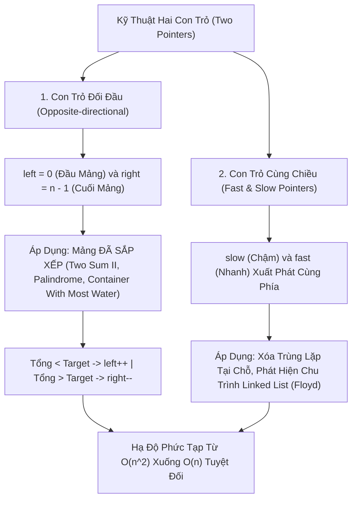

# 👥 Kỹ Thuật Hai Con Trỏ (Two Pointers Pattern)

> [[00 - Master Dashboard|🧭 Dashboard]] / [[Master MOC|🗺️ Master MOC]] / [[Roadmap|📋 Roadmap]]

---

## 1. Bản Đồ Khái Niệm (Mermaid DAG)



---

## 2. Chân Lý Vô Điều Kiện (First Principles)

> [!NOTE] Tiên Đề Thu Hẹp Không Gian Tìm Kiếm 2 Chiều
> **Kỹ thuật hai con trỏ đối đầu biến bài toán duyệt qua toàn bộ ma trận $N \times N$ cặp phần tử ($O(n^2)$) thành một đường đi chéo 1 chiều có độ dài tối đa đúng $N$ bước ($O(n)$):**
>
> - Khi mảng đã sắp xếp tăng dần: Nếu `arr[left] + arr[right] > target`, thì do `arr[right]` là phần tử lớn nhất hiện tại, **mọi cặp** giữa `arr[right]` với các phần tử lớn hơn `arr[left]` chắc chắn cũng sẽ lớn hơn target.
> - $\implies$ Ta an tâm loại bỏ vĩnh viễn phần tử `arr[right]` khỏi xét duyệt (`right--`) mà **chắc chắn không bao giờ bỏ sót bất kỳ đáp án tối ưu nào**.

---

## 3. Trực Giác Motivated Discovery

> [!TIP] Động Lực 3Blue1Brown: Hai Người Đi Tìm Nhau Trên Cầu Hẹp
> Hai người bạn hẹn gặp nhau trên một cây cầu dài 100 mét:
>
> - **Cách ngây thơ ($O(n^2)$):** Người A đứng yên ở đầu cầu, người B chạy từ đầu đến cuối cầu rồi quay lại. Người A nhích 1 bước, người B lại chạy hết cây cầu một lần nữa... Cực kỳ kiệt sức và lãng phí!
> - **Cách hai con trỏ ($O(n)$):** Người A xuất phát từ đầu cầu bên trái, người B xuất phát từ đầu cầu bên phải. Hai người đi ngược chiều nhau tiến vào giữa. Khi gặp nhau, cả hai người gộp lại chỉ đi đúng chiều dài 1 cây cầu (100 mét)!

---

## 4. Khuôn Mẫu Code Chuẩn (TypeScript)

### 1. Dạng Con Trỏ Đối Đầu: Two Sum II (Mảng Đã Sắp Xếp)

```typescript
export function twoSumSorted(numbers: number[], target: number): [number, number] | null {
  let left = 0;
  let right = numbers.length - 1;

  while (left < right) {
    const sum = numbers[left] + numbers[right];

    if (sum === target) {
      return [left, right]; // Tìm thấy cặp chỉ số
    } else if (sum < target) {
      left++; // Cần tổng lớn hơn -> Tăng con trỏ trái
    } else {
      right--; // Cần tổng nhỏ hơn -> Giảm con trỏ phải
    }
  }

  return null; // Không tồn tại
}
```

### 2. Dạng Con Trỏ Nhanh & Chậm: Xóa Trùng Lặp Trên Mảng Đã Sắp Xếp

```typescript
export function removeDuplicates(nums: number[]): number {
  if (nums.length === 0) return 0;

  let slow = 0; // Ghi nhận vị trí phần tử duy nhất cuối cùng

  for (let fast = 1; fast < nums.length; fast++) {
    // Nếu phát hiện phần tử mới khác phần tử tại slow
    if (nums[fast] !== nums[slow]) {
      slow++;
      nums[slow] = nums[fast]; // Ghi đè tại chỗ
    }
  }

  return slow + 1; // Số lượng phần tử duy nhất
}
```

---

## 5. Danh Sách Bài Tập LeetCode Kinh Điển

| Bài Tập | Dạng Con Trỏ | Mục Tiêu Tối Ưu |
| :--- | :--- | :--- |
| **LeetCode 167: Two Sum II** | Đối đầu (`left`, `right`) | $O(n^2) \to O(n)$ thời gian, $O(1)$ bộ nhớ |
| **LeetCode 125: Valid Palindrome** | Đối đầu (`left`, `right`) | Kiểm tra chuỗi đối xứng từ 2 đầu |
| **LeetCode 11: Container With Most Water** | Đối đầu (`left`, `right`) | Thu hẹp cột có chiều cao thấp hơn |
| **LeetCode 26: Remove Duplicates** | Cùng chiều (`slow`, `fast`) | Xóa trùng lặp tại chỗ trong $O(1)$ Space |
| **LeetCode 141: Linked List Cycle** | Rùa và Thỏ (Tortoise & Hare) | Phát hiện chu trình với $O(1)$ bộ nhớ |

---

## 🧠 Thẻ Ghi Nhớ Nhanh (Spaced Repetition)

Điều kiện tiên quyết để áp dụng kỹ thuật hai con trỏ đối đầu cho bài toán tìm cặp tổng (Two Sum) là gì? #card
?
Mảng bắt buộc phải được **sắp xếp theo thứ tự tăng dần (hoặc giảm dần)**. Tính đơn điệu này cho phép ta đưa ra quyết định chắc chắn: khi tổng nhỏ hơn mục tiêu thì phải tăng con trỏ `left`, khi tổng lớn hơn mục tiêu thì phải giảm con trỏ `right`.

Thuật toán "Rùa và Thỏ" (Floyd's Cycle-Finding Algorithm) hoạt động như thế nào trên Linked List? #card
?
Sử dụng hai con trỏ xuất phát từ `head`: con trỏ Chậm (`slow`) bước 1 nút mỗi lần, con trỏ Nhanh (`fast`) bước 2 nút mỗi lần. Nếu danh sách có chu trình khép kín, con trỏ Nhanh chắc chắn sẽ bắt kịp và trùng vị trí với con trỏ Chậm (`slow === fast`) sau tối đa $O(n)$ bước.
