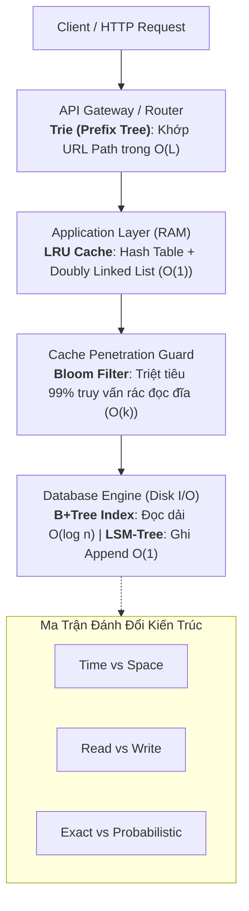

# 🏛️ Ma Trận Đánh Đổi & Quyết Định Thiết Kế Hệ Thống (System Trade-offs)

> [[00 - Master Dashboard|🧭 Dashboard]] / [[Master MOC|🗺️ Master MOC]] / [[Roadmap|📋 Roadmap]]

---

## 1. Bản Đồ Khái Niệm (Mermaid DAG)



---

## 2. Chân Lý Vô Điều Kiện (First Principles)

> [!NOTE] Tiên Đề Không Có Bữa Trưa Miễn Phí (No Free Lunch) Trong Kiến Trúc Hệ Thống
> **Không tồn tại bất kỳ cấu trúc dữ liệu hoặc thuật toán nào tối ưu tuyệt đối trên mọi chiều không gian, thời gian và thông lượng:**
>
> 1. **Định luật bảo toàn độ phức tạp:** Để tăng tốc độ ở một chiều (ví dụ: đưa thời gian tra cứu về $O(1)$), hệ thống bắt buộc phải trả giá bằng tài nguyên ở một chiều khác (tiêu tốn thêm $O(n)$ RAM hoặc làm chậm tốc độ ghi do phải cập nhật chỉ mục).
> 2. **Sự phù hợp bối cảnh (Context is King):** Một giải pháp "tồi" trong bối cảnh này ($O(n)$ Linear Scan) lại là giải pháp tối ưu số 1 trong bối cảnh khác (duyệt mảng nhỏ $N \le 16$ tận dụng CPU Cache Prefetching).

---

## 3. Trực Giác Motivated Discovery

> [!TIP] Động Lực 3Blue1Brown: Chọn Phương Tiện Đi Lại
> Bạn muốn chọn một phương tiện giao thông hoàn hảo nhất:
>
> - **Máy bay ($O(1)$ siêu tốc):** Bay xuyên lục địa chỉ mất vài giờ, nhưng chi phí nhiên liệu khổng lồ (ngốn RAM) và không thể hạ cánh xuống đầu ngõ nhà bạn.
> - **Xe máy ($O(n)$ cơ động):** Đi chậm hơn máy bay, nhưng luồn lách vào từng ngõ ngách, chi phí cực rẻ và đậu ở bất kỳ đâu ($O(1)$ Space).
> - **Tàu hỏa ($O(n \log n)$ ổn định):** Chở được hàng ngàn tấn hàng hóa an toàn trong mọi thời tiết xấu (Merge Sort ổn định), nhưng cần đường ray riêng biệt ($O(n)$ bộ nhớ phụ).
>
> Không ai lái máy bay đi chợ mua bó rau, và cũng không ai chạy xe máy đi vòng quanh trái đất. Thiết kế hệ thống là chọn đúng phương tiện cho đúng hành trình.

---

## 4. Bảng Ma Trận Đánh Đổi Cốt Lõi (Core Trade-off Matrix)

| Chiều Đánh Đổi | Lựa Chọn A (Tối ưu khía cạnh này) | Lựa Chọn B (Tối ưu khía cạnh kia) | Bối Cảnh Thực Tế |
| :--- | :--- | :--- | :--- |
| **Thời Gian vs Bộ Nhớ (Time vs Space)** | Dùng [[Hash Table & HashSet\|Hash Table]] ($O(1)$ Time) $\to$ Tốn thêm $O(n)$ RAM | Dùng In-place [[Two Pointers Pattern\|Two Pointers]] ($O(1)$ Space) $\to$ Tốn công sort $O(n \log n)$ | Hệ thống nhúng (Embedded) chọn B; Máy chủ Cloud chọn A. |
| **Đọc Nhanh vs Ghi Nhanh (Read vs Write)** | Dùng [[Array & Dynamic Array\|Array]] / B+Tree Index $\to$ Đọc siêu tốc $O(\log n)$, ghi chậm do re-index | Dùng [[Linked List]] / LSM-Tree $\to$ Ghi chớp nhoáng $O(1)$ Append-only, đọc chậm do phải merge | SQL OLAP chọn A; CSDL Time-series / Log (Cassandra, ClickHouse) chọn B. |
| **Chính Xác vs Tiết Kiệm (Exact vs Probabilistic)** | Dùng `HashSet` lưu chuỗi đầy đủ $\to$ Chính xác $100\%$, ngốn hàng chục GB RAM | Dùng [[Bloom Filter]] $\to$ Tốn vài chục MB RAM, chấp nhận $1\%$ sai số dương tính giả | Lọc URL độc hại, ngăn Cache Penetration chọn B. |
| **In-place vs Ổn Định (Stability vs Space)** | Dùng [[Quick Sort]] $\to$ In-place $O(\log n)$ Space, nhưng Unstable | Dùng [[Merge Sort]] $\to$ Luôn $O(n \log n)$ và Stable, nhưng tốn $O(n)$ RAM phụ | Sắp xếp dữ liệu RAM chọn A; Sắp xếp danh sách tài chính chọn B. |

---

## 5. Minh Họa Mã Nguồn (TypeScript)

Mô phỏng sự đánh đổi giữa Hash Table ($O(1)$ Lookup, tốn RAM) vs Sorted Array ($O(\log n)$ Lookup, $0$ RAM phụ):

```typescript
// LỰA CHỌN A: Ưu tiên Tốc độ - Dùng Hash Map (O(1) Time, O(n) RAM phụ)
export class FastLookupStore {
  private map = new Map<number, string>();

  insert(id: number, data: string): void {
    this.map.set(id, data);
  }

  find(id: number): string | undefined {
    return this.map.get(id); // O(1) Time
  }
}

// LỰA CHỌN B: Ưu tiên Bộ nhớ - Dùng Mảng Sắp Xếp (O(log n) Time, O(1) RAM phụ)
export class MemoryEfficientStore {
  private keys: number[] = [];
  private values: string[] = [];

  insert(id: number, data: string): void {
    // Chèn giữ mảng luôn sắp xếp
    let i = this.keys.length - 1;
    while (i >= 0 && this.keys[i] > id) {
      this.keys[i + 1] = this.keys[i];
      this.values[i + 1] = this.values[i];
      i--;
    }
    this.keys[i + 1] = id;
    this.values[i + 1] = data;
  }

  find(id: number): string | undefined {
    // Binary Search O(log n) không tốn thêm 1 byte RAM phụ nào
    let low = 0, high = this.keys.length - 1;
    while (low <= high) {
      const mid = low + Math.floor((high - low) / 2);
      if (this.keys[mid] === id) return this.values[mid];
      if (this.keys[mid] < id) low = mid + 1;
      else high = mid - 1;
    }
    return undefined;
  }
}
```

---

## 🧠 Thẻ Ghi Nhớ Nhanh (Spaced Repetition)

Nguyên lý "No Free Lunch" trong thiết kế hệ thống phần mềm phát biểu điều gì? #card
?
Không có một cấu trúc dữ liệu hay thuật toán nào hoàn hảo ở mọi khía cạnh. Mọi sự gia tăng về tốc độ thực thi (Time) đều phải trả giá bằng dung lượng bộ nhớ (Space), tính phức tạp khi ghi dữ liệu (Write Overhead), hoặc sự đánh đổi về tính nhất quán (Consistency).

Tại sao các hệ quản trị CSDL ghi nhiều (Write-heavy như Cassandra) lại chọn LSM-Tree thay vì B+Tree? #card
?
Vì B+Tree ghi ngẫu nhiên (Random Write) xuống đĩa tốn chi phí tìm kiếm và phân tách trang (Page Split), trong khi LSM-Tree chuyển toàn bộ thao tác ghi thành ghi tuần tự liên tục (Append-only) vào MemTable và SSTable trong $O(1)$, đánh đổi việc đọc phải quét qua nhiều tầng dữ liệu.
