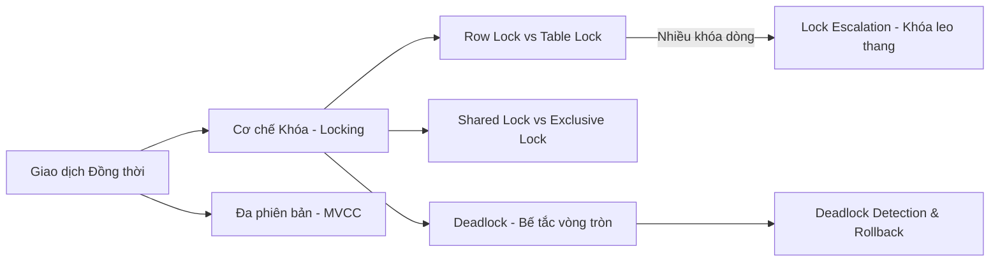

# 🔒 Hub Quản trị Đồng thời & Khóa Tranh chấp (Concurrency & Lock)

⬅️ **[[MOC - Database Overview]]** | 🔗 **Các Hub liên quan:** [[MOC - Query Optimization]], [[MOC - Storage & Engine]]

---

## 🎯 Mục tiêu
Giải quyết bài toán "điểm nghẽn" lớn nhất trong các hệ thống High Concurrency (hàng triệu giao dịch/giây): Xử lý tranh chấp tài nguyên (Resource Contention), loại bỏ hiện tượng treo hệ thống do Lock leo thang (Lock Escalation) và Deadlock.

---

## 🛡️ 1. Các Khái niệm Cốt lõi về Khóa
- **[[Lock]]:**
  - **Shared Lock (S - Khóa Đọc):** Cho phép nhiều tiến trình cùng đọc nhưng cấm sửa.
  - **Exclusive Lock (X - Khóa Ghi):** Độc quyền sửa dữ liệu, cấm tất cả các tiến trình khác đọc/sửa.
  - **Intent Lock (IS, IX):** Khóa dự định ở cấp bảng để tối ưu hiệu năng kiểm tra khóa cấp dòng.
  - **[[Lock Escalation]]:** Hiện tượng tự động nâng cấp hàng chục nghìn Row Lock thành 1 Table Lock gây đóng băng hệ thống.
- **[[Deadlock]]:** Hiện tượng 2 hoặc nhiều giao dịch giữ tài nguyên của nhau và chờ đợi lẫn nhau tạo thành vòng lặp vô tận.
- **[[Foreign Key]]:** Cái bẫy chết người khi bảng con không có Index trên cột khóa ngoại.

---

## ⚡ 2. Nguyên lý & Triết lý Phòng chống Nghẽn
- **[[Nguyên lý Không va chạm trong tối ưu SQL]]:**
  - Tách biệt tác vụ Đọc nặng (Báo cáo thống kê, Analytics) ra khỏi tác vụ Ghi thời gian thực (OLTP).
  - Sử dụng hàng đợi (Message Queue) để làm phẳng đỉnh tải (Traffic Peak).
  - Thu hẹp phạm vi giao dịch (Keep transactions as short as possible).
- **[[3 Yếu tố cốt lõi làm Database nhanh]]:** Kiểm soát **Wait Events** thông qua Audit Log và Database Monitoring.

---

## 🛠️ 3. Tình huống Thực chiến & Phân tích Lỗi
- 💥 **[[Case - Tối ưu Foreign Key và Lock leo thang]]:** Cách xóa/sửa 1 dòng ở bảng Cha làm khóa toàn bộ bảng Con 10 triệu dòng.
- 💥 **[[Tổng hợp Lock và Deadlock trong Database]]:** Bản tổng hợp toàn diện các loại Lock, cách đọc Deadlock Graph và các phương pháp phòng tránh triệt để trong code ứng dụng.
