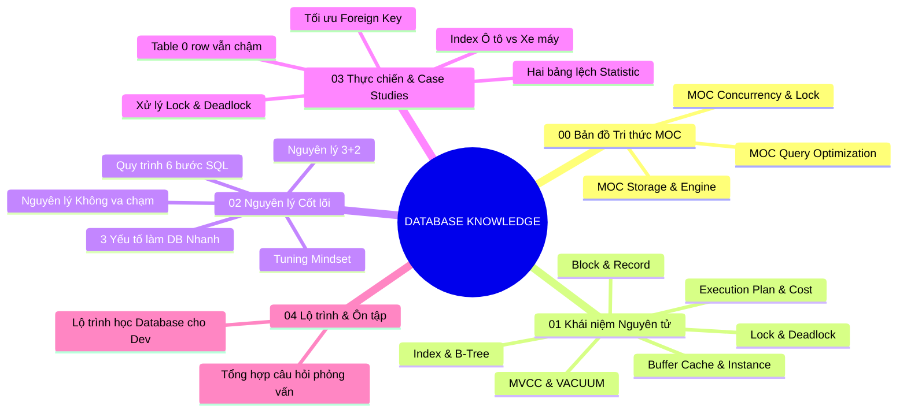

# 🗺️ Bản đồ Tri thức Cơ sở Dữ liệu (Database Master Index)

> **Chào mừng bạn đến với kho tri thức chuyên sâu về Cơ sở Dữ liệu (Database & Performance Tuning).**
> Kho tri thức này được thiết kế theo phương pháp **Zettelkasten + MOC (Map of Content)** giúp liên kết các khái niệm từ mức vật lý phần cứng, cơ chế vận hành của Database Engine cho đến các kỹ thuật tối ưu hóa thực chiến trong môi trường Production (Core Banking, Chứng khoán, E-Commerce).

---

## 🧭 Cấu trúc Kho Tri thức

---

## 📌 Các Hub Tri thức Chuyên đề (Sub-MOCs)

| Hub Tri thức | Mô tả | Các chủ đề trọng tâm |
| :--- | :--- | :--- |
| 🚀 **[[MOC - Query Optimization]]** | Tối ưu hóa truy vấn SQL | [[Execution Plan]], [[SQL Optimizer]], [[Cost]], [[Data Access Methods]], [[Join Methods]], [[Quy trình 6 bước xử lý câu lệnh SQL]] |
| 💾 **[[MOC - Storage & Engine]]** | Cấu trúc lưu trữ vật lý & Bộ nhớ | [[Block (Page)]], [[Record (Tuple)]], [[Buffer Cache]], [[Database Instance]], [[Transaction & MVCC]], [[VACUUM & Dọn rác Database]] |
| 🔒 **[[MOC - Concurrency & Lock]]** | Quản trị đồng thời & Tranh chấp | [[Lock]], [[Deadlock]], [[Foreign Key]], [[Nguyên lý Không va chạm trong tối ưu SQL]], [[Tổng hợp Lock và Deadlock trong Database]] |

---

## 🧠 1. Khung Nguyên lý Cốt lõi (Mental Models)

Để tối ưu hóa cơ sở dữ liệu hiệu quả, bạn cần chuyển đổi góc nhìn từ **Lập trình viên (Software Dev)** sang **Góc nhìn của Database Engine**:

1. **[[Tư duy tối ưu Database (Database Tuning Mindset)]]:** Database không làm việc bằng Row mà bằng Block; có Index nhưng chưa chắc DB đã dùng; thống kê (Statistic) quyết định tất cả.
2. **[[Tại sao Database không chọn Index (Bản chất Cost-Based Optimizer)]]:** Khám phá cơ chế CBO qua thí nghiệm đo đếm chi tiết Block I/O và Random Reads trên Oracle & SQL Server.
3. **[[Nguyên lý 3+2 trong Database]]:**
   - **3 Cạnh tam giác:** [[Block (Page)]] (Đơn vị I/O) ⟷ [[Buffer Cache]] (Bộ nhớ RAM) ⟷ [[Cost]] (Chi phí tính toán qua [[Execution Plan]]).
   - **2 Cơ chế vận hành:** Cơ chế Đọc (Read Logic - Access & Join) ⟷ Cơ chế Ghi (Write Logic - Log & WAL).
4. **[[3 Yếu tố cốt lõi làm Database nhanh]]:** Thiết kế cấu trúc đúng ⟷ Tối ưu từng câu lệnh đơn lẻ ⟷ Quản trị tranh chấp tài nguyên (Concurrency & Wait Events).
5. **[[Quy trình 6 bước xử lý câu lệnh SQL]]:** Từ Syntax Check, Semantic Check, Hard Parse, Soft Parse đến Execution Plan. Sức mạnh của Bind Variables.
6. **[[Nguyên lý Không va chạm trong tối ưu SQL]]:** Triết lý phân luồng tác vụ để triệt tiêu thời gian chờ (Wait Time) trong các hệ thống High Concurrency.
7. **[[Tư duy tối ưu hóa cho Software Architect]]:** Tầm nhìn kiến trúc cho hệ thống chịu tải lớn, ổn định cao như Core Banking, Sàn giao dịch.

---

## 🔬 2. Hệ thống Khái niệm Nguyên tử (Core Concepts)

- **Đơn vị Lưu trữ & Dữ liệu:**
  - [[Block (Page)]] - Đơn vị I/O cơ bản của Database (8KB - 64KB).
  - [[Record (Tuple)]] - Bản ghi/dòng dữ liệu nằm bên trong Block.
  - [[Buffer Cache]] - Bộ nhớ đệm dữ liệu trên RAM, giảm thiểu đọc đĩa vật lý.
  - [[Database Instance]] - Cấu trúc bộ nhớ (SGA/Buffer Pool) và các tiến trình nền (Background Processes).
- **Chỉ mục & Tối ưu Tìm kiếm:**
  - [[Index]] - Cấu trúc B-Tree & Doubly Linked List, Primary, Secondary, Clustered, Composite, Covering Index.
  - [[Data Access Methods]] - [[Full Table Scan]], [[Index Scan]], [[Index Seek]], [[Index Only Scan]].
  - [[Join Methods]] - [[Nested Loop Join]], [[Hash Join]], [[Merge Join]].
- **Kế hoạch Thực thi & Thống kê:**
  - [[Execution Plan]] - Bản đồ thực thi chi tiết của câu lệnh SQL.
  - [[SQL Optimizer]] - Trình tối ưu hóa dựa trên chi phí (Cost-Based Optimizer - CBO).
  - [[Cost]] - Đại lượng định lượng chi phí CPU và I/O của câu lệnh.
  - [[Statistics (Thống kê Database)]] - Siêu dữ liệu giúp Optimizer lựa chọn đường đi tối ưu.
- **Giao dịch, Đồng thời & Dọn dẹp:**
  - [[Transaction & MVCC]] - Đa phiên bản dữ liệu (Multi-Version Concurrency Control).
  - [[VACUUM & Dọn rác Database]] - Cơ chế xử lý Dead Tuples, chống phình bảng (Table Bloat).
  - [[Lock]] - Shared Lock (S), Exclusive Lock (X), Row Lock, Table Lock, Lock Escalation.
  - [[Deadlock]] - Hiện tượng bế tắc giao dịch và giải pháp xử lý.
  - [[Foreign Key]] - Ràng buộc khóa ngoại và cái bẫy khóa bảng con khi thiếu Index.

---

## 🛠️ 3. Tình huống Thực chiến & Case Studies (Anti-Patterns)

- 💥 **[[Case - Table 0 row nhưng truy vấn vẫn cực chậm]]:** Hiện tượng High Water Mark (HWM) và quét qua hàng trăm nghìn Block rỗng sau lệnh `DELETE`.
- 💥 **[[Case - Hai bảng giống nhau nhưng hiệu năng khác nhau]]:** Thảm họa lệch thông số thống kê (Statistic) khiến Optimizer chọn nhầm Nested Loop Join trên 17 triệu dòng.
- 💥 **[[Case - Tối ưu Foreign Key và Lock leo thang]]:** Thiếu Index trên cột Foreign Key dẫn tới Lock cứng toàn bộ bảng Con khi sửa bảng Cha.
- 💥 **[[Case - Khi nào Index phản tác dụng (Ô tô tải vs Xe máy)]]:** Vấn đề Low Selectivity, Random I/O và lý do Optimizer từ chối Index để chạy Full Table Scan.
- 💥 **[[Tổng hợp Lock và Deadlock trong Database]]:** Bức tranh toàn cảnh về nghẽn Wait Events, phân tích Deadlock Graph và chiến lược phòng tránh.

---

## 🎓 4. Lộ trình Học tập & Ôn tập (Learning & Interview)

- 🛣️ **[[Lộ trình học Database toàn diện cho Developer]]:** Khung lộ trình 4 giai đoạn chuẩn mực từ Junior đến Software Architect.
- 💡 **[[Tổng hợp câu hỏi ôn tập & phỏng vấn Database]]:** Bộ câu hỏi chuyên sâu kiểm tra bản chất vật lý của B-Tree, Random I/O, DML vs Index, và Optimizer.

---

## ⚙️ Hướng dẫn Sử dụng & Mở rộng Vault

- Xem file hướng dẫn: **[[README]]** để biết quy chuẩn đặt tên file, cấu trúc thư mục, quy ước metadata (Frontmatter) và template để viết note mới.
