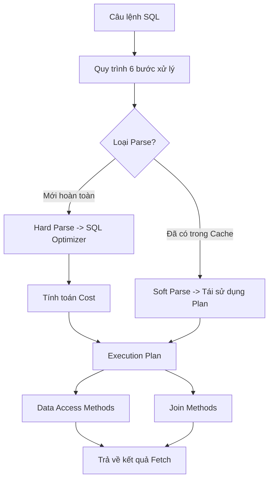

# 🚀 Hub Tối ưu hóa Truy vấn SQL (Query Optimization)

⬅️ **[[MOC - Database Overview]]** | 🔗 **Các Hub liên quan:** [[MOC - Storage & Engine]], [[MOC - Concurrency & Lock]]

---

## 🎯 Mục tiêu
Cung cấp toàn bộ kiến thức từ lý thuyết đến thực hành về cách Database Engine tiếp nhận, phân tích, lập kế hoạch và thực thi một câu lệnh SQL; từ đó biết cách tối ưu truy vấn đạt hiệu năng cao nhất.

---

## 📚 1. Quy trình Thực thi & Bộ máy Tối ưu
- **[[Quy trình 6 bước xử lý câu lệnh SQL]]:**
  1. Syntax Check (Kiểm tra cú pháp)
  2. Semantic Check (Kiểm tra ngữ nghĩa & quyền)
  3. Query Parsing (Hard Parse vs Soft Parse)
  4. Optimization & Plan Generation
  5. Execution (Thực thi)
  6. Fetch (Trả dữ liệu)
- **[[SQL Optimizer]]:** Trình tối ưu hóa dựa trên chi phí (Cost-Based Optimizer - CBO) hoạt động như thế nào.
- **[[Cost]]:** Công thức chi phí CPU + I/O mà Optimizer dùng để cân đo các chiến lược.
- **[[Execution Plan]]:** Cách đọc và phân tích cây thực thi, nhận diện các nút thắt hiệu năng (Bottlenecks).
- **[[Statistics (Thống kê Database)]]:** Vai trò sinh tử của số liệu thống kê (Row count, Block count, Histograms, Density).

---

## ⚡ 2. Kỹ thuật Đọc Dữ liệu (Data Access & Join)
- **[[Data Access Methods]]:**
  - `[[Full Table Scan]]`: Quét toàn bộ các Block dữ liệu của bảng.
  - `[[Index Scan]]` / `[[Index Seek]]`: Tìm kiếm theo cây B-Tree.
  - `[[Index Only Scan]]`: Lấy toàn bộ dữ liệu ngay trên Index mà không cần chạm bảng gốc (Table Access by RowID).
- **[[Join Methods]]:**
  - `[[Nested Loop Join]]`: Phù hợp khi một bảng rất nhỏ (Outer loop) kết hợp Index trên bảng lớn (Inner loop).
  - `[[Hash Join]]`: Phù hợp cho việc Join 2 tập dữ liệu lớn không có Index.
  - `[[Merge Join]]`: Phù hợp khi 2 tập dữ liệu đã được sắp xếp sẵn (Sorted).

---

## 💡 3. Các Nguyên lý & Bí kíp Thực chiến
- **[[Tư duy tối ưu Database (Database Tuning Mindset)]]:** Chuyển từ tư duy "đếm Row" sang tư duy "đếm Block".
- **[[Tại sao Database không chọn Index (Bản chất Cost-Based Optimizer)]]:** Giải mã bản chất Cost-Based Optimizer qua thực nghiệm đo đếm I/O trên Oracle & SQL Server.
- **[[Nguyên lý Không va chạm trong tối ưu SQL]]:** Tối ưu câu lệnh để triệt tiêu thời gian chờ đợi tài nguyên.
- **Sức mạnh của Bind Variables:** Tránh tiêu tốn hàng nghìn chu kỳ CPU cho Hard Parse vô ích.
- **Tối ưu Index Tổ hợp (Composite Index):** Nguyên tắc cột dẫn đầu (Leading column).
- **Loại bỏ bước SORT tốn kém:** Tận dụng thứ tự sắp xếp sẵn của Index để phục vụ mệnh đề `ORDER BY` / `GROUP BY`.

---

## 🧩 4. Case Studies Thực tế
- 💥 **[[Case - Hai bảng giống nhau nhưng hiệu năng khác nhau]]:** Lệch Statistic khiến Optimizer chọn sai Join Method.
- 💥 **[[Case - Khi nào Index phản tác dụng (Ô tô tải vs Xe máy)]]:** Vấn đề Random I/O trên tập kết quả lớn.
- 💥 **[[Case - Table 0 row nhưng truy vấn vẫn cực chậm]]:** Full Table Scan trên bảng rỗng nhưng dung lượng Block khổng lồ.
