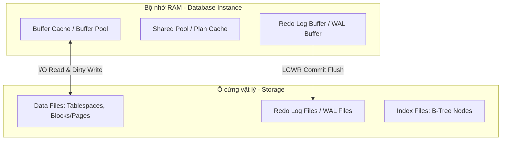

# 💾 Hub Cấu trúc Lưu trữ & Engine Database (Storage & Engine)

⬅️ **[[MOC - Database Overview]]** | 🔗 **Các Hub liên quan:** [[MOC - Query Optimization]], [[MOC - Concurrency & Lock]]

---

## 🎯 Mục tiêu

Khám phá tầng đáy vật lý của cơ sở dữ liệu: từ cách một Byte/Record được sắp xếp trong Block/Page, cơ chế nạp lên RAM (Buffer Cache), cho đến các tiến trình ghi nhật ký (WAL/Redo Log) và dọn dẹp rác (MVCC / VACUUM).

---

## 🧱 1. Đơn vị Lưu trữ Vật lý

- **[[Block (Page)]]:** Đơn vị I/O nhỏ nhất của Database (8KB trong Oracle/Postgres, 16KB trong MySQL InnoDB, 64KB trong SQL Server Extent). Mọi thao tác đọc/ghi đều diễn ra theo đơn vị Block.
- **[[Record (Tuple)]]:** Dòng dữ liệu nghiệp vụ, cấu trúc header của Record, hiện tượng Row Migration và Row Chaining.
- **High Water Mark (HWM):** Mốc đánh dấu dung lượng tối đa mà bảng từng chiếm dụng.

---

## ⚡ 2. Kiến trúc Bộ nhớ & Tiến trình (Instance Architecture)

- **[[Database Instance]]:** Phân biệt giữa _Database_ (các file vật lý trên đĩa) và _Instance_ (bộ nhớ RAM + các tiến trình ngầm).
- **[[Buffer Cache]]:** Vùng nhớ lưu trữ các Block dữ liệu thường xuyên truy xuất, giải thuật thay thế trang LRU (Least Recently Used).
- **[[Write-Ahead Logging (WAL)]]:** Cơ chế đảm bảo tính bền vững (Durability) của giao dịch bằng cách ghi tuần tự (Sequential I/O) trước khi ghi Data File.
- **[[Vận hành ngầm của câu lệnh DML (INSERT Internals)]]:** Bóc tách 3 bài toán kiến trúc khi thực thi DML: Tính nhất quán hệ sinh thái Table, Crash Recovery và Cơ chế Hoàn tác (Oracle Undo vs SQL Server Tx Log vs PostgreSQL Dead Tuples).
- **Background Processes:** DBWn (Database Writer), LGWR (Log Writer), CKPT (Checkpoint), SMON/PMON.

---

## 🧹 3. Cơ chế Đa Phiên bản & Dọn rác (MVCC & Garbage Collection)

- **[[Transaction & MVCC]]:** Multi-Version Concurrency Control giúp Đọc không chặn Ghi và Ghi không chặn Đọc.
- **[[VACUUM & Dọn rác Database]]:** Cơ chế quét dọn "Dead Tuples" trong PostgreSQL / Purge trong MySQL, chống phình đĩa (Table Bloat).

---

## 🔍 4. Cấu trúc Chỉ mục Vật lý (Index Internals)

- **[[Index]]:** Tổ chức kết hợp giữa **Cây cân bằng (B-Tree)** (tìm kiếm dọc theo cấp số nhân) và **Danh sách liên kết đôi (Doubly Linked List)** (quét ngang tại các Leaf Nodes).
- So sánh giữa **Clustered Index** (dữ liệu nằm trực tiếp ở lá Index) và **Secondary Index** (chỉ chứa con trỏ Row ID trỏ về bảng gốc).

---

## 💥 5. Case Studies & Sơ Đồ Tư Duy Thực Tiễn

- 🎨 **[[Vận hành ngầm đằng sau 1 câu lệnh INSERT.excalidraw]]:** Bản vẽ tư duy toàn cảnh về vận hành ngầm của Database Engine khi chạy INSERT.
- **[[Case - Table 0 row nhưng truy vấn vẫn cực chậm]]:** Xóa sạch dữ liệu bằng `DELETE` nhưng Block không được giải phóng.
- **[[Case - Khi nào Index phản tác dụng (Ô tô tải vs Xe máy)]]:** Chi phí Random I/O khi nhảy từ Index về Block vật lý.
