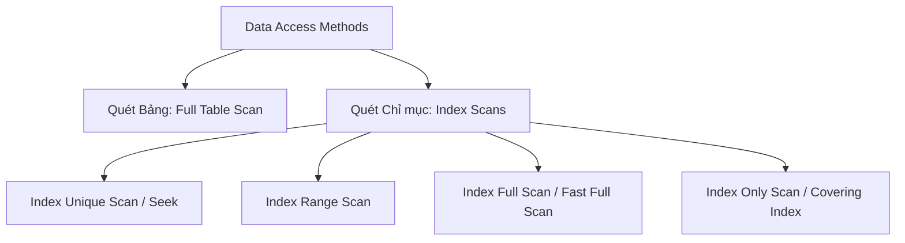

# 🚀 Các Phương thức Truy cập Dữ liệu (Data Access Methods)

⬅️ **[[MOC - Query Optimization]]** | 🔗 **[[MOC - Database Overview]]**

---

## 1. Tổng quan

Khi thực thi câu lệnh SQL, **[[SQL Optimizer]]** sẽ lựa chọn một trong các phương thức truy cập dữ liệu dưới đây để đọc các [[Block (Page)]] từ Đĩa/RAM:

---

## 2. Chi tiết Từng Phương thức

### 2.1. Full Table Scan (FTS)
- **Cách thức:** Quét toàn bộ tất cả các Block vật lý của Table từ đầu cho đến mốc High Water Mark (HWM).
- **Cơ chế I/O:** Sử dụng **Multi-block Read (Sequential I/O)** đọc hàng loạt Block trong một lần gọi I/O.
- **Khi nào tối ưu?** Khi cần lấy lượng lớn dữ liệu (> 20% bảng), hoặc khi bảng rất nhỏ (vài Block), hoặc bảng không có Index phù hợp.

### 2.2. Index Unique Scan / Index Seek
- **Cách thức:** Duyệt dọc theo cây B-Tree để tìm chính xác 1 bản ghi duy nhất (dùng trên `PRIMARY KEY` hoặc `UNIQUE INDEX` với điều kiện `=`).
- **Chi phí:** Cực thấp, chỉ tốn khoảng 2 - 4 Block I/O.

### 2.3. Index Range Scan
- **Cách thức:** Duyệt cây B-Tree để tìm điểm đầu, sau đó trượt ngang trên danh sách liên kết đôi ở Nút lá để gom dải giá trị (dùng cho toán tử `>`, `<`, `BETWEEN`, `LIKE 'ABC%'`).
- **Bước tiếp theo:** Với mỗi giá trị tìm được, Database nhảy sang bảng gốc (**Table Access by RowID**) để lấy nốt các cột còn thiếu.

### 2.4. Index Only Scan (Covering Index)
- **Cách thức:** Tất cả các cột cần thiết cho câu truy vấn đều nằm sẵn trong Index.
- **Ưu điểm vượt trội:** Database **KHÔNG CẦN** chạm vào bảng dữ liệu gốc, triệt tiêu 100% chi phí Random I/O trên Table Block.

---

## 🔗 Liên kết Liên quan
- Khái niệm liên quan: [[Index]], [[Block (Page)]], [[Execution Plan]], [[Cost]], [[SQL Optimizer]]
- Nguyên lý & Case Study: [[Case - Khi nào Index phản tác dụng (Ô tô tải vs Xe máy)]]
