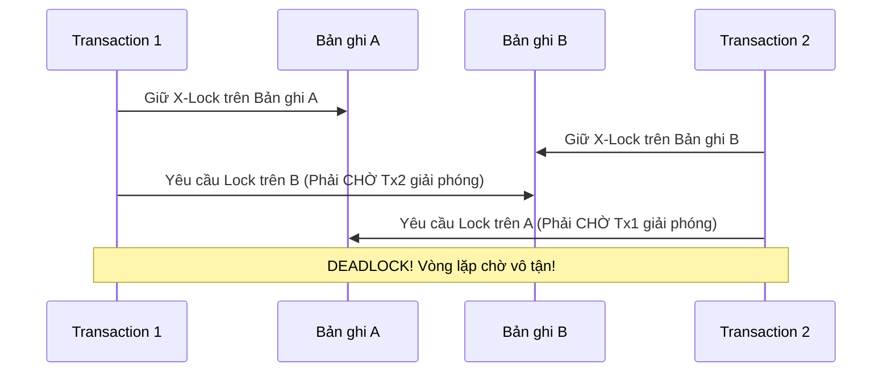

# 🛑 Hiện tượng Deadlock trong Cơ sở Dữ liệu

⬅️ **[[MOC - Concurrency & Lock]]** | 🔗 **[[MOC - Database Overview]]**

---

## 1. Định nghĩa Deadlock

**Deadlock (Bế tắc)** là trạng thái xảy ra khi **hai hoặc nhiều giao dịch (Transactions) cùng chờ đợi tài nguyên mà bên kia đang nắm giữ**, tạo thành một vòng lặp phụ thuộc khép kín (Circular Wait). Không có giao dịch nào có thể tiếp tục hoàn thành nếu không có sự can thiệp từ bên ngoài.

---

## 2. Cơ chế Xử lý của Database (Deadlock Detection)

Hầu hết các Database hiện đại đều có một tiến trình ngầm (**Deadlock Detector**) chạy định kỳ (mỗi vài trăm mili-giây):
1. Quét đồ thị chờ đợi (Wait-For Graph).
2. Khi phát hiện chu trình (Cycle), Database sẽ chọn ra một transaction làm "nạn nhân" (**Deadlock Victim**) dựa trên chi phí rollback thấp nhất.
3. Database tự động **ROLLBACK** transaction nạn nhân và ném ra lỗi mã lỗi (ví dụ: `ORA-00060` trong Oracle, `Deadlock found when trying to get lock` trong MySQL, `error 1205` trong SQL Server).

---

## 3. Các Nguyên tắc Vàng Phòng tránh Deadlock trong Ứng dụng

1. **Luôn truy cập tài nguyên theo một thứ tự cố định (Strict Ordering):** Nếu cần cập nhật bảng A và bảng B, tất cả mọi luồng code trong ứng dụng bắt buộc phải cập nhật A trước rồi mới đến B.
2. **Thu hẹp phạm vi giao dịch (Keep Transactions Short):** Không thực hiện các tác vụ gọi API bên ngoài, gửi email, xử lý tính toán nặng bên trong một Transaction SQL.
3. **Thêm Index đầy đủ cho các cột Khóa ngoại ([[Foreign Key]]):** Tránh việc Database phải Lock lan truyền sang toàn bộ bảng khác.
4. **Sử dụng mức cô lập (Isolation Level) phù hợp:** Tận dụng tối đa sức mạnh của **[[Transaction & MVCC]]**.

---

## 🔗 Liên kết Mở rộng
- Khái niệm liên quan: [[Lock]], [[Foreign Key]], [[Transaction & MVCC]]
- Bài tổng hợp: [[Tổng hợp Lock và Deadlock trong Database]], [[Case - Tối ưu Foreign Key và Lock leo thang]]
