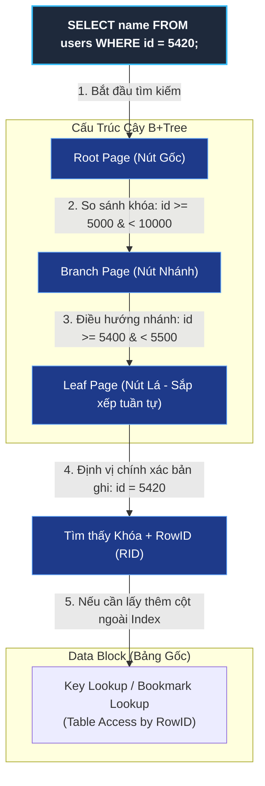
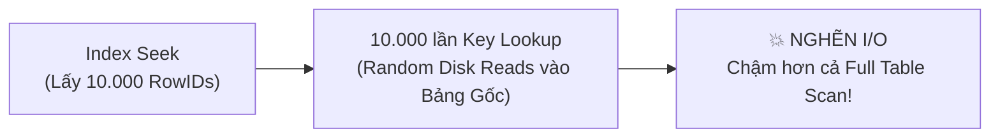

# 🎯 Phương Thức Truy Cập Index Seek (B+Tree Traversal)

⬅️ **[[MOC - Query Optimization]]** | 🔗 **[[MOC - Database Overview]]** | 🧱 **[[Index]]**

---

## 🗺️ 1. Sơ Đồ Mermaid DAG Phụ Thuộc (How Index Seek Works)



---

## ⚖️ 2. Chân Lý Vô Điều Kiện (Unconditional Truths)

> [!NOTE]
>
> 1. **Index Seek luôn duyệt theo chiều dọc (Vertical Traversal):** Index Seek không bao giờ đọc quét ngang các dòng; nó luôn bắt đầu từ Root Node, đi qua các Branch Nodes và đáp xuống chính xác Leaf Node chứa giá trị cần tìm.
> 2. **Độ phức tạp cố định $\mathcal{O}(\log_B N)$:** Với cây B+Tree có Fan-out $B \ge 100$, chiều cao cây $h$ của bảng hàng chục triệu dòng chỉ dao động từ $3$ đến $4$ tầng. Do đó, một thao tác Index Seek **chỉ tiêu tốn từ $3$ đến $4$ lần đọc Block ([[Block (Page)]])**.

---

## 💡 3. Trực Giác Khám Phá: Index Seek vs Index Scan

### 📖 Hình ảnh Ẩn dụ: Tra cứu Danh Bạ Điện Thoại

Hãy tưởng tượng bạn cầm cuốn Danh bạ điện thoại dày 2.000 trang:

- **Index Seek:** Bạn muốn tìm số của anh _"Trần Quốc Huy"_. Bạn mở ngay mục chữ cái **T**, lật tiếp đến vần **Tr**, rồi lật chính xác đến trang có tên _"Trần Quốc Huy"_. Bạn chỉ lật đúng **3 lần** là tìm thấy số điện thoại.
- **Index Scan:** Bạn muốn tìm tất cả những người có họ _"Trần"_. Bạn dùng Index Seek để lật tới người họ Trần đầu tiên, sau đó **quét ngang liên tục** từ dòng này sang dòng khác cho đến khi hết người họ Trần (Index Range Scan). Hoặc nếu bạn lật từng trang từ trang 1 đến trang 2.000 chỉ để đếm xem danh bạ có bao nhiêu người (Index Full Scan).

---

## 🔬 4. Phân Tích Kỹ Thuật Chuyên Sâu & $\LaTeX$

### 4.1. Toán Học Độ Phức Tạp Của Index Seek

Gọi:

- $N$ là tổng số bản ghi trong bảng.
- $B$ là hệ số phân nhánh (**Fan-out**) của nút B+Tree (số con trỏ chứa trong một Block $8\text{ KB}$). Với cột số nguyên hoặc UUID ngắn, $B$ thường nằm trong khoảng $100 \le B \le 500$.
- $h$ là chiều cao của cây B+Tree.

Chiều cao của cây được xác định bởi công thức:
$$h \approx \lceil \log_B N \rceil$$

| Số lượng bản ghi ($N$)       | Fan-out ($B$) | Chiều cao cây ($h$) | Số lần đọc đĩa (I/O) của Index Seek |
| :--------------------------- | :------------ | :------------------ | :---------------------------------- |
| $100.000$ dòng               | $200$         | $3$ tầng            | **3 Blocks**                        |
| $10.000.000$ dòng (10 triệu) | $200$         | $4$ tầng            | **4 Blocks**                        |
| $1.000.000.000$ dòng (1 tỷ)  | $200$         | $4 - 5$ tầng        | **4 - 5 Blocks**                    |

> [!TIP]
> Do Root Node và phần lớn Branch Nodes của B+Tree luôn được lưu giữ sẵn trên RAM ([[Buffer Cache]]), một thao tác **Index Seek thực tế thường chỉ tốn $0 - 1$ lần đọc đĩa vật lý (Physical I/O)**.

### 4.2. So Sánh Thuật Ngữ Giữa Các RDBMS

| Hệ Quản Trị CSDL         | Thuật ngữ trong Execution Plan                                                             | Ý nghĩa thực thi                                                                     |
| :----------------------- | :----------------------------------------------------------------------------------------- | :----------------------------------------------------------------------------------- |
| **Microsoft SQL Server** | **Index Seek**                                                                             | Duyệt cây B-Tree từ Root xuống Leaf Node theo biểu thức tìm kiếm (`Seek Predicate`). |
| **Oracle Database**      | **Index Unique Scan** (tìm 1 dòng duy nhất) hoặc giai đoạn Seek trong **Index Range Scan** | Định vị địa chỉ RowID của bản ghi thông qua cây chỉ mục.                             |
| **PostgreSQL**           | **Index Scan** / **Bitmap Index Scan**                                                     | Tìm kiếm vị trí tuple thông qua B-Tree con trỏ TID.                                  |
| **MySQL (InnoDB)**       | Type: `const`, `eq_ref`, hoặc `ref`                                                        | Tìm kiếm trực tiếp qua Clustered B+Tree hoặc Secondary Index.                        |

---

## ⚠️ 5. Cạm Bẫy Hiệu Năng: Index Seek Chưa Chắc Đã Nhanh!

Nhiều lập trình viên nhìn thấy chữ **Index Seek** trong Kế hoạch thực thi ([[Execution Plan]]) thì yên tâm nghĩ rằng câu query đã tối ưu tuyệt đối. **Đây là một sai lầm phổ biến!**



### Hiện tượng "Key Lookup / Table Access by RowID"

- Nếu câu truy vấn của bạn là:
  ```sql
  SELECT id, full_name, address, phone FROM users WHERE age = 25;
  ```
- Trên cột `age` có Non-Clustered Index.
- **Bước 1:** Database thực hiện **Index Seek** trên cây index `age` $\to$ Tìm thấy $10.000$ bản ghi thỏa mãn.
- **Bước 2 (Tử huyệt):** Nhưng Index trên `age` không chứa cột `address` và `phone`. Database bắt buộc phải lấy RowID của từng dòng để nhảy sang bảng dữ liệu gốc tìm nốt các cột còn lại (**Key Lookup / Bookmark Lookup**).
- **Hậu quả:** Phát sinh tới $10.000$ lần **Random Disk I/O**. Trong tình huống này, chi phí cao gấp nhiều lần so với việc chạy một lần **[[Full Table Scan]]** bằng Multi-block I/O!
- **Giải pháp:** Sử dụng **Covering Index (Index-Only Scan)** bằng cú pháp `INCLUDE (full_name, address, phone)`.

---

## 🎴 6. Spaced Repetition Flashcards

### Flashcard 1

Index Seek khác Index Scan ở điểm cốt lõi nào về cơ chế duyệt cây B+Tree? #card
**Trả lời:**

- **Index Seek:** Duyệt cây theo **chiều dọc** (từ Root $\to$ Branch $\to$ Leaf) dựa trên phép so sánh nhị phân của điều kiện tìm kiếm, chỉ đọc các node trên đường đi dẫn đến giá trị cần tìm ($\mathcal{O}(\log_B N)$).
- **Index Scan:** Duyệt theo **chiều ngang** (quét tuần tự qua danh sách liên kết đôi giữa các Leaf Nodes) trên một khoảng giá trị hoặc toàn bộ cây chỉ mục.
<!--ID: 1725345600006-->

---

### Flashcard 2

Tại sao một câu lệnh có Execution Plan ghi nhận "Index Seek" vẫn có thể chạy cực kỳ chậm và ngốn nhiều I/O? #card
**Trả lời:**
Vì sau khi Index Seek tìm ra các con trỏ RowID, nếu câu query đòi hỏi các cột không nằm trong Index, Database phải thực hiện thao tác **Key Lookup (Table Access by RowID)** quay về bảng gốc. Nếu số lượng dòng thỏa mãn lớn (ví dụ hàng nghìn dòng), số lượt Random Disk I/O sinh ra sẽ cực lớn và làm sập hiệu năng.

<!--ID: 1725345600007-->

---

## 🔗 7. Liên Kết Tri Thức Liên Quan

- **Phương thức truy cập liên quan:**
  - [[Data Access Methods]] - Bản đồ tổng quan các phương thức truy cập dữ liệu.
  - [[Full Table Scan]] - Đối trọng của Index Seek khi xử lý tập dữ liệu lớn.
- **Cấu trúc chỉ mục & Tối ưu:**
  - [[Index]] - Cấu trúc B-Tree và Doubly Linked List.
  - [[SQL Optimizer]] & [[Cost]] - Cách bộ tối ưu tính toán chi phí để quyết định dùng Seek hay Scan.
  - [[Execution Plan]] - Cách đọc hiểu toán tử Index Seek trên sơ đồ thực thi.
  - [[Case - Khi nào Index phản tác dụng (Ô tô tải vs Xe máy)]] - Phân tích chi tiết ranh giới giữa Index Seek + Lookup vs Full Table Scan.
