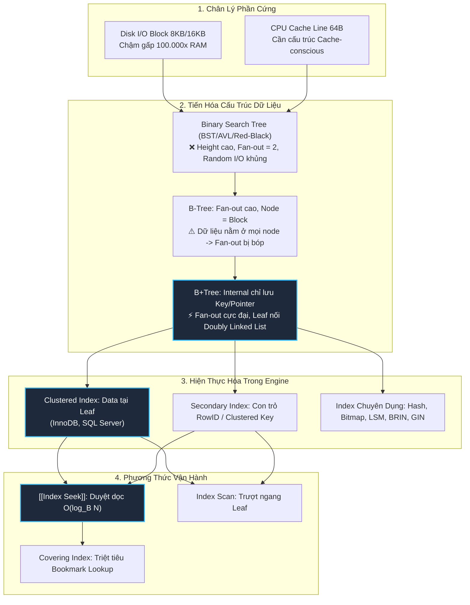

# 🔍 Toàn Tập Index Trong Database: Bản Chất Tận Đáy Phần Cứng

⬅️ **[[MOC - Query Optimization]]** | 🔗 **[[MOC - Storage & Engine]]** | 🧭 **[[Index Seek]]**

---

## 🗺️ 1. Sơ Đồ Mermaid DAG Phụ Thuộc (Dependency Architecture)



---

## ⚖️ 2. Chân Lý Vô Điều Kiện (Unconditional Truths)

> [!NOTE]
>
> 1. **Index là Redundant Data:** Index không sinh ra dữ liệu mới. Index nhân bản một phần dữ liệu bảng gốc + sắp xếp thứ tự để đánh đổi **Không gian đĩa & Tốc độ ghi** lấy **Tốc độ đọc**.
> 2. **Không có Free Lunch:** Mọi Index bổ sung làm tăng tốc lệnh `SELECT` đều **bắt buộc phải trả giá bằng chi phí CPU, RAM và Disk I/O khi `INSERT`, `UPDATE`, `DELETE`** (Write Amplification + Page Split).
> 3. **Đơn vị I/O là Block/Page, không phải Row:** Index node có kích thước đúng bằng 1 Database Page ($8\text{ KB}$ hoặc $16\text{ KB}$). Tối ưu Index = Tối đa hóa **Fan-out** để giảm chiều cao cây $h$.
> 4. **Trật tự sắp xếp (Sorted):** Dữ liệu bên trong mọi cây Index luôn được tự động duy trì sắp xếp theo thứ tự nhị phân liên tục.

---

## 💡 3. Trực Giác Khám Phá: Tại Sao Phải Là B+Tree?

### 📖 Hình ảnh Ẩn dụ: Quyển Sổ và Mục Lục

Khái niệm **Index** gắn liền với **[[Block (Page)]]**. Nếu [[Block (Page)]] là các "trang giấy A4" chứa dữ liệu nằm lộn xộn trong một quyển sổ lớn, thì Index chính là **Mục lục tra cứu** giúp Database không phải lật mở từng trang giấy A4 một cách mù quáng.

### 🛑 Tại sao không dùng Binary Search Tree (BST / AVL / Red-Black)?

- RAM: BST duyệt cực nhanh. Với $N = 10^7$ dòng $\implies h = \log_2(10^7) \approx 24$ tầng.
- Disk: Mỗi node BST = 1 con trỏ bộ nhớ ngẫu nhiên. Nhảy 24 tầng = 24 lần **Random Disk I/O**.
  $$24 \times 10\text{ ms} = 240\text{ ms} \implies \text{Chậm tê liệt hệ thống!}$$
- Cần cấu trúc: 1 lần đọc đĩa nạp được hàng trăm khóa $\implies$ **B-Tree ra đời**.

### ⚡ B-Tree vs B+Tree: Cú Nhảy Quyết Định

- **B-Tree cổ điển:** Node gốc và nhánh lưu cả `Key + Data Record`. Dữ liệu to chiếm chỗ $\implies$ 1 Page $8\text{ KB}$ chỉ chứa được vài chục Key $\implies$ Fan-out $B$ nhỏ $\implies$ Cây cao lên. Muốn scan dải (`WHERE age BETWEEN 20 AND 30`) phải duyệt In-order traversal trèo lên trèo xuống các tầng $\implies$ Nát đĩa.
- **B+Tree hiện đại:**
  - Node nội bộ (Root/Branch): **CHỈ LƯU `Key + Child Page Pointer`**. Nhẹ. 1 Page nhét được $500 - 1000$ keys.
  - Node lá (Leaf): Chứa toàn bộ dữ liệu hoặc con trỏ bảng gốc.
  - **Mấu chốt:** Các Node lá nối với nhau bằng **Doubly Linked List**.
  - Kết quả: Tìm đầu dải bằng 1 đường dọc $\mathcal{O}(\log_B N)$, sau đó trượt ngang mượt mà $\mathcal{O}(1)$ lấy hết dải.

```text
                      [ Root Node (Gốc) ]
                           /        \
              [ Branch Node ]      [ Branch Node ] (Nhánh)
                 /        \          /        \
           [ Leaf 1 ] <---> [ Leaf 2 ] <---> [ Leaf 3 ] (Lá & Doubly Linked List)
```

1. **Cây B-Tree (Hạ cánh thẳng đứng - Vertical Traverse):** Từ Root Node -> Branch Node -> Leaf Node. Quãng đường từ gốc đến mọi nút lá là như nhau (độ sâu thông thường chỉ 3 - 4 tầng kể cả với bảng hàng chục triệu dòng). Giúp tìm ra bản ghi đầu tiên trong tích tắc ([[Index Seek]]).
2. **Danh sách liên kết đôi (Quét ngang - Horizontal Scan):** Tại tầng Nút lá (Leaf Nodes), các block Index móc nối với nhau theo cả 2 chiều (trước - sau). Nhờ dữ liệu đã sắp xếp, Database chỉ cần trượt ngang qua trái/phải để gom toàn bộ các bản ghi thỏa điều kiện mà không cần duyệt lại cây.

---

## 🔬 4. Phân Tích Kỹ Thuật Tận Đáy: Giải Phẫu 1 Index Page ($8\text{ KB}$)

```text
┌────────────────────────────────────────────────────────────────────────┐
│                        INDEX PAGE STRUCTURE (8KB)                      │
├────────────────────────────────────────────────────────────────────────┤
│ Page Header: LSN, Page Type, Free Space Pointer, Prev Page, Next Page  │
├────────────────────────────────────────────────────────────────────────┤
│ Slot Array / Line Pointers: Trỏ tới từng Cell (Đọc nhị phân trong RAM) │
├────────────────────────────────────────────────────────────────────────┤
│ Free Space: Khoảng trống giãn nở cho INSERT (Quyết định Page Split)    │
├────────────────────────────────────────────────────────────────────────┤
│ Cells / Key Records:                                                   │
│   [Key Value | Child Page ID (Internal)] hoặc [Key Value | RowID (Leaf)]│
└────────────────────────────────────────────────────────────────────────┘
```

### Toán Học Độ Sâu Cây B+Tree

Gọi:

- $N$: Tổng số bản ghi bảng.
- $P_{size}$: Kích thước Page ($8.192\text{ Bytes}$).
- $K_{size}$: Kích thước cột Index ($8\text{ Bytes}$ cho `BIGINT`).
- $Ptr_{size}$: Kích thước con trỏ Page ($6\text{ Bytes}$).
- $H_{size}$: Header mẩu tin ($4\text{ Bytes}$).

Hệ số phân nhánh (Fan-out) $B$:
$$B = \frac{P_{size} - \text{Header}}{K_{size} + Ptr_{size} + H_{size}} \approx \frac{8192 - 128}{8 + 6 + 4} \approx 448$$

Chiều cao cây $h$:
$$h = \lceil \log_B N \rceil$$

| Số dòng bảng ($N$)        | Chiều cao cây ($h$) | Số lần đọc đĩa Index | Tỷ lệ node trên RAM ([[Buffer Cache]])                               |
| :------------------------ | :------------------ | :------------------- | :------------------------------------------------------------------- |
| $1.000.000$ (1 triệu)     | $3$ tầng            | $3$ Pages            | Root + Branch nằm $100\%$ trên RAM $\implies$ **Chỉ 1 Physical I/O** |
| $100.000.000$ (100 triệu) | $3 - 4$ tầng        | $3 - 4$ Pages        | Thường chỉ tốn **1 Physical I/O tại tầng Leaf**                      |
| $10.000.000.000$ (10 tỷ)  | $4$ tầng            | $4$ Pages            | Vẫn dưới 4 I/O!                                                      |

---

## 🏗️ 5. Chi Tiết Phân Loại Các Loại Index Trong Database

### 5.1. Primary Index (Chỉ mục Khóa chính)

![[Pasted image 20260619132308.png]]

- **Bản chất:** Tự động khởi tạo khi khai báo `PRIMARY KEY`.
- **Đặc tính:** Đảm bảo tính duy nhất tuyệt đối (`UNIQUE`), không chứa giá trị `NULL`, và dữ liệu luôn sắp xếp tăng dần.

---

### 5.2. Secondary Index (Non-Clustered Index / Chỉ mục Phụ)

![[Pasted image 20260619132330.png]]

- **Bản chất:** Tạo trên các cột tìm kiếm thông thường (`city`, `created_at`, `email`).
- **Cơ chế hoạt động:** Tồn tại hoàn toàn độc lập với bảng dữ liệu gốc. Nút lá của Secondary Index chứa `Key Value + Con trỏ RowID` (trong Heap Table như Oracle, Postgres) hoặc `Key Value + Clustered Key` (trong InnoDB, SQL Server).
- **Hạn chế:** Khi câu lệnh `SELECT` cần lấy các cột ngoài Index, Database bắt buộc phải thực hiện bước **Key Lookup / Bookmark Lookup** (Table Access by RowID) nhảy về bảng gốc, gây phát sinh Random I/O.

---

### 5.3. Clustered Index (Chỉ mục Cụm / Index-Organized Table)

![[Pasted image 20260619132722.png|556]]

- **Bản chất:** Trong MySQL InnoDB hoặc SQL Server, Clustered Index quyết định **trật tự sắp xếp vật lý** của toàn bộ bảng trên ổ đĩa.
- **Cấu trúc nút lá:** Toàn bộ dữ liệu của tất cả các cột trong dòng dữ liệu nằm trực tiếp ngay tại các Nút lá (Leaf Nodes) của Clustered Index.
- **Quy tắc bất biến:** Mỗi bảng chỉ có **DUY NHẤT 1 Clustered Index** (chính là Primary Key).
- **Ưu điểm:** Khi tìm theo Clustered Key, không bao giờ tốn bước Lookup. Tìm thấy Leaf Node là có đủ toàn bộ dữ liệu dòng.

---

### 5.4. Composite Index (Index Tổ hợp / Multi-Column Index)

![[Pasted image 20260619132827.png]]

- **Bản chất:** Index được xây dựng trên nhiều cột cùng lúc, ví dụ `INDEX idx_dept_sal (department_id, salary)`.
- **Nguyên tắc Cột dẫn đầu (Leftmost Prefix Rule):**
  - Dữ liệu được sắp xếp ưu tiên theo cột đầu tiên (`department_id`), nếu trùng giá trị thì mới xét tiếp cột thứ hai (`salary`).
  - **Quy luật:** Index CHỈ phát huy tác dụng Seek khi câu lệnh lọc có chứa cột đứng đầu (`department_id`). Nếu lọc riêng theo `salary`, Index sẽ bị vô hiệu hóa hoàn toàn!
  - **Bẫy toán tử Range:** Nếu gặp toán tử so sánh dải (`>`, `<`, `BETWEEN`) ở cột nào, thì các cột đứng sau nó trong Composite Index chỉ dùng để Filter chứ không Seek được nữa.

---

### 5.5. Covering Index (Index Bao phủ / Index-Only Scan)

![[Pasted image 20260619133221.png]]

- **Bản chất:** Đưa toàn bộ các cột xuất hiện trong mệnh đề `SELECT`, `WHERE`, `ORDER BY` vào bên trong cấu trúc Index (sử dụng mệnh đề `INCLUDE` trên SQL Server/Postgres).
- **Ví dụ:**
  ```sql
  CREATE INDEX idx_user_covering ON Users (department_id) INCLUDE (full_name, salary);
  ```
- 👉 **Lợi ích tối thượng:** Database lấy đủ $100\%$ dữ liệu ngay tại tầng Nút lá của Index và **loại bỏ hoàn toàn bước Table Access by RowID (Bookmark Lookup / Random I/O)**. Tốc độ đạt mức cực đại!

---

### 5.6. Bảng Phân Loại Các Loại Index Nâng Cao & Chuyên Dụng

```text
┌──────────────────────────────────────────────────────────────────────────────────────────────┐
│                               PHÂN LOẠI CÁC LOẠI INDEX TRONG CSDL                            │
├──────────────────┬─────────────────────────────┬─────────────────────────────────────────────┤
│ LOẠI INDEX       │ ĐẶC TRƯNG CẤU TRÚC          │ TRƯỜNG HỢP DÙNG TỐI ƯU & NHƯỢC ĐIỂM         │
├──────────────────┼─────────────────────────────┼─────────────────────────────────────────────┤
│ Hash Index       │ Bảng băm Array + Hash Func  │ Điểm truy vấn O(1) với toán tử =. Hoàn toàn │
│                  │ (Bucket chaining).          │ VÔ DỤNG với range (<, >), LIKE, ORDER BY.   │
├──────────────────┼─────────────────────────────┼─────────────────────────────────────────────┤
│ Bitmap Index     │ Mảng bit 0/1 cho từng giá   │ Tuyệt đỉnh cho Low Cardinality (Giới tính,  │
│                  │ trị (Oracle Data Warehouse).│ Status). Phép AND/OR bitwise siêu tốc.      │
│                  │                             │ TỬ HUYỆT: Khóa chết bảng khi có DML Write.  │
├──────────────────┼─────────────────────────────┼─────────────────────────────────────────────┤
│ LSM-Tree         │ MemTable (RAM) -> WAL ->    │ Ghi tuần tự Append-only. Tối ưu WRITE cực   │
│ (Log-Structured) │ SSTables (Disk) + Compaction│ hạn (Cassandra, RocksDB). Đọc chậm hơn      │
│                  │ (LevelDB, SQLite4).         │ B+Tree (phải scan nhiều SSTables/Bloom).    │
├──────────────────┼─────────────────────────────┼─────────────────────────────────────────────┤
│ BRIN             │ Lưu Min/Max cho từng block  │ PostgreSQL. Kích thước siêu nhỏ (vài chục   │
│ (Block Range)    │ range (ví dụ: mỗi 128 trang)│ KB). Cực mạnh cho dữ liệu Append tăng dần   │
│                  │                             │ theo thời gian (Log, Timeseries, IoT).      │
├──────────────────┼─────────────────────────────┼─────────────────────────────────────────────┤
│ GIN              │ Inverted Index (Từ điển map │ Dùng cho Full-Text Search, JSONB, Array     │
│ (Đảo ngược)      │ phần tử con -> RowIDs).     │ trong PostgreSQL. Query cực nhanh, Build lâu│
├──────────────────┼─────────────────────────────┼─────────────────────────────────────────────┤
│ Partial/Filtered │ Chỉ đánh index các dòng thỏa│ Tiết kiệm dung lượng. Ví dụ:                │
│                  │ điều kiện: WHERE is_active=1│ `WHERE status = 'PENDING'` trong hàng đợi.  │
├──────────────────┼─────────────────────────────┼─────────────────────────────────────────────┤
│ Expression/Func  │ Index trên kết quả hàm:     │ Tránh bẫy vô hiệu hóa Index khi gọi hàm:    │
│                  │ `LOWER(email)`, `DATE(ts)`  │ `WHERE LOWER(email) = 'abc@gmail.com'`.     │
└──────────────────┴─────────────────────────────┴─────────────────────────────────────────────┘
```

---

## 🛠️ 6. Cú Pháp Quản Lý Index Trong SQL (Syntax)

```sql
-- 1. Tạo Single Column Index thông thường
CREATE INDEX idx_product_id ON Sales (product_id);

-- 2. Tạo Composite Index (Tuân thủ Leftmost Prefix)
CREATE INDEX idx_dept_salary ON Employees (department_id, salary);

-- 3. Tạo Unique Index (Chống trùng lặp)
CREATE UNIQUE INDEX idx_user_email ON Users (email);

-- 4. Tạo Covering Index với mệnh đề INCLUDE (SQL Server / PostgreSQL)
CREATE INDEX idx_orders_covering ON Orders (customer_id) INCLUDE (order_date, total_amount);

-- 5. Tạo Filtered / Partial Index (Chỉ lập chỉ mục đơn chưa xử lý)
CREATE INDEX idx_pending_orders ON Orders (created_at) WHERE status = 'PENDING';

-- 6. Xem danh sách Index của bảng
SHOW INDEXES FROM Sales; -- MySQL
-- hoặc dùng sp_helpindex 'Sales' trên SQL Server

-- 7. Xóa Index không còn sử dụng
DROP INDEX idx_product_id ON Sales;

-- 8. Tái xây dựng Index (Rebuild Index chống phân mảnh dữ liệu)
ALTER INDEX idx_product_id ON Sales REBUILD; -- SQL Server / Oracle
REINDEX TABLE Sales; -- PostgreSQL
OPTIMIZE TABLE Sales; -- MySQL
```

---

## 🚗 7. Khi Nào Index Phản Tác Dụng? (Ô Tô Tải vs Xe Máy)

![[Pasted image 20260618025349.png|0]]

Nhiều lập trình viên lầm tưởng: _"Cứ có Index là câu truy vấn chạy nhanh hơn."_ **Hoàn toàn sai!**

### Hình Ảnh Ẩn Dụ:

- **Index Seek + Bookmark Lookup:** Giống như một **chàng shipper đi xe máy**. Nếu cần chở $5 - 10$ bưu phẩm (vài dòng dữ liệu), xe máy luồn lách cực nhanh qua các ngõ ngách.
- **[[Full Table Scan]]:** Giống như một **chiếc ô tô tải**. Khởi động nặng nề, nhưng một chuyến gom sạch toàn bộ kho hàng bằng cơ chế Multi-block Sequential Read.

### Ngưỡng Tử Huyệt Selectivity ($15\% - 20\%$):

- Nếu điều kiện tìm kiếm trả về **quá nhiều dữ liệu** ($> 15\% - 20\%$ tổng số dòng của bảng):
  - Chàng shipper xe máy phải chạy đi chạy lại $100.000$ lần giữa Index và Bảng gốc (**$100.000$ lần Random Disk I/O**).
  - Chi phí lúc này cao gấp $10 - 50$ lần so với việc cho chiếc ô tô tải [[Full Table Scan]] quét một mạch toàn bộ các Block vật lý từ đầu đến cuối!
- Khi gặp tình huống này, `[[SQL Optimizer]]` dựa trên `[[Statistics (Thống kê Database)]]` sẽ **thẳng thừng từ chối Index** để chạy Full Table Scan.
  👉 Xem phân tích chi tiết tại: **[[Case - Khi nào Index phản tác dụng (Ô tô tải vs Xe máy)]]**.

---

## ⚡ 8. Chi Phí Ngầm Tận Đáy: Tại Sao Thêm Index Làm Chết Hệ Thống?

### 1. Write Amplification & Page Split

Khi bảng có 1 Clustered Index + 4 Secondary Index:

- Mỗi câu lệnh `INSERT` phát sinh:
  - 1 lần chèn dòng vào Clustered Block.
  - 4 lần chèn con trỏ vào 4 cây B+Tree khác nhau.
- **Hiện tượng Page Split:** Khi một trang lá của Index bị đầy $100\%$, Database bắt buộc phải cấp phát Page mới, cắt đôi dữ liệu (**50-50 Page Split**), cập nhật lại con trỏ Doubly Linked List và Parent Node.
- Hậu quả: Gây bão Random I/O, xả ngập file Redo Log/WAL, và làm suy giảm nghiêm trọng thông lượng ghi của hệ thống. Xem thêm tại: **[[Vận hành ngầm của câu lệnh DML (INSERT Internals)]]**.

### 2. Bẫy Khóa Chính UUID v4 / Random String

- `AUTO_INCREMENT / BIGSERIAL`: Khóa luôn tăng dần $\implies$ Dữ liệu luôn nhét vào cuối trang lá phải cùng (**Append-only Leaf split 90-10**) $\implies$ Không bao giờ bị phân mảnh, cực nhanh.
- `UUID v4 / MD5 hash`: Giá trị phân tán ngẫu nhiên $\implies$ Chèn vào bất kỳ vị trí nào giữa cây $\implies$ **Page Split liên tục trên toàn bộ các node lá** $\implies$ Cache RAM bị tống khứ liên tục (Buffer Pool Thrashing), bảng phình to gấp đôi dung lượng thực.

---

## 🛑 9. Nguyên Tắc SARGable: Khi Nào SQL Giết Chết Index?

**SARGable** = _Search Argument Able_ (Khả năng kích hoạt toán tử Index Seek của câu lệnh).

| Câu lệnh KHÔNG SARGable (Liệt Index $\implies$ Full Scan)                 | Cách sửa thành SARGable (Kích hoạt Index Seek)                              |
| :------------------------------------------------------------------------ | :-------------------------------------------------------------------------- |
| `WHERE YEAR(created_at) = 2026` _(Bọc hàm quanh cột)_                     | `WHERE created_at >= '2026-01-01' AND created_at < '2027-01-01'`            |
| `WHERE phone LIKE '%999'` _(Wildcard đứng đầu)_                           | Đảo chuỗi lưu cột phụ `phone_reverse` hoặc dùng Reverse Index / GIN Trigram |
| `WHERE age + 10 > 40` _(Phép toán trên cột)_                              | `WHERE age > 30` _(Chuyển vế sang hằng số)_                                 |
| `WHERE varchar_col = 12345` _(Lệch kiểu dữ liệu $\implies$ Ép kiểu ngầm)_ | `WHERE varchar_col = '12345'` _(Truyền đúng chuỗi)_                         |
| `WHERE status != 'DELETED'` _(Toán tử phủ định)_                          | Đổi sang quét tập thuận `WHERE status IN ('ACTIVE', 'PENDING')`             |

---

## 🎴 10. Flashcards Tư Duy Bản Chất (Spaced Repetition)

### Flashcard 1

Tại sao B+Tree lại ưu việt hơn B-Tree truyền thống trong vai trò cấu trúc chỉ mục cho CSDL lưu trữ trên đĩa? #card
**Trả lời:**

1. **Fan-out lớn hơn:** B+Tree loại bỏ dữ liệu thực ra khỏi các node gốc và nhánh, chỉ lưu khóa và con trỏ trang. Một trang $8\text{ KB}$ chứa được nhiều khóa hơn gấp nhiều lần, giúp giảm chiều cao cây $h$ xuống còn $3 - 4$ tầng (giảm số lần đọc đĩa).
2. **Range Scan siêu tốc:** Toàn bộ dữ liệu nằm ở nút lá và được liên kết bằng danh sách liên kết đôi (Doubly Linked List). Chỉ cần 1 lần Seek tới đầu dải rồi trượt ngang tuần tự $\mathcal{O}(1)$, không phải duyệt lên xuống cây như B-Tree.
<!--ID: 1725700000001-->

---

### Flashcard 2

Nguyên tắc Leftmost Prefix trong Composite Index `INDEX(A, B, C)` hoạt động ra sao và toán tử range (`>`, `<`) ảnh hưởng thế nào đến nó? #card
**Trả lời:**
Index được sắp xếp ưu tiên theo `A`, sau đó đến `B`, rồi đến `C`.

- Bắt buộc phải có điều kiện trên cột dẫn đầu `A` thì Index mới có thể Seek. Nếu chỉ lọc theo `B` hoặc `C`, Index Seek bị vô hiệu hóa.
- Nếu gặp toán tử so sánh khoảng (range) ở cột nào (ví dụ `WHERE A = 10 AND B > 5 AND C = 20`), Index chỉ Seek được đến hết cột `B`. Từ cột `C` trở đi, Database chỉ dùng để Filter các dòng đã lấy chứ không thể Seek trên B-Tree được nữa.
<!--ID: 1725700000002-->

---

### Flashcard 3

Tại sao dùng UUID v4 ngẫu nhiên làm Clustered Primary Key là thảm họa hiệu năng ghi so với số nguyên tự tăng (Auto-increment ID)? #card
**Trả lời:**
UUID v4 có tính ngẫu nhiên cao, phân bố rải rác trên toàn bộ không gian khóa. Mỗi lần `INSERT`, dữ liệu bị chèn vào giữa các trang lá ngẫu nhiên thay vì ghi nối đuôi ở trang cuối. Khi các trang lá bị đầy, hiện tượng **Page Split 50-50** diễn ra trên diện rộng, làm phát sinh hàng loạt thao tác Random I/O, phình to dung lượng bảng và phá nát bộ nhớ đệm Buffer Cache.

<!--ID: 1725700000003-->

---

## 🔗 11. Liên Kết Tri Thức Liên Quan

- **Phương thức truy cập & Tối ưu:**
  - [[Index Seek]] - Cơ chế duyệt cây B+Tree từ Root tới Leaf.
  - [[Data Access Methods]] - Bản đồ các cách thức Engine nạp dữ liệu.
  - [[SQL Optimizer]] & [[Cost]] - Cách CBO cân đo chi phí I/O để chọn hoặc bỏ Index.
- **Tầng lưu trữ & Vận hành:**
  - [[Block (Page)]] - Đơn vị lưu trữ nền tảng chứa Index Node.
  - [[Buffer Cache]] - Nơi lưu giữ Root và Branch pages trên RAM.
  - [[Write-Ahead Logging (WAL)]] - Cơ chế ghi nhật ký phục hồi khi Index Page bị phân tách.
  - [[Vận hành ngầm của câu lệnh DML (INSERT Internals)]] - Chi phí cập nhật $K$ cây Index khi chạy INSERT.
- **Thực chiến & Case Studies:**
  - [[Case - Khi nào Index phản tác dụng (Ô tô tải vs Xe máy)]] - Phân tích chi phí Bookmark Lookup vs Full Table Scan.
  - [[Case - Tối ưu Foreign Key và Lock leo thang]] - Vai trò sống còn của Index trên cột khóa ngoại.
