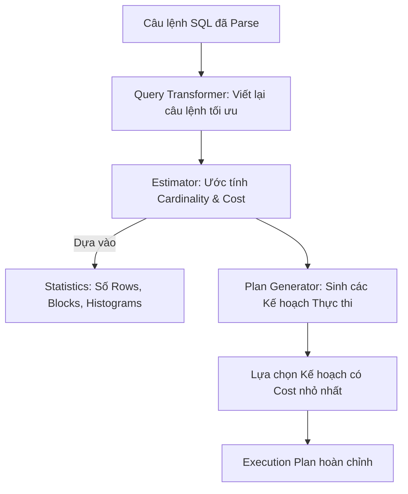

# 🧠 Khái niệm SQL Optimizer (Trình Tối ưu hóa Truy vấn)

⬅️ **[[MOC - Query Optimization]]** | 🔗 **[[MOC - Database Overview]]**

---

## 1. Định nghĩa

**SQL Optimizer (Trình tối ưu hóa truy vấn)** là "bộ não" tinh vi nhất bên trong một RDBMS. Nhiệm vụ của nó là tiếp nhận câu lệnh SQL sau khi phân tích cú pháp/ngữ nghĩa, tìm kiếm trong không gian các chiến lược thực thi khả thi và lựa chọn ra kế hoạch thực thi (**[[Execution Plan]]**) tối ưu nhất.

Hầu hết các hệ quản trị hiện đại (Oracle, PostgreSQL, MySQL, SQL Server) đều sử dụng **Cost-Based Optimizer (CBO)** thay vì Rule-Based Optimizer (RBO) cũ kỹ.

---

## 2. Quy trình Hoạt động của Optimizer

1. **Query Transformation (Chuyển đổi truy vấn):** Tự động viết lại câu lệnh SQL sao cho hiệu quả hơn nhưng không làm đổi kết quả logic (ví dụ: gộp View, đẩy điều kiện lọc xuống sâu - Predicate Pushdown, chuyển Subquery thành Join).
2. **Estimation (Ước lượng):** Dựa vào **[[Statistics (Thống kê Database)]]** để tính toán Selectivity (độ chọn lọc), Cardinality (số dòng trả về ở mỗi bước) và tính **[[Cost]]**.
3. **Plan Generation (Sinh kế hoạch):** So sánh các phương thức truy xuất ([[Data Access Methods]]) và phương thức kết hợp bảng ([[Join Methods]]).

---

## 🔗 Liên kết Liên quan
- Khái niệm liên quan: [[Execution Plan]], [[Cost]], [[Statistics (Thống kê Database)]], [[Data Access Methods]], [[Join Methods]]
- Nguyên lý & Thực chiến: [[Quy trình 6 bước xử lý câu lệnh SQL]], [[Tư duy tối ưu Database (Database Tuning Mindset)]], [[Tại sao Database không chọn Index (Bản chất Cost-Based Optimizer)]]
