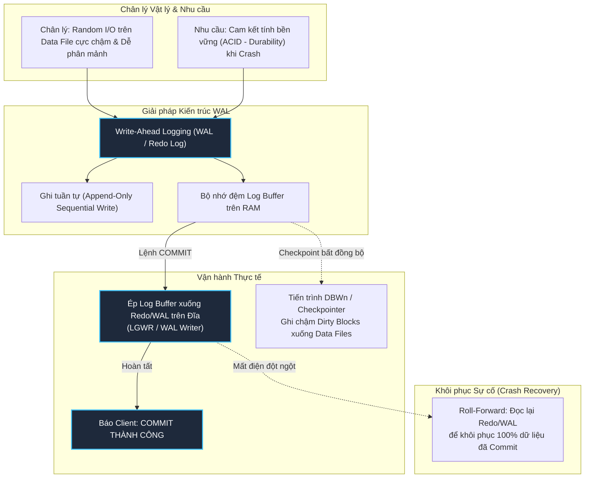
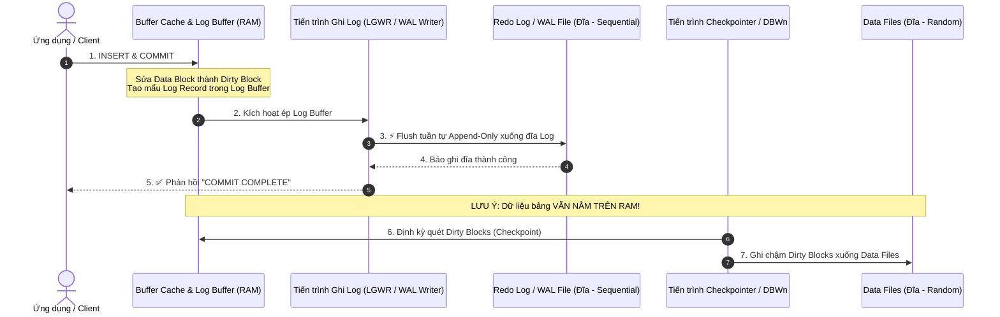

# 📝 Write-Ahead Logging (WAL) & Cơ chế Ghi Nhật Ký Redo Log

⬅️ **[[MOC - Storage & Engine]]** | 🔗 **[[MOC - Database Overview]]** | 🎨 **[[Vận hành ngầm đằng sau 1 câu lệnh INSERT.excalidraw]]**

---

## 🗺️ 1. Sơ Đồ Mermaid DAG Phụ Thuộc (Dependency Architecture)

---

## ⚖️ 2. Chân Lý Vô Điều Kiện (Unconditional Truths)

> [!NOTE]
>
> 1. **Quy tắc Bất biến của WAL:** _Nhật ký thay đổi (Redo Log / WAL record) **BẮT BUỘC PHẢI ĐƯỢC GHI XUỐNG ĐĨA VẬT LÝ TRƯỚC** khi các khối dữ liệu thực tế ([[Block (Page)]] / Dirty Blocks) được phép ghi xuống Data Files._
> 2. **Chân lý Hiệu năng I/O:** _Ghi tuần tự nối đuôi (**Sequential Append-Only I/O**) luôn nhanh hơn ghi ngẫu nhiên phân tán (**Random Disk I/O**) từ hàng chục đến hàng trăm lần, bất kể là ổ đĩa từ tính HDD hay ổ thể rắn NVMe SSD._

---

## 💡 3. Trực Giác Khám Phá (Motivated Discovery - 3Blue1Brown Mindset)

### Nghịch lý giữa "Ghi Nhanh" và "Không Thể Mất Dữ Liệu"

Hãy đặt mình vào vị trí kỹ sư thiết kế Database Engine:

- Khi người dùng gửi lệnh `INSERT` hoặc `UPDATE` và gõ `COMMIT`, họ đòi hỏi hệ thống phải phản hồi ngay lập tức trong vài mili-giây (**Fast Latency**).
- Đồng thời, họ đòi hỏi nếu 1 micro-giây sau khi hệ thống báo OK mà trung tâm dữ liệu bị sập cầu giao, mất điện toàn bộ, thì khi khởi động lại dữ liệu **KHÔNG ĐƯỢC PHÉP MẤT DÙ CHỈ 1 BYTE** (**Durability trong ACID**).

### Tại sao KHÔNG THỂ ghi thẳng vào Data File trên đĩa?

1. **Quá chậm (Random I/O bottleneck):** Một câu lệnh `INSERT` không chỉ nhét dữ liệu vào 1 bảng; nó phải cập nhật nhiều cây [[Index]], kiểm tra [[Foreign Key]], phân vùng [[Block (Page)]]. Các khối này nằm rải rác ở khắp các vị trí trên đĩa cứng. Nếu mỗi lần commit phải ghi đĩa ngẫu nhiên từng khối $\to$ Hệ thống sẽ nghẽn cứng ngắc, IOPS chạm trần.
2. **Nguy cơ hỏng cấu trúc (Torn Page Risk):** Một Block dữ liệu thường là $8\text{ KB}$, trong khi sector vật lý của đĩa là $512\text{ Bytes}$ hoặc $4\text{ KB}$. Nếu đang ghi dở $8\text{ KB}$ xuống Data File mà mất điện ở byte thứ 4000, khối dữ liệu bị xé làm đôi (**Torn Page**), cấu trúc bảng bị hỏng vĩnh viễn và không thể tự phục hồi.

### Bước đột phá: Tách rời "Nhật Ký Hành Động" và "Trạng Thái Dữ Liệu"

Thay vì cập nhật toàn bộ trạng thái phức tạp xuống đĩa ngay lập tức, Database làm một việc cực kỳ thông minh:

- **Chỉ ghi lại một mẩu nhật ký ngắn gọn:** _"Giao dịch TX#101 lúc 09:00:00 đã chèn dòng dữ liệu X vào bảng Y"_.
- Mẩu nhật ký này được ghi nối tiếp vào đuôi một file log duy nhất (**Append-Only**).
- **Bản chất của lệnh `COMMIT`:** Database **KHÔNG HỀ CHỜ** dữ liệu bảng được ghi xuống Data File. Database chỉ cần đẩy mẩu nhật ký từ RAM xuống đĩa log thành công là lập tức báo cho Client: _"COMMIT THÀNH CÔNG!"_. Việc ghi các trang dữ liệu thực tế sẽ để các tiến trình nền làm từ từ (Asynchronous Checkpoint).

---

## 🔬 4. Phân Tích Kỹ Thuật Chuyên Sâu & $\LaTeX$

### 4.1. Vòng Đời Vật Lý Của Một Giao Dịch Qua WAL

### 4.2. Phân Tích Chi Phí Độ Phức Tạp I/O

Gọi:

- $K$ là số lượng Index trên bảng.
- $B_{data}$ là block chứa dữ liệu bảng, $B_{idx}$ là các block lá index bị cập nhật.

$$\text{Chi phí nếu ghi trực tiếp xuống Data File} = \mathcal{O}(1 + K) \text{ Random Disk Writes}$$
$$\text{Chi phí với Write-Ahead Logging} = \mathcal{O}(1) \text{ Sequential Append Write (vài trăm Bytes)}$$

Nhờ có WAL, độ trễ phản hồi của câu lệnh `COMMIT` giảm từ hàng chục mili-giây xuống mức **dưới 1 mili-giây** ($< 1\text{ ms}$).

---

## ⚖️ 5. So Sánh Kiến Trúc Ghi Nhật Ký Giữa Các Database Lớn

| Tiêu chí                                          | Oracle Database                                                                                                                                 | Microsoft SQL Server                                                                                                                                  | PostgreSQL                                                                                                                                       |
| :------------------------------------------------ | :---------------------------------------------------------------------------------------------------------------------------------------------- | :---------------------------------------------------------------------------------------------------------------------------------------------------- | :----------------------------------------------------------------------------------------------------------------------------------------------- |
| **Thuật ngữ Log phục hồi**                        | **Redo Log** (phục vụ đi tới / Crash recovery)                                                                                                  | **Transaction Log** (file `.ldf`)                                                                                                                     | **WAL** (Write-Ahead Log, thư mục `pg_wal/`)                                                                                                     |
| **Tiến trình ghi Log đĩa**                        | `LGWR` (Log Writer)                                                                                                                             | Log Manager / Lazy Writer                                                                                                                             | WAL Writer / Server Backend Sync                                                                                                                 |
| **Cơ chế lưu thông tin Hoàn tác (Undo/Rollback)** | **Tách biệt hoàn toàn:** Lưu vào **Undo Tablespace** (Undo Segment) riêng biệt.                                                                 | **Gộp chung:** Lưu lẫn lộn cả Redo và Undo trong cùng một file Transaction Log.                                                                       | **In-Place Append:** Ghi trực tiếp version tuple mới lên Data Page; dùng trạng thái commit trong `pg_xact`.                                      |
| **Rủi ro vận hành Production kinh điển**          | **Đầy Undo Tablespace:** Khi một transaction dài làm tràn Undo, toàn bộ các lệnh DML (INSERT/UPDATE/DELETE) trên hệ thống **bị dừng đứng lại**. | **Transaction Log phình cực đại ("to tổ trảm"):** Nếu không có job backup log định kỳ để truncate, file `.ldf` sẽ nuốt trọn ổ cứng, làm sập Database. | **Table Bloat (Phân mảnh bảng):** Dữ liệu rollback không bị xóa ngay mà thành Dead Tuple trên Data Page $\to$ Cần [[VACUUM & Dọn rác Database]]. |

---

## 🎴 6. Câu Hỏi Ôn Tập Tư Duy Bản Chất (Spaced Repetition Flashcards)

### Flashcard 1

Khi một câu lệnh `INSERT` được phản hồi "COMMIT thành công", dữ liệu của bạn đã chắc chắn được ghi vào Data File (bảng dữ liệu trên đĩa) hay chưa? Tại sao? #card
**Trả lời:**
**CHƯA HỀ.** Dữ liệu thực tế của bảng mới chỉ nằm trên [[Buffer Cache]] (ở trạng thái Dirty Block). Database chỉ cam kết rằng **Redo Log Buffer đã được flush thành công xuống Redo Log / WAL file trên đĩa** bằng thao tác ghi tuần tự. Dữ liệu bảng sẽ được ghi xuống Data File sau đó một cách bất đồng bộ qua tiến trình **Checkpoint**.

<!--ID: 1725345600001-->

---

### Flashcard 2

Tại sao quy tắc vàng của WAL bắt buộc phải ghi Redo Log xuống đĩa trước khi ghi Dirty Data Block xuống Data File? Điều gì sẽ xảy ra nếu làm ngược lại? #card
**Trả lời:**
Nếu ghi Dirty Block xuống Data File trước nhưng chưa kịp ghi Redo Log mà hệ thống bị sập nguồn: Data File đã bị biến đổi nhưng Database lại không có bất kỳ nhật ký nào để biết giao dịch đó là của ai, đã commit hay chưa, hoặc cần rollback ra sao. Dữ liệu sẽ rơi vào trạng thái hư hỏng (Inconsistent / Corrupted State) và không thể tự phục hồi.

<!--ID: 1725345600002-->

---

### Flashcard 3

Điểm khác biệt cốt lõi trong kiến trúc quản lý Rollback giữa Oracle và SQL Server là gì, và nó dẫn đến rủi ro vận hành Production nào? #card
**Trả lời:**

- **Oracle** tách riêng Redo Log (chỉ phục vụ đi tới) và Undo Segment (lưu dữ liệu cũ để đi lùi và đọc nhất quán). Rủi ro: Nếu Undo Tablespace bị đầy, toàn bộ lệnh DML trên Database sẽ bị dừng toàn diện.
- **SQL Server** gộp chung cả thông tin Redo và Undo vào một file Transaction Log (`.ldf`) duy nhất. Rủi ro: Transaction Log phình to khổng lồ, nếu đặt trên ổ cứng chậm sẽ bóp nghẹt toàn bộ IOPS của hệ thống.
<!--ID: 1725345600003-->

---

## 🔗 7. Liên Kết Tri Thức Liên Quan

- **Cấu trúc lưu trữ & Bộ nhớ:**
  - [[Block (Page)]] - Đơn vị lưu trữ dữ liệu vật lý trên Data File.
  - [[Buffer Cache]] - Nơi chứa các Dirty Blocks trước khi Checkpoint xả xuống đĩa.
  - [[Database Instance]] - Mối quan hệ giữa bộ nhớ RAM và các tiến trình nền `LGWR`, `DBWn`, `CKPT`.
- **Nguyên lý vận hành & Tối ưu:**
  - [[Vận hành ngầm của câu lệnh DML (INSERT Internals)]] - Bóc tách toàn diện những gì diễn ra ngầm khi thực thi INSERT.
  - [[Transaction & MVCC]] - Cơ chế đọc nhất quán và kiểm soát giao dịch đồng thời.
  - [[VACUUM & Dọn rác Database]] - Cách PostgreSQL xử lý hệ quả của cơ chế Append-Only Tuple.
