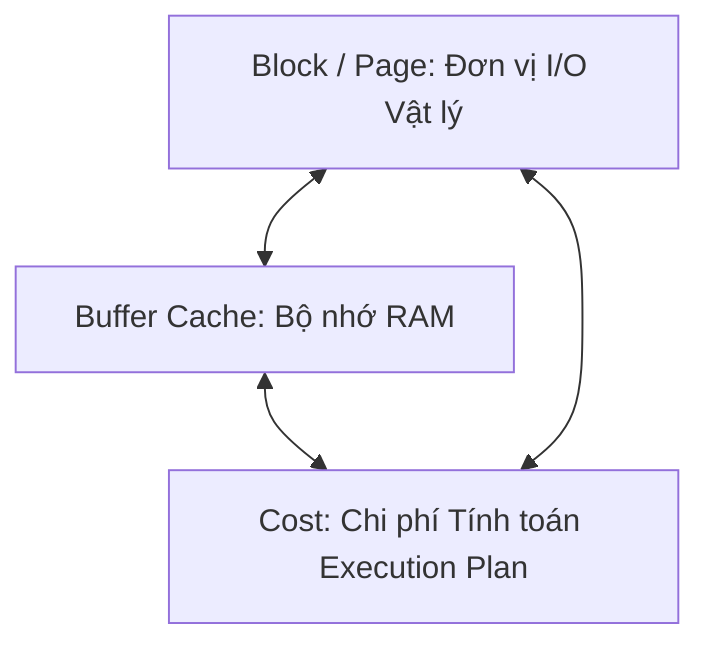

# 🏛️ Nguyên lý "3 + 2" trong Cơ sở Dữ liệu

⬅️ **[[MOC - Database Overview]]** | 🔗 **[[MOC - Query Optimization]]** | 🔗 **[[MOC - Storage & Engine]]**

---

## I. Giới thiệu Mô hình "3 + 2"

Mô hình **"3 + 2"** là kim chỉ nam tối thượng giúp người làm kỹ thuật (Developer, DBA, Solution Architect) xây dựng một tư duy có hệ thống, nhìn xuyên qua các hiện tượng bề nổi để hiểu chính xác bản chất vật lý bên dưới của mọi hệ quản trị cơ sở dữ liệu quan hệ (Oracle, PostgreSQL, MySQL, SQL Server).

![[Pasted image 20260618155403.png]]

---

## II. Ba Yếu tố Cốt lõi (3 Cạnh của Tam giác Vật lý)

### 1. [[Block (Page)]] (Đơn vị làm việc nhỏ nhất)
- Database không bao giờ làm việc với đơn vị từng bản ghi ([[Record (Tuple)]]).
- Đơn vị tính toán và đọc/ghi I/O luôn luôn là **Block/Page** (thường từ 8KB - 64KB).
- Tốc độ câu lệnh phụ thuộc vào **tổng số lượng Block cần xử lý**, không phụ thuộc vào số lượng dòng trả về.

### 2. [[Buffer Cache]] (Bộ nhớ Đệm RAM)
- Mọi dữ liệu muốn đọc hoặc sửa đổi bắt buộc phải được nạp từ Ổ đĩa vào Buffer Cache trên RAM.
- Tốc độ đọc từ RAM (Logical Read) nhanh gấp hàng nghìn lần đọc từ Ổ cứng (Physical Read).
- Hiệu năng tối ưu khi giảm thiểu tối đa các thao tác Physical I/O không cần thiết.

### 3. [[Cost]] (Chi phí Ước tính Kế hoạch Thực thi)
- Trình tối ưu hóa (**[[SQL Optimizer]]**) luôn tính toán điểm Cost dựa trên lượng I/O và CPU cần dùng.
- Optimizer chọn phương án có Cost thấp nhất để tạo thành **[[Execution Plan]]**.
- Cost được tính toán dựa trên **[[Statistics (Thống kê Database)]]**. Nếu Statistics sai, toàn bộ quyết định của Optimizer sẽ sụp đổ.

---

## III. Hai Cơ chế Vận hành Truy vấn (2 Cơ chế Đọc & Ghi)

### 1. Cơ chế Đọc (Read Logic)
Bao gồm 2 quyết định chiến lược lớn:
1. **Phương thức Truy cập Dữ liệu ([[Data Access Methods]]):**
   - Quét toàn bộ: `[[Full Table Scan]]`.
   - Quét chỉ mục: `[[Index Scan]]`, `[[Index Seek]]`, `[[Index Only Scan]]` (Covering Index).
2. **Phương thức Ghép Bảng ([[Join Methods]]):**
   - `[[Nested Loop Join]]`: Phù hợp tập dữ liệu nhỏ + Index.
   - `[[Hash Join]]`: Phù hợp tập dữ liệu lớn không Index.
   - `[[Merge Join]]`: Phù hợp dữ liệu đã sắp xếp sẵn.

### 2. Cơ chế Ghi (Write Logic)
- **Đảm bảo tính ACID & Bền vững:** Ghi nhật ký trước khi ghi dữ liệu thật (**Write-Ahead Logging - WAL / Redo Log**).
- **Ghi bất đồng bộ (Asynchronous Dirty Flush):** Ghi nhận Commit ngay khi ghi xong Log Buffer vào Redo Log; các Dirty Blocks trên RAM sẽ được tiến trình nền ghi xuống đĩa sau.
- **Xử lý Đa phiên bản ([[Transaction & MVCC]]):** `UPDATE`/`DELETE` tạo Dead Tuples, đòi hỏi tiến trình **[[VACUUM & Dọn rác Database]]** để bảo trì hệ thống.

---

## IV. Phá vỡ các Lầm tưởng Kinh điển nhờ Nguyên lý 3+2

| Lầm tưởng của Lập trình viên | Bản chất dưới góc nhìn Database |
| :--- | :--- |
| **"Bảng ít dòng thì câu lệnh chắc chắn chạy nhanh"** | Sai. Bảng 0 dòng nhưng có 200.000 Block rỗng thì Full Table Scan vẫn mất hàng giây (Xem: **[[Case - Table 0 row nhưng truy vấn vẫn cực chậm]]**). |
| **"Đã đánh Index thì câu lệnh chắc chắn dùng Index"** | Sai. Nếu điều kiện lọc lấy > 20% dữ liệu, Optimizer sẽ từ chối Index vì sợ chi phí Random I/O quá lớn (Xem: **[[Case - Khi nào Index phản tác dụng (Ô tô tải vs Xe máy)]]**). |
| **"Hai bảng giống hệt nhau thì tốc độ chạy phải như nhau"** | Sai. Nếu thông số Statistic khác nhau, Optimizer sẽ chọn 2 Execution Plan hoàn toàn khác biệt (Xem: **[[Case - Hai bảng giống nhau nhưng hiệu năng khác nhau]]**). |

---

## 🔗 Liên kết Điều hướng
- MOC liên quan: [[MOC - Database Overview]], [[MOC - Query Optimization]], [[MOC - Storage & Engine]]
- Bài học tiếp theo: [[3 Yếu tố cốt lõi làm Database nhanh]], [[Quy trình 6 bước xử lý câu lệnh SQL]], [[Tư duy tối ưu Database (Database Tuning Mindset)]]
