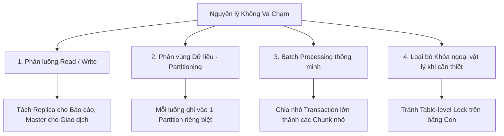

# 🛡️ Nguyên lý Không Va Chạm trong Tối ưu SQL

⬅️ **[[MOC - Concurrency & Lock]]** | 🔗 **[[MOC - Database Overview]]**

---

## 1. Nỗi đau Lớn nhất của Hệ thống Tải cao (High Concurrency)

Khi hệ thống có hàng chục nghìn người dùng đồng thời, phần lớn thời gian câu lệnh SQL bị chậm **không phải do thời gian tính toán CPU**, mà là do **thời gian chờ đợi (Wait Time)**:
- Chờ khóa giải phóng do người khác đang giữ ([[Lock]] contention).
- Chờ I/O đĩa do quá nhiều tiến trình cùng tranh nhau đọc/ghi một vùng dữ liệu.
- Chờ tài nguyên bộ nhớ đệm Buffer Cache.

---

## 2. Bản chất của "Nguyên lý Không Va Chạm"

> [!TIP]
> **Nguyên lý Không Va Chạm (Non-Collision Principle):** Thiết kế kiến trúc và viết câu lệnh sao cho các tiến trình xử lý dữ liệu hoạt động trên các luồng độc lập, **hoàn toàn không tranh chấp tài nguyên, không khóa lẫn nhau và không phải xếp hàng chờ đợi**.

---

## 3. Các Giải pháp Thực chiến Áp dụng Nguyên lý Không Va Chạm

1. **Phân tách Đọc và Ghi (Read/Write Separation):**
   - Đẩy toàn bộ các tác vụ báo cáo, phân tích nặng (tốn nhiều thời gian đọc) sang các máy chủ **Read Replica**.
   - Dành trọn vẹn máy chủ **Primary/Master** cho các giao dịch ghi thời gian thực (OLTP).
2. **Phân mảnh và Phân vùng (Partitioning & Sharding):**
   - Phân chia bảng dữ liệu thành các phân vùng vật lý độc lập. Các worker ghi dữ liệu vào các partition khác nhau sẽ hoàn toàn không xảy ra va chạm khóa.
3. **Kỹ thuật Batching & Chunking:**
   - Thay vì chạy một lệnh `DELETE` 1 triệu dòng (gây khóa toàn bảng và làm đầy Undo/WAL), hãy chia thành các mẻ nhỏ 5.000 dòng kết hợp `COMMIT` ngắn gọn để nhường tài nguyên cho các giao dịch khác.

---

## 🔗 Liên kết Điều hướng
- MOC liên quan: [[MOC - Concurrency & Lock]], [[MOC - Database Overview]]
- Khái niệm liên quan: [[Lock]], [[Deadlock]], [[Foreign Key]], [[3 Yếu tố cốt lõi làm Database nhanh]]
