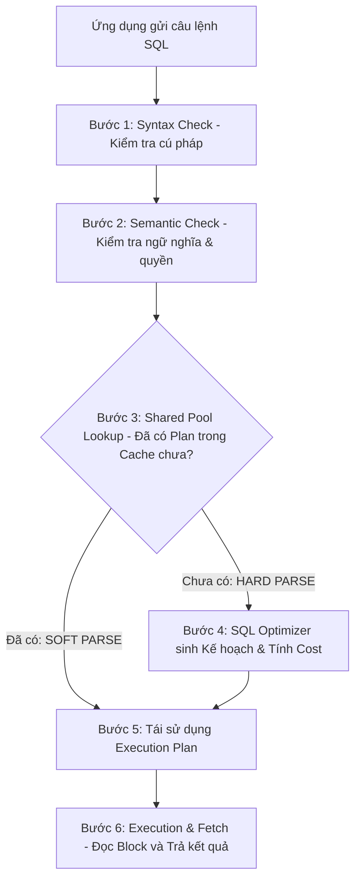

# ⚙️ Quy trình 6 Bước Cơ sở Dữ liệu Xử lý một Câu lệnh SQL

⬅️ **[[MOC - Query Optimization]]** | 🔗 **[[MOC - Database Overview]]**

---

## 1. Tại sao Lập trình viên cần hiểu Quy trình Thực thi SQL?

- **Hiểu rõ bản chất:** Không hiểu bản chất sẽ khiến bạn hoang mang tại sao cùng một câu lệnh có lúc chạy vài mili-giây, có lúc lại mất vài phút.
- **Tư duy hình tượng:** Quá trình Database xử lý câu lệnh giống hệt việc bạn đặt xe công nghệ (Grab). Bạn cần biết tài xế đi cung đường nào, qua những trạm thu phí nào để hiểu lý do vì sao chuyến đi mất nhiều thời gian.
- **Nguyên lý phổ quát:** Đúng với mọi RDBMS quan hệ hàng đầu (PostgreSQL, Oracle, SQL Server, MySQL).

---

## 2. Chi tiết 6 Bước Xử lý Câu lệnh SQL

![[Quy trình 6 bước trong SQL.excalidraw]]

### Bước 1: Kiểm tra Cú pháp (Syntax Check)
- Kiểm tra lỗi chính tả ngữ pháp SQL (ví dụ: gõ thiếu `FROM`, viết sai chữ `SELECT`).
- Nếu sai, dừng lại và báo lỗi ngay lập tức. Tiêu tốn cực ít tài nguyên.

### Bước 2: Kiểm tra Ngữ nghĩa (Semantic Check)
- Kiểm tra các Bảng (Table) và Cột (Column) có thực sự tồn tại trong Data Dictionary không.
- Kiểm tra người dùng (User/Role) có quyền (`SELECT`, `UPDATE`...) trên đối tượng đó không.

### Bước 3 & Bước 4: Phân tích & Lập Kế hoạch (**Hard Parse**)
- Hệ thống kiểm tra trong Cache xem câu lệnh này đã từng chạy trước đây chưa.
- Nếu là câu lệnh mới hoàn toàn, **[[SQL Optimizer]]** phải thực hiện **Hard Parse**:
  - Phân tích toàn bộ các đường đi khả thi.
  - Tính toán **[[Cost]]** cho từng phương án.
  - Chọn ra phương án tối ưu để xây dựng **[[Execution Plan]]**.
- > [!CAUTION]
  > **TỬ HUYỆT HIỆU NĂNG:** Quá trình Hard Parse tiêu tốn **rất nhiều CPU và RAM**, có thể chiếm tới 90% tổng thời gian thực thi của câu lệnh!

### Bước 5 & Bước 6: Tái sử dụng Kế hoạch (**Soft Parse**) & Trả Kết quả (Fetch)
- Nếu câu lệnh đã có sẵn trong Cache, Database lấy luôn Execution Plan ra dùng (**Soft Parse**), bỏ qua hoàn toàn bước tính toán tốn kém.
- Thực thi câu lệnh: Nạp [[Block (Page)]] vào [[Buffer Cache]] và trả dữ liệu về cho ứng dụng.

---

## 3. Bài học Thực chiến: Sức mạnh Vô địch của Bind Variables

Thử nghiệm chạy vòng lặp **100.000 câu lệnh SELECT** tìm kiếm theo Primary Key:

| Tiêu chí | Viết Giá trị Tĩnh (Gây Hard Parse liên tục) | Dùng Biến Truyền vào - Bind Variable (Tận dụng Soft Parse) |
| :--- | :--- | :--- |
| **Mã SQL** | `WHERE id = 1` `WHERE id = 2` `WHERE id = 3`... | `WHERE id = :B1` |
| **Cách DB nhìn nhận** | Coi đây là **100.000 câu lệnh hoàn toàn khác biệt**. | Coi đây là **1 câu lệnh duy nhất** chạy 100.000 lần với tham số khác nhau. |
| **Cách DB xử lý** | Bắt buộc thực hiện **Hard Parse 100.000 lần**. | Chỉ Hard Parse **1 lần đầu tiên**, 99.999 lần sau đều là **Soft Parse**. |
| **Thời gian chạy** | **5 phút 06 giây** (CPU 100%). | **Chỉ đúng 3 giây** (Nhanh gấp ~100 lần!). |

---

## 🔗 Liên kết Điều hướng
- MOC liên quan: [[MOC - Query Optimization]], [[MOC - Database Overview]]
- Khái niệm nền tảng: [[SQL Optimizer]], [[Execution Plan]], [[Cost]], [[Buffer Cache]]
