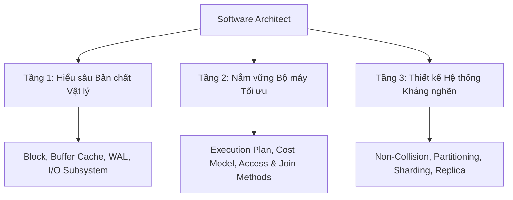

# 🏗️ Tư duy Tối ưu hóa Database cho Software Architect

⬅️ **[[MOC - Database Overview]]** | 🔗 **[[MOC - Query Optimization]]**

---

## 1. Tầm nhìn Kiến trúc trong Hệ thống Lớn (Core Banking, Chứng khoán)

Trong các hệ thống lõi tài chính, ngân hàng, chứng khoán hoặc sàn thương mại điện tử quy mô lớn:
- Một giây nghẽn database có thể gây thiệt hại hàng tỷ đồng.
- Vấn đề hiệu năng không đơn thuần là câu chuyện "thêm RAM, nâng cấp CPU" (Scale-Up), mà là **bản thiết kế kiến trúc xử lý dữ liệu ngay từ đầu**.

---

## 2. Vì sao Code chạy nhanh ở Môi trường Dev nhưng sập ở Production?

1. **Sự khác biệt về Dung lượng Dữ liệu:** Trên môi trường Dev chỉ có vài trăm dòng test, câu lệnh nào chạy cũng chỉ tốn vài mili-giây. Lên Production với hàng chục triệu dòng, các thuật toán không tối ưu ([[Nested Loop Join]] sai, [[Full Table Scan]]) lập tức bộc lộ khuyết điểm.
2. **Sự khác biệt về Độ Đồng thời (Concurrency):** Trên Dev chỉ có 1 developer test. Trên Production có 10.000 user cùng thao tác, các lỗi tranh chấp khóa ([[Lock]], [[Deadlock]], thiếu Index trên [[Foreign Key]]) lập tức làm sập Database Connection Pool.

---

## 3. Khung Năng lực Tối ưu của một Software Architect

---

## 🔗 Liên kết Điều hướng
- MOC liên quan: [[MOC - Database Overview]], [[MOC - Query Optimization]], [[MOC - Concurrency & Lock]]
- Lộ trình phát triển: [[Lộ trình học Database toàn diện cho Developer]]
