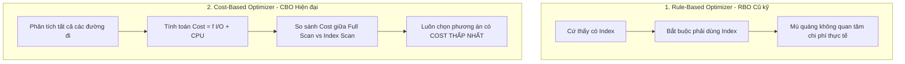

# 🧠 Tại sao Database Không Chọn Index? (Bản chất Cost-Based Optimizer)

⬅️ **[[MOC - Query Optimization]]** | 🔗 **[[MOC - Database Overview]]**

---

## 1. Nghịch lý Kinh điển của Lập trình viên

Trong quá trình phát triển ứng dụng, rất nhiều lập trình viên gặp phải tình huống trớ trêu:
- Có một bảng dữ liệu lớn (ví dụ bảng `Users` với hơn **2.4 triệu bản ghi**).
- Câu lệnh SQL rất đơn giản: chỉ lọc tìm kiếm trên đúng một cột duy nhất (ví dụ: `reputation > ...` hoặc `ORDER BY reputation`).
- Cột đó **đã được đánh Index cẩn thận** (`idx_reputation`).
- Nhưng khi kiểm tra kế hoạch thực thi (**[[Execution Plan]]**), cả trên **Oracle** lẫn **SQL Server**, Database Engine kiên quyết **KHÔNG DÙNG INDEX** mà lại quét toàn bộ bảng (**[[Full Table Scan]]** / `Clustered Index Scan`)!

> [!QUESTION]
> **Câu hỏi đặt ra:** Tại sao có Index sẵn mà Database lại "ngó lơ"? Có phải Database bị lỗi (Bug) hay ta phải dùng **Hint** để ép nó dùng Index bằng mọi giá?

---

## 2. Bản chất Bộ máy Ra Quyết định: RBO vs CBO

Để trả lời câu hỏi trên, ta cần hiểu sự tiến hóa của trình tối ưu hóa (**[[SQL Optimizer]]**):



- **Rule-Based Optimizer (RBO):** Hoạt động theo các luật cứng (Heuristic Rules). Nếu thấy cột có Index thì luôn luôn chọn dùng Index mà không quan tâm bảng có bao nhiêu dòng hay tốn bao nhiêu I/O. RBO hiện nay đã bị khai tử ở hầu hết các RDBMS hiện đại.
- **Cost-Based Optimizer (CBO):** Hoạt động dựa trên việc tính toán **[[Cost]]** (chi phí tiêu tốn I/O đĩa và chu kỳ CPU). Database không quan tâm bạn thích dùng Index hay không, nó chỉ quan tâm: **"Phương án nào tốn ít tài nguyên nhất và chạy an toàn nhất cho toàn bộ hệ thống?"**

![[Pasted image 20260827103459.png]]

---

## 3. Thực chứng Đo đếm Thực nghiệm 1: So sánh Tự chọn vs Ép Index

Thực hiện bài kiểm tra trên bảng `Users` (> 2.4 triệu dòng) với câu truy vấn lọc theo cột `reputation` (đã có index `idx_reputation`):

### Phương pháp Thực nghiệm Chuẩn mực:
1. **Xóa sạch bộ nhớ đệm Buffer Cache** trước mỗi lần chạy để kết quả đo đếm I/O vật lý hoàn toàn minh bạch:
   - SQL Server: `DBCC DROPCLEANBUFFERS;`
   - Oracle: `ALTER SYSTEM FLUSH BUFFER_CACHE;`
2. **Bật chế độ Trace tài nguyên chi tiết:**
   - SQL Server: `SET STATISTICS IO ON;`
   - Oracle: `SET AUTOTRACE ON; SET TERMOUT OFF;` (tắt hiển thị dữ liệu ra màn hình, chỉ đo đếm số liệu kỹ thuật).

---

### Bảng Kết quả Đo lường Thực tế trên SQL Server & Oracle

| Hệ quản trị    | Tiêu chí Đo đếm                    | Trường hợp 1: Để Database Tự chọn ([[Full Table Scan]]) | Trường hợp 2: Dùng Hint ÉP DÙNG INDEX        | Đánh giá & Chênh lệch                   |
| :------------- | :--------------------------------- | :------------------------------------------------------ | :------------------------------------------- | :-------------------------------------- |
| **SQL Server** | **Chiến lược Thực thi**            | `Clustered Index Scan` (Quét Full bảng)                 | `Index Scan (idx_reputation)` + `Key Lookup` | Ép dùng Index thành công                |
|                | **Logical Reads (Số Page 8KB)**    | **44,530 pages** (~347 MB)                              | **3,000,000+ pages** (~23.4 GB)              | 🔴 Ép Index tốn I/O **gấp gần 70 lần!** |
|                | **Physical Reads (Đọc Đĩa)**       | 3 pages                                                 | Tăng cao đột biến                            | Tải đĩa nặng hơn                        |
|                | **Thời gian chạy**                 | ~10 giây                                                | ~9 - 10 giây                                 | Không cải thiện thời gian               |
| **Oracle**     | **Chiến lược Thực thi**            | `TABLE ACCESS FULL`                                     | `INDEX RANGE SCAN` + `TABLE ACCESS BY ROWID` | Ép dùng Index thành công                |
|                | **Consistent Gets (Số Block 8KB)** | **1,400,000 blocks**                                    | **24,000,000+ blocks**                       | 🔴 Ép Index tốn Block **gấp 17 lần!**   |
|                | **Physical Reads (Đọc Đĩa)**       | **434 blocks**                                          | **51,000+ blocks**                           | 🔴 Đọc đĩa tăng **gấp 117 lần!**        |
|                | **Cost Ước lượng**                 | **13,615**                                              | Tăng vọt lên hàng trăm nghìn                 | CBO từ chối Index là hoàn toàn đúng     |

```
[ BẢN CHẤT VẬT LÝ VÌ SAO ÉP DÙNG INDEX LẠI TỆ HƠN ]:

1. Khi quét Full Table Scan:
   Database dùng Multi-block Read (Sequential I/O), mỗi lần đọc 1 cụm gồm 16 - 128 Block liên tiếp.
   => Tổng số lần gọi I/O cực ít, CPU xử lý tuần tự rất mượt.

2. Khi ép dùng Index:
   Database phải duyệt cây Index -> Lấy từng RowID -> Nhảy ngẫu nhiên (Random I/O) vào Table Block
   hàng triệu lần để lấy các cột còn lại.
   => Sinh ra hơn 24 TRIỆU Block I/O và 51.000 lần đọc đĩa ngẫu nhiên!
```

---

## 4. Thực chứng Đo đếm Thực nghiệm 2: Hiện tượng Index với `ORDER BY`

Xem xét câu truy vấn có sắp xếp: `SELECT * FROM users ORDER BY reputation;`

```sql
-- Câu lệnh 1: Không dùng Hint (Database Tự chọn)
SELECT * FROM users ORDER BY reputation;

-- Câu lệnh 2: Dùng Hint ép dùng Index
SELECT /*+ INDEX(users idx_reputation) */ * FROM users ORDER BY reputation;
```

### Kết quả Phân tích Execution Plan & Cost:

```
[ Trường hợp 1: Database Tự chọn ]
-> Thao tác: TABLE ACCESS FULL + SORT (ORDER BY)
-> Đặc điểm: Database chấp nhận tốn CPU để thực hiện bước SORT sau khi quét Full.
-> Cost: 86,952.

[ Trường hợp 2: Dùng Hint ÉP dùng Index ]
-> Thao tác: INDEX FULL SCAN (idx_reputation) + TABLE ACCESS BY ROWID
-> Đặc điểm: LOẠI BỎ ĐƯỢC BƯỚC SORT (vì dữ liệu trong Index đã xếp sẵn thứ tự!).
-> Cost: 1,000,000+ (HƠN 1 TRIỆU COST!).
```

> [!IMPORTANT]
> **Bài học Vàng:** Việc loại bỏ được bước `SORT` không có ý nghĩa gì nếu chi phí Random I/O trên bảng gốc bị đội lên gấp **hơn 11 lần** (Cost từ 86 nghìn nhảy lên hơn 1 triệu). Optimizer thông minh thà tốn một ít CPU để Sort còn hơn là tra tấn ổ cứng bằng hàng triệu lần Random Read!

---

## 5. Kỹ thuật Sử dụng Hint để Benchmark (Dành cho Dev & DBA)

Trong quá trình phân tích và tối ưu hóa dự án, việc dùng Hint là một công cụ mạnh mẽ để **kiểm tra giả định và đối chiếu chi phí** (không nên lạm dụng Hint trong mã Production):

### Trên Microsoft SQL Server:
```sql
-- Bật đo đếm I/O
SET STATISTICS IO ON;
SET STATISTICS TIME ON;

-- Xóa cache để đo đếm chính xác (Cẩn trọng trên Production)
DBCC DROPCLEANBUFFERS;
DBCC FREEPROCCACHE;

-- Ép dùng Index cụ thể
SELECT * FROM users WITH (INDEX(idx_reputation)) WHERE reputation > 100;
```

### Trên Oracle Database:
```sql
-- Bật theo dõi tài nguyên tự động
SET AUTOTRACE ON;
SET TERMOUT OFF; -- Tắt in kết quả dòng, chỉ in bảng thống kê execution

-- Xóa Buffer Cache (Cẩn trọng trên Production)
ALTER SYSTEM FLUSH BUFFER_CACHE;

-- Cú pháp Hint ép Index (Lưu ý: /*+ là cú pháp Hint, không phải comment thường!)
SELECT /*+ INDEX(users idx_reputation) */ * FROM users WHERE reputation > 100;
```

---

## 6. 4 Câu hỏi Tư duy Kiến trúc Chuyên sâu (Architect Questions)

Khi hiểu sâu công thức $	ext{Cost} = f(	ext{Block I/O}, 	ext{CPU})$ của CBO, bạn có thể tự mình trả lời các câu hỏi lớn về thiết kế hệ thống:

```
                  +-------------------------------------------------+
                  |       4 CÂU HỎI TƯ DUY KIẾN TRÚC DATABASE       |
                  +-------------------------------------------------+
                     /               |               |                                 /                |               |                           [ 1. Phần cứng ] [ 2. Loại DBMS ] [ 3. Version ] [ 4. Bản chất ]
```

1. **Thay đổi Phần cứng (HDD => SSD NVMe / Nâng cấp CPU) có làm thay đổi Execution Plan không?**
   - **Có!** Vì tốc độ Random I/O của SSD NVMe nhanh hơn HDD rất nhiều, trọng số chi phí $W_{io}$ giảm xuống. Lúc này, Optimizer có thể sẽ chuyển từ Full Table Scan sang chọn Index Scan cho cùng một câu lệnh.
1. **Chuyển đổi Hệ quản trị (MySQL => Oracle / Postgres) có làm thay đổi việc chọn Index không?**
   - **Chắc chắn có!** Mỗi Engine có một Cost Model, giải thuật đánh giá Index, và cách tổ chức lưu trữ vật lý ([[Block (Page)]]) khác nhau hoàn toàn.
3. **Nâng cấp Phiên bản Database (Upgrade Version) có rủi ro thay đổi Kế hoạch thực thi không?**
   - **Có!** Đây là rủi ro lớn nhất trong các dự án Migration/Upgrade. Một câu lệnh đang chạy nhanh ở bản cũ có thể bị Optimizer bản mới chọn lại Plan khác do bộ tham số CBO được cập nhật.
4. **Tại sao học từ Kiến trúc Bản chất lại giúp ta làm chủ toàn bộ Hệ thống?**
   - Khi hiểu cách Database tính toán từ tầng đáy (Block, Cache, Cost, Random I/O), bạn không còn tối ưu theo kiểu "thử - sai ở phần ngọn" mà có thể **dự đoán chính xác mọi đường đi của dữ liệu**.

---

## 🔗 Liên kết Điều hướng Mạng lưới
- MOC liên quan: [[MOC - Query Optimization]], [[MOC - Database Overview]]
- Khái niệm nền tảng: [[Cost]], [[SQL Optimizer]], [[Index]], [[Block (Page)]], [[Execution Plan]], [[Buffer Cache]], [[Data Access Methods]]
- Nguyên lý & Case Study liên quan:
  - [[Nguyên lý 3+2 trong Database]]
  - [[Tư duy tối ưu Database (Database Tuning Mindset)]]
  - [[Case - Khi nào Index phản tác dụng (Ô tô tải vs Xe máy)]]
  - [[Case - Hai bảng giống nhau nhưng hiệu năng khác nhau]]
