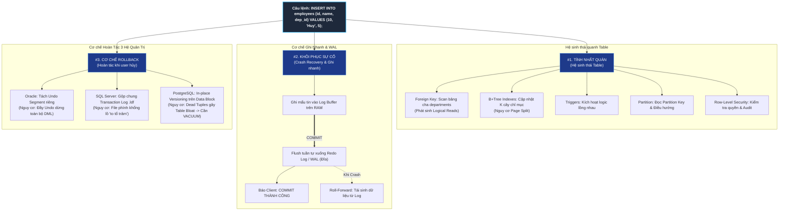

# ⚙️ Vận Hành Ngầm Đằng Sau Câu Lệnh DML (INSERT Internals)

⬅️ **[[MOC - Storage & Engine]]** | 🔗 **[[MOC - Database Overview]]** | 🧭 **[[MOC - Query Optimization]]**

---

## 🎨 1. Bản Vẽ Sơ Đồ Tư Duy Tổng Quan (Excalidraw Architecture)

> [!TIP]
> Toàn bộ tư duy bóc tách bản chất từ bài giảng của chuyên gia Trần Quốc Huy (Wecommit) được tổng hợp trực quan trong bản vẽ tay bên dưới:

![[Vận hành ngầm đằng sau 1 câu lệnh INSERT.excalidraw]]

---

## 🗺️ 2. Bản Đồ 3 Trục Kiến Trúc Vận Hành Ngầm (Mermaid DAG)



---

## ⚖️ 3. Chân Lý Vô Điều Kiện (Unconditional Truths)

> [!NOTE]
>
> 1. **Bản chất của DML không phải là "Thêm/Sửa Dữ liệu":** Bản chất thực sự của mọi câu lệnh DML (`INSERT`, `UPDATE`, `DELETE`) là **Thay đổi trạng thái dữ liệu (State Mutation)** của toàn bộ Database Engine.
> 2. **INSERT không bao giờ cô lập:** Một câu lệnh `INSERT` không bao giờ chỉ chạm vào bảng đích một cách đơn độc; nó kích hoạt ngầm một mạng lưới ràng buộc toàn vẹn, chỉ mục, phân vùng và cơ chế ghi log phục hồi.
> 3. **Tách rời Log và Data:** Database không bao giờ ghi dữ liệu bảng trực tiếp xuống đĩa ngay lúc thực thi; nó luôn ghi nhật ký hành động tuần tự (**Write-Ahead Logging**) trước, và ghi dữ liệu bảng thực tế sau một cách bất đồng bộ (**Checkpoint**).

---

## 🔬 4. Phân Tích 3 Bài Toán Kiến Trúc Lớn Của Database Engine

### 🧩 Bài Toán 1: Làm Thế Nào Đảm Bảo Tính Nhất Quán? (Tác Động Ngầm Quanh Table)

#### A. Thí Nghiệm Thực Tế Với `SET STATISTICS IO ON`

Trong bài giảng, chuyên gia Trần Quốc Huy thực hiện một thí nghiệm đo đếm nội bộ:

```sql
SET STATISTICS IO ON;

INSERT INTO employees (emp_id, emp_name, department_id)
VALUES (10, 'Huy', 5);
```

**Kết quả thống kê I/O thu được:**

```text
Table 'departments'. Scan count 0, logical reads 2.
Table 'employees'. Scan count 0, logical reads 2.
```

> [!CAUTION]
> **Hiện tượng nghịch lý:** Câu lệnh của lập trình viên chỉ chèn vào bảng `employees`. Tại sao Database Engine lại phát sinh đến $2$ lần đọc dữ liệu (**Logical Reads = 2 blocks**) trên bảng `departments`?

#### B. Giải Mã Bản Chất: Ràng Buộc Khóa Ngoại ([[Foreign Key]])

- Bảng `employees` có ràng buộc khóa ngoại `department_id` tham chiếu sang bảng cha `departments`.
- Để bảo đảm tính toàn vẹn dữ liệu, Database **bắt buộc phải đọc các Block dữ liệu hoặc Index của bảng `departments`** để xác minh xem phòng ban số `5` có thực sự tồn tại hay không.
- Nếu phòng ban số `5` chưa có trên RAM ([[Buffer Cache]]), Database phải phát sinh **Physical Disk Read** để nạp block đó từ ổ cứng lên.

#### C. Hệ Sinh Thái Các Yếu Tố Bị Kích Hoạt Ngầm Khi INSERT

Một câu lệnh `INSERT` làm việc trực tiếp với bảng, nhưng xung quanh bảng luôn tồn tại một hệ sinh thái các thành phần:

| Thành phần phụ thuộc                 | Hoạt động ngầm của Database Engine                                                                                | Tác động hiệu năng thực tế                                                   |
| :----------------------------------- | :---------------------------------------------------------------------------------------------------------------- | :--------------------------------------------------------------------------- |
| **[[Foreign Key]] & Constraints**    | Quét bảng cha kiểm tra khóa ngoại; duyệt Unique Index kiểm tra trùng lặp; kiểm tra điều kiện Check & Not Null.    | Phát sinh thêm nhiều Logical Reads/Physical I/O ngoài dự kiến.               |
| **[[Index]] (B+Tree)**               | Bảng có $K$ index thì Database phải ghi thêm $K$ con trỏ vào các cây B+Tree tương ứng.                            | Nguy cơ **Page Split** (phân tách block chỉ mục) khiến chi phí ghi tăng vọt. |
| **Triggers**                         | Kích hoạt các thủ tục lưu trữ ngầm ngay trước/sau lệnh INSERT.                                                    | Có thể kéo theo hàng loạt câu lệnh DML lồng nhau trên các bảng khác.         |
| **Partition / Sub-Partition**        | Kiểm tra Partition Key (ví dụ: ngày tuyển dụng) để định tuyến bản ghi vào đúng thùng dữ liệu (Partition Routing). | Tốn thêm CPU để tính toán nhánh phân vùng vật lý.                            |
| **Row-Level Security (RLS) & Audit** | Kiểm tra phân quyền dòng dữ liệu và ghi log kiểm toán bảo mật.                                                    | Tiêu tốn thêm tài nguyên xử lý logic trước khi nạp dữ liệu.                  |

---

### ⚡ Bài Toán 2: Làm Thế Nào Để Khôi Phục Dữ Liệu Khi Có Sự Cố? (Crash Recovery & WAL)

Giả sử lệnh `INSERT` vừa thực thi xong thì phòng máy chủ bị mất điện đột ngột. Chúng ta đối mặt với 2 kịch bản sinh tử:

1. **Nếu đã nhận thông báo COMMIT:** Bằng cách nào khi bật lại máy chủ, dữ liệu chắc chắn vẫn còn vẹn nguyên?
2. **Nếu CHƯA kịp COMMIT:** Bằng cách nào khi bật lại máy chủ, dữ liệu dở dang không bị ghi nhận lung tung vào hệ thống?

#### Tư Duy Thiết Kế Của Database Architect:

- **Nếu ghi thẳng vào Data File:** Gây ra hàng loạt thao tác **Random Disk Writes** cực chậm do bảng và index bị phân mảnh. Nếu mất điện giữa chừng, khối $8\text{ KB}$ bị ghi dở thành **Torn Page**, dữ liệu hỏng vĩnh viễn.
- **Giải pháp - Ghi nhật ký trước ([[Write-Ahead Logging (WAL)]]):**
  1. Ghi lại **Hành động gì** thay vì cập nhật toàn bộ trạng thái dữ liệu.
  2. Dùng cơ chế **Append-Only Sequential Write**: Ghi nối tiếp vào cuối file log $\to$ Tốc độ cực nhanh, không phân mảnh.
  3. Áp dụng cơ chế **Memory First**: Nạp Dirty Block vào [[Buffer Cache]] trên RAM, đồng thời nạp mẩu nhật ký vào Log Buffer trên RAM.
  4. **Thời khắc COMMIT:** Tiến trình Log Writer (`LGWR`) ép toàn bộ Log Buffer xuống đĩa. Ngay khi file log trên đĩa ghi xong, Database lập tức báo `COMMIT OK`. Dữ liệu bảng thực tế vẫn nằm trên RAM và được xả chậm xuống đĩa sau đó qua tiến trình **Checkpoint**.
  5. **Khi Crash:** Database chỉ việc đọc lại file Log từ mốc Checkpoint để phát lại (**Roll-Forward / Replay**), phục hồi lại $100\%$ dữ liệu đã commit.

---

### 🔄 Bài Toán 3: Làm Thế Nào Để Hoàn Tác Khi Người Dùng Không Muốn Xác Nhận? (Rollback & MVCC)

Nếu người dùng phát lệnh `ROLLBACK`, hoặc ứng dụng bị crash trước khi commit, Database phải đưa dữ liệu trở về quá khứ ra sao?

Có 2 tư duy thiết kế gốc:

1. Lưu giá trị cũ ở một vùng nhớ riêng biệt để khi cần thì lấy ra đắp lại.
2. Lưu hành động đảo ngược (Compensating Action: nếu trước đó INSERT thì lưu lệnh xóa dòng đó).

#### Bảng So Sánh Chiến Lược Hoàn Tác Giữa 3 Hệ Quản Trị CSDL:

```text
┌──────────────────────────────────────────────────────────────────────────────────┐
│              SO SÁNH 3 TRIẾT LÝ QUẢN TRỊ GHI NHẬT KÝ & HOÀN TÁC                  │
├─────────────────┬──────────────────────────────────┬─────────────────────────────┤
│ DATABASE        │ TRIẾT LÝ THIẾT KẾ                │ TỬ HUYỆT VẬN HÀNH THỰC CHIẾN│
├─────────────────┼──────────────────────────────────┼─────────────────────────────┤
│ 🔴 ORACLE       │ TÁCH BIỆT RẠCH RÒI:              │ ĐẦY UNDO TABLESPACE:        │
│                 │ - Redo Log: Chỉ phục vụ đi tới.  │ Khi Undo bị đầy do lệnh lớn │
│                 │ - Undo Tablespace: Chỉ phục vụ   │ hoặc query dài, TOÀN BỘ CÂU │
│                 │   đi lùi & Đọc nhất quán (CR).   │ LỆNH DML TRÊN TOÀN HỆ THỐNG │
│                 │                                  │ SẼ BỊ DỪNG HẾT (ĐỨNG HÌNH)! │
├─────────────────┼──────────────────────────────────┼─────────────────────────────┤
│ 🔵 SQL SERVER   │ GỘP CHUNG TẤT CẢ VÀO MỘT:        │ FILE PHÌNH "TO TỔ TRẢM":    │
│                 │ - Cả Redo (đi tới) và Undo       │ Transaction Log phình khổng │
│                 │   (đi lùi) đều nằm chung trong   │ lồ; nếu không backup & cắt  │
│                 │   Transaction Log (.ldf).        │ tỉa (truncate log) định kỳ, │
│                 │                                  │ đĩa sẽ đầy và DB ngừng chạy.│
├─────────────────┼──────────────────────────────────┼─────────────────────────────┤
│ 🐘 POSTGRESQL   │ IN-PLACE APPEND MULTI-VERSION:   │ PHÂN MẢNH BẢNG (TABLE BLOAT)│
│                 │ - Ghi trực tiếp version mới lên  │ Dòng rollback thành Dead    │
│                 │   chính Data Page của bảng.      │ Tuple rác $\to$ Quét bảng   │
│                 │ - Khi Rollback: Không xóa, chỉ   │ cực chậm, bắt buộc phải có  │
│                 │   bật cờ Abort trong clog/pg_xact│ tiến trình VACUUM dọn dẹp.  │
└─────────────────┴──────────────────────────────────┴─────────────────────────────┘
```

---

## 🎯 5. Tư Duy Tối Ưu Hóa Dành Cho Software Architect & DBA

Từ bản chất vận hành ngầm của câu lệnh `INSERT`, người kỹ sư cần rút ra các bài học đắt giá khi thiết kế hệ thống chịu tải cao (Core Banking, E-Commerce, Chứng khoán):

1. **Không lạm dụng Index trên bảng ghi nhiều (Write-Heavy Tables):**
   - Mỗi Index bổ sung là một cây B+Tree mà lệnh INSERT bắt buộc phải cập nhật và phát sinh thêm Redo Log.
   - Xem thêm: [[Case - Khi nào Index phản tác dụng (Ô tô tải vs Xe máy)]].
2. **Cẩn trọng với Khóa Ngoại và Trigger:**
   - Cân nhắc sử dụng cơ chế xử lý bất đồng bộ (Message Queue / Event-Driven) thay vì dùng Trigger đồng bộ trên các bảng lõi giao dịch.
   - Luôn tạo Index trên cột Foreign Key để tránh bẫy khóa bảng cha/con: [[Foreign Key]] & [[Case - Tối ưu Foreign Key và Lock leo thang]].
3. **Tách biệt ổ đĩa vật lý cho Log và Data:**
   - File Log (Redo Log / WAL / `.ldf`) có đặc thù ghi tuần tự liên tục theo thời gian thực $\to$ Nên đặt trên ổ đĩa SSD NVMe chuyên biệt có độ trễ cực thấp (Write Latency $< 0.5\text{ ms}$).
   - Data Files chịu các đợt ghi ngẫu nhiên qua Checkpoint $\to$ Có thể cấu hình trên phân vùng lưu trữ có dung lượng lớn hơn.
4. **Giám sát sức khỏe vùng nhớ Hoàn tác:**
   - Trên Oracle: Luôn đặt cảnh báo dung lượng Undo Tablespace để tránh tê liệt DML.
   - Trên SQL Server: Thiết lập lịch trình Backup Transaction Log nghiêm ngặt.
   - Trên PostgreSQL: Theo dõi sát sao hiện tượng Table Bloat và tần suất hoạt động của tiến trình [[VACUUM & Dọn rác Database]].

---

## 🎴 6. Spaced Repetition Flashcards

### Flashcard 1

Tại sao câu lệnh `INSERT` vào một bảng con có thể làm phát sinh thêm nhiều Logical Reads trên một bảng khác mà lập trình viên không hề gọi tên trong câu SQL? #card
**Trả lời:**
Do bảng con có ràng buộc **Khóa ngoại ([[Foreign Key]])** tham chiếu sang bảng cha. Để bảo đảm tính nhất quán dữ liệu, Database Engine bắt buộc phải thực hiện các thao tác đọc ngầm trên bảng cha (hoặc Unique/PK Index của bảng cha) nhằm kiểm tra sự tồn tại của khóa tham chiếu.

<!--ID: 1725345600004-->

---

### Flashcard 2

Khi thiết kế Database Engine, 3 bài toán lớn nhất cần giải quyết xoay quanh một câu lệnh thay đổi dữ liệu (DML) là gì? #card
**Trả lời:**

1. **Tính nhất quán dữ liệu:** Xử lý hệ sinh thái quanh bảng (Constraints, Indexes, Triggers, Partitioning).
2. **Khôi phục khi có sự cố (Crash Recovery):** Đảm bảo ghi nhanh và không mất dữ liệu bằng cơ chế Write-Ahead Logging (WAL / Redo Log).
3. **Cơ chế hoàn tác (Rollback):** Đưa trạng thái dữ liệu quay về quá khứ nếu giao dịch bị hủy hoặc người dùng không muốn xác nhận (Undo Segment / Transaction Log / Dead Tuples).
<!--ID: 1725345600005-->

---

## 🔗 7. Liên Kết Tri Thức Liên Quan

- **Khái niệm nguyên tử:**
  - [[Write-Ahead Logging (WAL)]] - Cơ chế ghi nhật ký trước khi ghi dữ liệu.
  - [[Foreign Key]] - Bản chất kiểm tra toàn vẹn và bẫy hiệu năng khóa ngoại.
  - [[Index]] - Chi phí cập nhật B+Tree khi chèn dữ liệu mới.
  - [[Block (Page)]] & [[Buffer Cache]] - Vòng đời của Dirty Blocks trên RAM và đĩa.
  - [[Transaction & MVCC]] & [[VACUUM & Dọn rác Database]] - Cơ chế quản trị đa phiên bản và dọn dẹp rác.
- **Tư duy kiến trúc:**
  - [[Nguyên lý 3+2 trong Database]] - Tam giác Block - Cache - Cost và 2 cơ chế Đọc/Ghi.
  - [[Tư duy tối ưu Database (Database Tuning Mindset)]] - Chuyển đổi từ góc nhìn dòng sang góc nhìn khối.
  - [[3 Yếu tố cốt lõi làm Database nhanh]] - Thiết kế, câu lệnh và tranh chấp tài nguyên.
