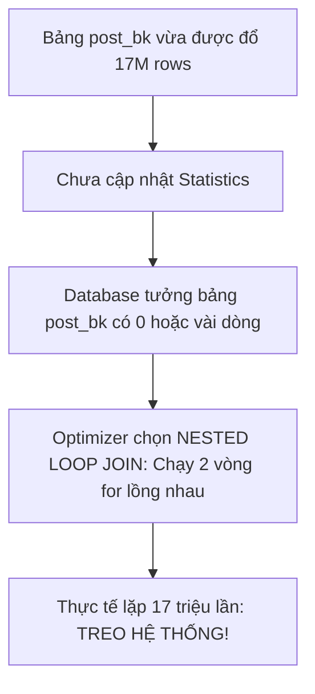

# 💥 Case Study: Hai Bảng Giống hệt nhau nhưng Hiệu năng Khác biệt Một trời Một vực

⬅️ **[[MOC - Query Optimization]]** | 🔗 **[[MOC - Database Overview]]**

---

## 1. Đặt Vấn đề

Trong thực tế dự án: Nếu có 2 bảng **giống hệt nhau 100%** (cùng cấu trúc cột, cùng kiểu dữ liệu, cùng 17 triệu bản ghi, cùng Index, nằm trên cùng một server), và ta chạy **cùng một câu lệnh SQL** trên hai bảng đó, thì thời gian chạy có giống nhau không?

- **Góc nhìn Dev thông thường:** Chắc chắn phải giống nhau.
- **Thực tế Production:** Một bảng chạy trong 1 giây, còn bảng kia làm treo toàn bộ Database!

---

## 2. Kịch bản Thực chứng (Demo Breakdown)

- **Bảng gốc (`post`):** Chứa hơn 17 triệu bản ghi, có đầy đủ Index chuẩn.
- **Bảng sao chép (`post_bk`):** Tạo ra bằng cách đổ toàn bộ dữ liệu từ bảng `post` sang. Dữ liệu và Index giống hệt 100%.
- **Chạy truy vấn Join:**
  - Chạy trên bảng `post`: Kết quả trả về tức thì.
  - Chạy trên bảng `post_bk`: Hệ thống bị đơ cứng, CPU nhảy vọt lên 100%.

---

## 3. Nguyên nhân Cốt lõi: Cơn ác mộng Stale Statistics



1. **Database không nhìn vào dữ liệu thực tế:** Khi xây dựng [[Execution Plan]], **[[SQL Optimizer]]** chỉ nhìn vào bảng số liệu **[[Statistics (Thống kê Database)]]**.
2. **Chọn sai Thuật toán Join:**
   - Đối với bảng `post` (đã có Statistic chuẩn): Optimizer chọn `[[Hash Join]]` (thuật toán tối ưu nhất cho tập dữ liệu lớn).
   - Đối với bảng `post_bk` (chưa có Statistic): Optimizer lầm tưởng bảng này rất nhỏ nên đã chọn `[[Nested Loop Join]]`.
   - Thuật toán Nested Loop chạy 2 vòng lặp `for` lồng nhau trên 17 triệu bản ghi khiến tài nguyên cạn kiệt ngay lập tức.

---

## 4. Cách Xử lý & Bài học Rút ra

### Cách Xử lý
Chạy lệnh thu thập lại thông số thống kê cho bảng mới:
```sql
-- Oracle
EXEC DBMS_STATS.GATHER_TABLE_STATS('SCHEMA_NAME', 'POST_BK');

-- PostgreSQL
ANALYZE post_bk;

-- MySQL
ANALYZE TABLE post_bk;
```
Ngay sau khi cập nhật Statistics, Optimizer nhận diện chính xác 17 triệu dòng, tự động chuyển sang `Hash Join` và câu lệnh chạy nhanh trở lại.

### Bài học cho Developer & DBA
1. **Hiệu năng do Execution Plan quyết định:** Hai bảng giống nhau về mặt vật lý nhưng khác nhau về Statistics sẽ dẫn đến Kế hoạch thực thi hoàn toàn khác biệt.
2. **Quy trình bắt buộc sau Migration / Import Data:** Sau khi đổ dữ liệu lớn vào bảng mới, bắt buộc phải chạy lệnh cập nhật Statistics trước khi cho phép ứng dụng truy vấn.

---

## 🔗 Liên kết Liên quan
- Khái niệm nền tảng: [[Statistics (Thống kê Database)]], [[SQL Optimizer]], [[Execution Plan]], [[Join Methods]]
- Nguyên lý: [[Tư duy tối ưu Database (Database Tuning Mindset)]], [[Nguyên lý 3+2 trong Database]]
