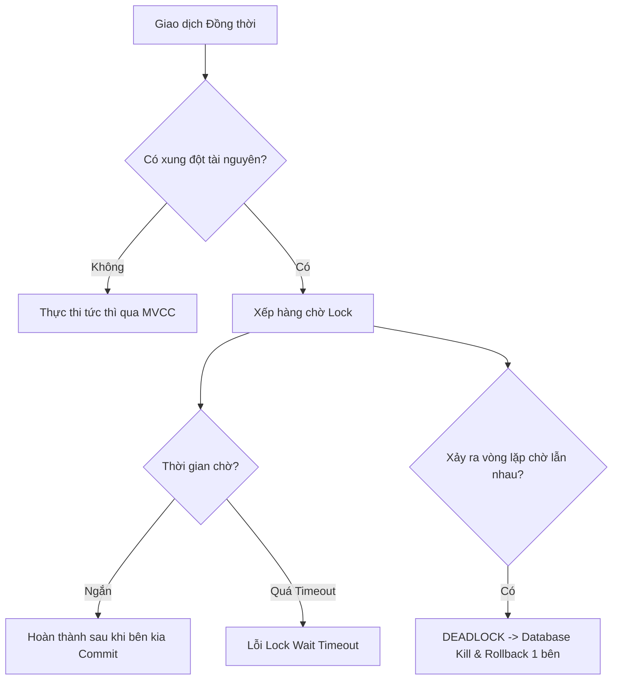

# 🛡️ Siêu Tổng hợp về Lock và Deadlock trong Cơ sở Dữ liệu

⬅️ **[[MOC - Concurrency & Lock]]** | 🔗 **[[MOC - Database Overview]]**

---

## 1. Bức tranh Toàn cảnh về Tranh chấp Tài nguyên

Trong các hệ thống tải cao, **Lock và Deadlock** là nguyên nhân số 1 dẫn tới tình trạng sập hệ thống dây chuyền (Cascading Failure), cạn kiệt Connection Pool và khiến CPU/RAM bị nghẽn ở trạng thái chờ (**Wait Events**).

---

## 2. Ma trận Tương thích Khóa (Lock Compatibility Matrix)

| Khóa đang giữ \ Khóa xin cấp | Shared Lock (S - Đọc) | Exclusive Lock (X - Ghi) |
| :--- | :---: | :---: |
| **Shared Lock (S)** | ✅ Cho phép (Tương thích) | ❌ Chặn lại (Conflict - Phải chờ) |
| **Exclusive Lock (X)** | ❌ Chặn lại (Conflict - Phải chờ) | ❌ Chặn lại (Conflict - Phải chờ) |

---

## 3. Các Dạng Deadlock Phổ biến trong Thực tế & Cách Xử lý

### Dạng 1: Deadlock do Đảo ngược Thứ tự Cập nhật (Reverse Order)
- **Tình huống:**
  - Luồng 1: Cập nhật Tài khoản A, sau đó cập nhật Tài khoản B.
  - Luồng 2: Cập nhật Tài khoản B, sau đó cập nhật Tài khoản A.
- **Khắc phục:** Chuẩn hóa quy tắc nghiệp vụ trong code: Luôn sắp xếp ID trước khi Lock (ví dụ: luôn cập nhật tài khoản có `ID` nhỏ hơn trước).

### Dạng 2: Deadlock do Nâng cấp Khóa (Lock Conversion / Escalation)
- **Tình huống:** Hai giao dịch cùng giữ S-Lock trên một dòng dữ liệu, sau đó cả hai cùng muốn `UPDATE` dòng đó (xin nâng cấp lên X-Lock). Cả hai bên đều chờ bên kia nhả S-Lock -> Deadlock.
- **Khắc phục:** Dùng cú pháp `SELECT ... FOR UPDATE` ngay từ đầu để giữ X-Lock, không cho phép cấp S-Lock đồng thời.

### Dạng 3: Deadlock do Thiếu Index trên Foreign Key
- **Tình huống:** Thao tác trên bảng Cha gây Lock lan truyền toàn bộ bảng Con.
- **Khắc phục:** Đánh Index ngay lập tức trên tất cả các cột khóa ngoại (Xem: **[[Case - Tối ưu Foreign Key và Lock leo thang]]**).

---

## 4. Checklist Thực chiến Phòng chống Lock & Deadlock

1. ✅ **Giữ Transaction siêu ngắn:** Đọc trước mọi thứ cần thiết, chỉ mở Transaction khi bắt đầu ghi và `COMMIT` ngay sau đó.
2. ✅ **Tuyệt đối không gọi Third-party API trong Transaction:** Không gọi HTTP request, gửi SMS, thanh toán bên trong khối SQL Transaction.
3. ✅ **Sắp xếp thứ tự cập nhật dữ liệu nhất quán.**
4. ✅ **Đánh Index đầy đủ cho Foreign Key.**
5. ✅ **Thiết lập Lock Timeout hợp lý:** Không để transaction chờ vĩnh viễn (ví dụ: cấu hình `lock_timeout = 5s`).

---

## 🔗 Liên kết Điều hướng
- Khái niệm nền tảng: [[Lock]], [[Deadlock]], [[Foreign Key]], [[Transaction & MVCC]]
- Nguyên lý & Case Study: [[Nguyên lý Không va chạm trong tối ưu SQL]], [[Case - Tối ưu Foreign Key và Lock leo thang]], [[3 Yếu tố cốt lõi làm Database nhanh]]
