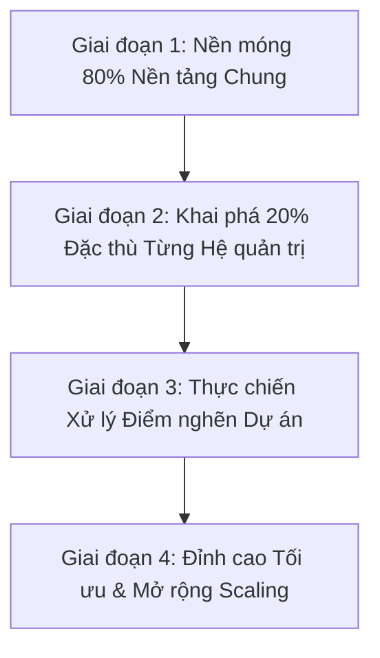

# 🛣️ Lộ trình Học Database Toàn diện cho Developer (4 Giai đoạn Thực chiến)

⬅️ **[[MOC - Database Overview]]**

---

## 🎯 Tổng quan Lộ trình

Lộ trình này được thiết kế dựa trên kinh nghiệm thực chiến tại các hệ thống lớn (Core Banking, Chứng khoán, Viễn thông), giúp lập trình viên từ mất gốc hoặc chỉ biết viết CRUD cơ bản tiến lên làm chủ hoàn toàn tầng dữ liệu và tư duy kiến trúc Database.

---

## 🧱 Giai đoạn 1: Nền móng - Đánh chiếm 80% Nền tảng Chung
Mọi cơ sở dữ liệu quan hệ (RDBMS) đều vận hành dựa trên các nguyên lý vật lý và toán học giống nhau:

- **Kiến trúc Bộ nhớ & Lưu trữ:**
  - [[Block (Page)]] - Đơn vị I/O cơ bản.
  - [[Record (Tuple)]] - Cấu trúc dòng dữ liệu.
  - [[Buffer Cache]] - Bộ nhớ đệm RAM và giải thuật LRU.
  - [[Database Instance]] - Cấu trúc Instance, Redo Log, WAL.
- **Bộ máy Tối ưu & Kế hoạch Thực thi:**
  - [[Quy trình 6 bước xử lý câu lệnh SQL]] (Syntax, Semantic, Hard Parse, Soft Parse, Bind Variables).
  - [[SQL Optimizer]] & [[Cost]].
  - [[Execution Plan]] - Cách đọc và phân tích cây thực thi.
- **Chỉ mục & Truy xuất:**
  - [[Index]] - Bản chất B-Tree và Doubly Linked List.
  - [[Data Access Methods]] - Full Table Scan, Index Scan, Index Seek, Covering Index.
  - [[Join Methods]] - Nested Loop Join, Hash Join, Merge Join.
- **Nguyên lý Tư duy:**
  - [[Nguyên lý 3+2 trong Database]].
  - [[Tư duy tối ưu Database (Database Tuning Mindset)]].
  - [[Tại sao Database không chọn Index (Bản chất Cost-Based Optimizer)]].

---

## 🔍 Giai đoạn 2: Sự Khác biệt - Khai phá 20% Đặc thù Từng Hệ Quản trị
Mỗi loại Database Engine có những "đặc sản" và cơ chế ngầm định riêng:

- **Oracle Database vs SQL Server:** Cơ chế Undo/Redo, Lock Escalation, Result Cache, Benchmark CBO bằng Hint (`WITH (INDEX)` vs `/*+ INDEX */`).
- **PostgreSQL vs MySQL (InnoDB):**
  - PostgreSQL: Cơ chế [[Transaction & MVCC]], Dead Tuples và tiến trình [[VACUUM & Dọn rác Database]].
  - MySQL InnoDB: Clustered Index trên Primary Key, Purge Threads, Buffer Pool Instances.

---

## 🛠️ Giai đoạn 3: Thực chiến - Xử lý "Nỗi đau" Dự án (Troubleshooting)
Đối mặt và giải quyết trực tiếp các sự cố thực tế trên Production:

- **Bài toán Bảng 0 row vẫn chậm:** [[Case - Table 0 row nhưng truy vấn vẫn cực chậm]].
- **Bài toán Lệch Thống kê:** [[Case - Hai bảng giống nhau nhưng hiệu năng khác nhau]].
- **Bài toán Khóa ngoại gây khóa toàn bảng:** [[Case - Tối ưu Foreign Key và Lock leo thang]].
- **Bài toán Index phản tác dụng & CBO ngó lơ:** [[Case - Khi nào Index phản tác dụng (Ô tô tải vs Xe máy)]], [[Tại sao Database không chọn Index (Bản chất Cost-Based Optimizer)]].
- **Xử lý Khóa và Bế tắc:** [[Tổng hợp Lock và Deadlock trong Database]], [[Lock]], [[Deadlock]].
- **Nguyên tắc Kháng nghẽn:** [[Nguyên lý Không va chạm trong tối ưu SQL]].

---

## 🚀 Giai đoạn 4: Đỉnh cao - Tối ưu Toàn diện & Mở rộng (Tuning & Scaling)
- **Tối ưu Cấu trúc Lớn:** Partitioning (Phân vùng bảng), Sharding (Phân mảnh ngang), Database Replication (Master - Slave / Active - Active).
- **Kiến trúc Tải cao:** Tầm nhìn của [[Tư duy tối ưu hóa cho Software Architect]].
- **Công nghệ Hiện đại:** NewSQL, Distributed SQL, Vector Database cho AI.

---

## 📚 Danh mục Video Bài giảng Tham khảo (Nguồn Wecommit - Trần Quốc Huy)

1. [Lộ trình học Database cho Dev](https://youtu.be/Pe-aTSANnlI?si=p_SaUyjsoBoH5QOZ)
2. [Database Tuning Mindset - Tư duy tối ưu Database](https://youtu.be/aRkidzUZ-gg?si=c2hXj0i-id9qn6qt)
3. [Nguyên lý 3+2 Trong Database](https://youtu.be/xC1662uBym8?si=DAJ8S1RCgPvwiCFF)
4. [3 Yếu tố làm DATABASE nhanh](https://youtu.be/j_4xM8Bv1sY?si=w7v_1W_5t1qV_2rT)
5. [Quy trình 6 bước buộc phải biết khi tối ưu SQL](https://youtu.be/GfLN0sfU-7U?si=dTcpt7xB9_71U2oy)
6. [Cách khiến một câu lệnh SQL NHANH (Nguyên lý Không va chạm)](https://youtu.be/HH6z5jCY7-Y?si=rXFw0Yi7eqZq4B9G)
7. [Table 0 row - câu lệnh SQL vẫn RẤT CHẬM](https://youtu.be/xSpXYB8v1NY?si=h2LTzOxRPvkiA0ER)
8. [Table giống nhau, hiệu năng SQL sẽ giống nhau hay không](https://youtu.be/BXiC686aOaE?si=qfVdnyr6oYofZc7I)
9. [Tại sao Database không chọn Index ?](https://youtu.be/GYn8dwwPBvo?si=FmX-FKi27W3GravP)

---

## 🔗 Liên kết Điều hướng
- Hub tổng quan: [[MOC - Database Overview]]
- Bộ câu hỏi ôn tập: [[Tổng hợp câu hỏi ôn tập & phỏng vấn Database]]
