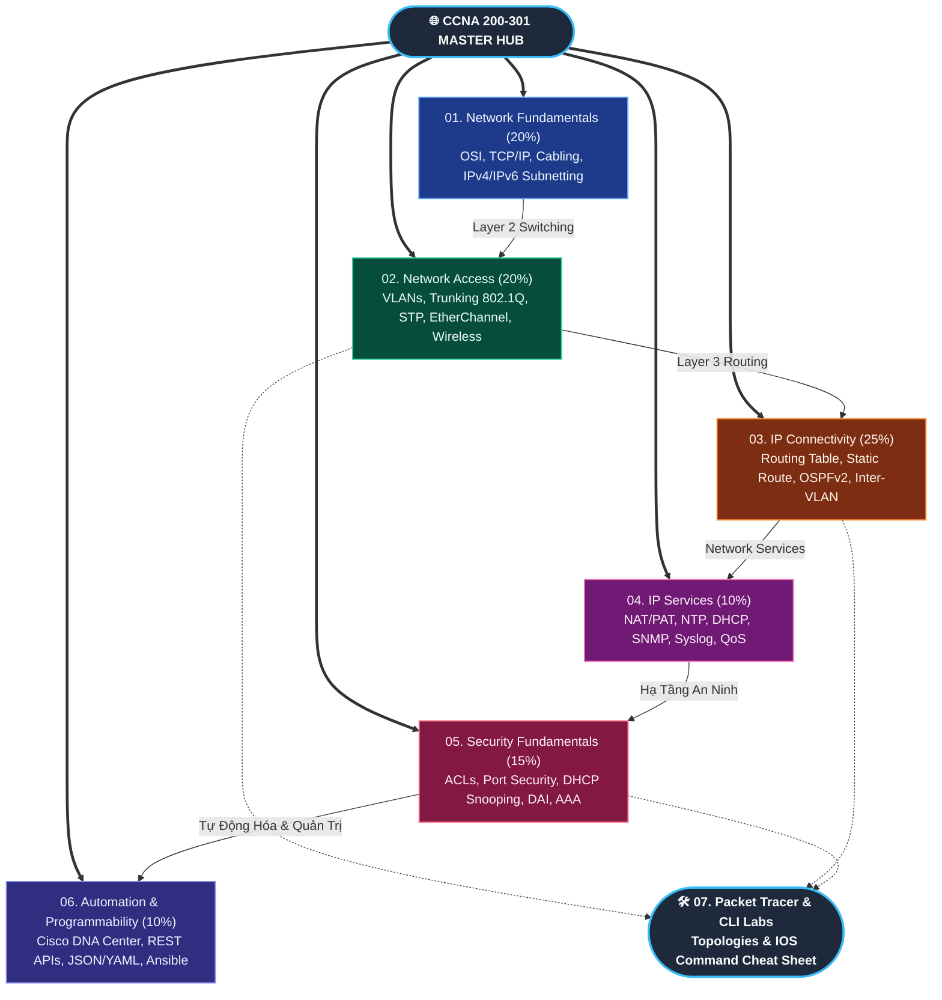

# 🌐 Master Dashboard: Computer Networks & Cisco CCNA (200-301)

> **Điều hướng tổng quan**: [[00 - Master Knowledge Hub|🌐 Master Hub]] | [[Network-CCNA/00 - Maps of Content/Roadmap - CCNA 200-301|📋 Lộ Trình Chi Tiết CCNA]] | [[Backend-full-course/Part 1 - Core Foundations/01 - Computer Networks & Protocols/00 - Networks MOC|⚙️ Backend Protocols MOC]]

Kho lưu trữ tri thức chuyên sâu về **Mạng Máy Tính (Computer Networking)** và lộ trình chinh phục chứng chỉ quốc tế **Cisco Certified Network Associate (CCNA 200-301 v1.1)**, vận hành theo phương pháp **Alvar Method (First Principles & Zero Hallucination)**.

---

## 🗺️ 1. Bản Đồ 6 Trụ Cột Tri Thức CCNA 200-301

---

## 📚 2. Cấu Trúc Khóa Học & Tỷ Trọng Đề Thi (Blueprint v1.1)

| Domain | Trọng số | Thư mục chuyên đề | Mục tiêu kỹ thuật cốt lõi |
| :---: | :---: | :--- | :--- |
| **1.0** | **20%** | [`01 - Network Fundamentals/`](file:///home/ryuuki/Long-project/Obsidian-learn/Network-CCNA/01%20-%20Network%20Fundamentals/) | Mô hình OSI & TCP/IP, Cáp quang/Đồng, IPv4 Subnetting (FLSM/VLSM), Kiến trúc IPv6. |
| **2.0** | **20%** | [`02 - Network Access/`](file:///home/ryuuki/Long-project/Obsidian-learn/Network-CCNA/02%20-%20Network%20Access/) | Chuyển mạch Layer 2: VLANs, Trunking 802.1Q, Spanning Tree (RSTP), EtherChannel, Wi-Fi 6. |
| **3.0** | **25%** | [`03 - IP Connectivity/`](file:///home/ryuuki/Long-project/Obsidian-learn/Network-CCNA/03%20-%20IP%20Connectivity/) | Định tuyến Layer 3: Cấu tạo bảng định tuyến, Static Route, OSPFv2 Single/Multi-area, Inter-VLAN. |
| **4.0** | **10%** | [`04 - IP Services/`](file:///home/ryuuki/Long-project/Obsidian-learn/Network-CCNA/04%20-%20IP%20Services/) | Cấu hình NAT/PAT (Inside/Outside/Overload), DHCP Server/Relay, NTP, SNMP, Syslog, Phân loại QoS. |
| **5.0** | **15%** | [`05 - Security Fundamentals/`](file:///home/ryuuki/Long-project/Obsidian-learn/Network-CCNA/05%20-%20Security%20Fundamentals/) | Bảo mật thiết bị: Standard/Extended ACL, Port Security, DHCP Snooping, Dynamic ARP Inspection (DAI). |
| **6.0** | **10%** | [`06 - Automation & Programmability/`](file:///home/ryuuki/Long-project/Obsidian-learn/Network-CCNA/06%20-%20Automation%20&%20Programmability/) | Mạng điều khiển bằng phần mềm (SDN): Cisco Catalyst Center (DNA-C), RESTCONF, JSON/YAML, Ansible. |
| **LABS** | **Thực hành** | [`07 - Packet Tracer Labs & Cisco CLI/`](file:///home/ryuuki/Long-project/Obsidian-learn/Network-CCNA/07%20-%20Packet%20Tracer%20Labs%20&%20Cisco%20CLI/) | Bài Lab thực chiến Packet Tracer, sơ đồ Topology mẫu, bảng tra cứu lệnh Cisco IOS toàn diện. |

---

## 🔗 3. Cầu Nối Liên Kết Hai Chiều Với Backend & DevOps (Cross-Domain Bridge)

Để đảm bảo nguyên tắc **Single Source of Truth** và tránh trùng lặp tri thức (**DRY**):
- **Phân định rạch ròi**:
  - `Network-CCNA/` sở hữu toàn bộ tri thức về **Cơ sở hạ tầng vật lý, Chuyển mạch L2, Định tuyến L3, và Vận hành Thiết bị**.
  - `Backend-full-course/` sở hữu tri thức về **Socket Programming, Ứng dụng Web L7 (HTTP, WebSocket), và Tích hợp API**.
- **Tra cứu giao thức tương đương**:
  - Giao thức tầng Giao vận: [[Backend-full-course/Part 1 - Core Foundations/01 - Computer Networks & Protocols/Core Transport & Routing/TCP - IP|TCP/IP]] | [[Backend-full-course/Part 1 - Core Foundations/01 - Computer Networks & Protocols/Core Transport & Routing/UDP|UDP]] | [[Backend-full-course/Part 1 - Core Foundations/01 - Computer Networks & Protocols/Core Transport & Routing/QUIC|QUIC]]
  - Dịch vụ mạng cốt lõi: [[Backend-full-course/Part 1 - Core Foundations/01 - Computer Networks & Protocols/Network & System Management/DNS|DNS]] | [[Backend-full-course/Part 1 - Core Foundations/01 - Computer Networks & Protocols/Network & System Management/DHCP|DHCP]] | [[Backend-full-course/Part 1 - Core Foundations/01 - Computer Networks & Protocols/Network & System Management/ARP|ARP]] | [[Backend-full-course/Part 1 - Core Foundations/01 - Computer Networks & Protocols/Network & System Management/ICMP|ICMP]]
  - Bảo mật & Quản trị: [[Backend-full-course/Part 1 - Core Foundations/01 - Computer Networks & Protocols/Security Protocols/SSH|SSH]] | [[Backend-full-course/Part 1 - Core Foundations/01 - Computer Networks & Protocols/Security Protocols/TLS|TLS]] | [[Backend-full-course/Part 1 - Core Foundations/01 - Computer Networks & Protocols/Network & System Management/SNMP|SNMP]]

---

## 🛠️ 4. Quy Chuẩn Học Tập Cùng Antigravity CLI (`agy`)

Mọi bài học mới trong khóa học này đều bắt buộc nạp qua lệnh `agy` với kỹ năng `teach` theo phương pháp **Alvar Method**:
1. Bắt đầu từ **Chân lý vô điều kiện** (Vật lý đường truyền, kích thước Frame Ethernet, bảng định tuyến).
2. Dẫn dắt theo **Motivated Discovery** (Tại sao mạng bị Loop bão Broadcast? $\to$ Phát minh ra Spanning Tree).
3. Đóng gói đầy đủ **Lệnh cấu hình Cisco IOS CLI thực tế** và **Flashcard ôn tập Spaced Repetition (`#card`)**.
