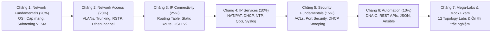

# 📋 Lộ Trình Toàn Diện Chinh Phục Cisco CCNA (200-301 v1.1)

> **Điều hướng**: [[Network-CCNA/00 - Maps of Content/00 - Master Dashboard|🧭 CCNA Dashboard]] | [[00 - Master Knowledge Hub|🌐 Master Hub]]

Lộ trình này được thiết kế bám sát 100% mục tiêu khảo thí của chứng chỉ **Cisco CCNA 200-301 v1.1** (120 phút, điểm đậu ~825/1000). Mọi kiến thức lý thuyết đều được bảo chứng bởi thực hành trên **Cisco Packet Tracer / EVE-NG**.

---

## 🧭 Tiến Trình Tổng Quan (Milestone Timeline)

---

## 🎯 Chặng 1: Domain 1.0 — Network Fundamentals (20%)

- [ ] **1.1. Vai trò & Chức năng thiết bị mạng**:
  - Router, L2/L3 Switch, Next-Generation Firewall (NGFW), Access Point (AP), Wireless LAN Controller (WLC), Endpoint, Server.
- [ ] **1.2. Kiến trúc Topology mạng doanh nghiệp**:
  - 2-Tier (Collapsed Core), 3-Tier (Core - Distribution - Access), Spine-Leaf (Data Center), WAN, SOHO, Cloud On-premises vs Hybrid.
- [ ] **1.3. Phương tiện truyền dẫn vật lý & Giao diện kết nối**:
  - Cáp đồng xoắn đôi (Cat5e/Cat6/Cat6a, UTP/STP), Cáp quang Single-mode (SMF) vs Multi-mode (MMF).
  - Chuẩn đầu nối RJ-45, LC, SC, SFP/SFP+, Cáp đồng trục, Hiện tượng suy hao (Attenuation), Nhiễu chéo (Crosstalk) và Song công (Half/Full Duplex, Auto-negotiation).
- [ ] **1.4. Phân tích gói tin & Tầng Giao vận**:
  - So sánh chi tiết [[Backend-full-course/Part 1 - Core Foundations/01 - Computer Networks & Protocols/Core Transport & Routing/TCP - IP|TCP]] (3-way handshake, Windowing, ACK) vs [[Backend-full-course/Part 1 - Core Foundations/01 - Computer Networks & Protocols/Core Transport & Routing/UDP|UDP]] (Connectionless).
- [ ] **1.5. Kỹ nghệ Phân rã Địa chỉ IPv4 & Subnetting chuyên sâu**:
  - Cấu trúc địa chỉ IPv4 32-bit, Network ID, Broadcast ID, Host range, Subnet Mask.
  - Phân vùng mạng cố định (FLSM) và Phân vùng mạng biến thiên (VLSM). Kỹ thuật tính nhanh Subnetting bằng Magic Number.
- [ ] **1.6. Phân định dải địa chỉ IPv4 Private & Public**:
  - Tiêu chuẩn RFC 1918 (Lớp A: `10.0.0.0/8`, Lớp B: `172.16.0.0/12`, Lớp C: `192.168.0.0/16`). Địa chỉ Loopback (`127.0.0.1`), Link-Local APIPA (`169.254.0.0/16`).
- [ ] **1.7. Kiến trúc & Phân loại Địa chỉ IPv6**:
  - Cấu trúc IPv6 128-bit, quy tắc viết gọn địa chỉ (Zero compression).
  - Phân loại: Global Unicast Address (GUA - `2000::/3`), Link-Local (`fe80::/10`), Unique Local (`fc00::/7`), Multicast (`ff00::/8`).
  - Cơ chế tự cấu hình không trạng thái (SLAAC) và thuật toán biến đổi EUI-64 từ địa chỉ MAC.
- [ ] **1.8. Nguyên lý mạng không dây (Wireless Fundamentals)**:
  - Tần số vô tuyến 2.4 GHz vs 5 GHz vs 6 GHz (Wi-Fi 6/6E 802.11ax), Kênh không trùng lặp (Non-overlapping channels 1, 6, 11).
  - Các khái niệm: SSID, BSSID, ESS, Roaming, RF Interference.
- [ ] **1.9. Ảo hóa hạ tầng (Virtualization Fundamentals)**:
  - So sánh Hypervisor Type 1 (Bare-metal: ESXi) vs Type 2 (Hosted: VirtualBox/VMware Workstation), Virtual Machine (VM), Virtual Switch (vSwitch).

---

## 🎯 Chặng 2: Domain 2.0 — Network Access (20%)

- [ ] **2.1. Cấu hình & Vận hành Chuyển mạch Layer 2 (VLANs)**:
  - Nguyên lý chia nhỏ miền quảng bá (Broadcast Domain).
  - Cấu hình Access Port, phân bổ cổng vào VLAN (Data VLAN, Voice VLAN, Management VLAN, Native VLAN).
- [ ] **2.2. Đường truyền trung kế (802.1Q Trunking)**:
  - Cấu trúc thẻ định danh Frame Tagging IEEE 802.1Q (4 bytes, VLAN ID 12-bit).
  - Cấu hình Trunk port, Native VLAN mismatch issue, cấu hình Allowed VLANs trên đường trung kế.
- [ ] **2.3. Giao thức khám phá thiết bị lân cận (CDP & LLDP)**:
  - Cisco Discovery Protocol (CDP - độc quyền Cisco) vs Link Layer Discovery Protocol (LLDP - chuẩn mở IEEE 802.1AB).
  - Lệnh giám sát: `show cdp neighbors detail`, `show lldp neighbors`.
- [ ] **2.4. Ghép kênh vật lý EtherChannel (Link Aggregation)**:
  - Mục tiêu chống nghẽn và tăng băng thông đường truyền.
  - So sánh các chế độ: Cisco PAgP (Auto/Desirable), Chuẩn mở IEEE 802.3ad LACP (Passive/Active), và Static (On).
  - Thuật toán cân bằng tải (Load-balancing hashing) trên EtherChannel.
- [ ] **2.5. Giao thức chống lặp vòng Spanning Tree Protocol (STP)**:
  - Hiểm họa Broadcast Storm, MAC Database Instability và Multiple Frame Transmission khi có vòng lặp vật lý.
  - Nguyên lý bầu chọn Root Bridge (Bridge Priority + MAC Address = Bridge ID).
  - Các trạng thái cổng: Blocking, Listening, Learning, Forwarding.
  - Nâng cấp lên Rapid PVST+ (RSTP 802.1w): Các vai trò cổng mới (Alternate, Backup) và tính năng tối ưu PortFast, BPDU Guard.
- [ ] **2.6. Kiến trúc mạng không dây Cisco Wireless**:
  - Mô hình Autonomous AP vs Controller-based (Lightweight AP - LAP). Giao thức đường hầm CAPWAP (Control & Data Plane separation).
  - Chế độ hoạt động của AP (Local, FlexConnect, Sniffer, Rogue Detector). Cấu hình WLAN trên Cisco WLC GUI.

---

## 🎯 Chặng 3: Domain 3.0 — IP Connectivity (25%)

- [ ] **3.1. Giải phẫu Bảng định tuyến (Routing Table Anatomy)**:
  - Các trường thông tin: Prefix, Subnet Mask, Next-hop IP, Exit Interface.
  - Nguyên tắc chọn đường ưu tiên số 1: **Longest Prefix Match (Quy tắc tiền tố dài nhất)**.
  - Khái niệm Độ tin cậy quản trị (Administrative Distance - AD) và Chỉ số đo lường chi phí (Metric).
- [ ] **3.2. Quá trình xử lý gói tin của Router (Hop-by-Hop Forwarding Decision)**:
  - Bước bóc tách Frame Layer 2, kiểm tra Checksum, tra cứu bảng định tuyến Layer 3, giảm TTL (Time To Live), và đóng gói lại Frame Layer 2 mới với MAC đích tiếp theo.
- [ ] **3.3. Định tuyến tĩnh (IPv4 & IPv6 Static Routing)**:
  - Cấu hình Default Route (`0.0.0.0/0` và `::/0`).
  - Network Route, Host Route (`/32` hoặc `/128`).
  - Định tuyến tĩnh dự phòng (Floating Static Route) bằng cách tùy biến AD cao hơn tuyến chính.
- [ ] **3.4. Định tuyến động Single-Area & Multi-Area OSPFv2**:
  - Thuật toán tìm đường ngắn nhất Dijkstra Shortest Path First (SPF). Metric = $\text{Cost} = \frac{\text{Reference Bandwidth}}{\text{Interface Bandwidth}}$.
  - Quá trình thiết lập láng giềng (Neighbor Adjacency) qua các trạng thái: Down $\to$ Init $\to$ 2-Way $\to$ ExStart $\to$ Exchange $\to$ Loading $\to$ Full.
  - Bầu chọn Designated Router (DR) và Backup Designated Router (BDR) trên mạng đa truy nhập Broadcast (Priority cao nhất, sau đó Router ID cao nhất).
  - Cấu hình OSPFv2 cơ bản: lệnh `router ospf`, cấu hình Router-ID tĩnh, câu lệnh `network ... area 0`, passive-interface.
- [ ] **3.5. Giao thức dự phòng Gateway mặc định (FHRP / HSRP)**:
  - Cơ chế dự phòng khi Default Gateway bị sập.
  - Cisco Hot Standby Router Protocol (HSRPv1 / HSRPv2): Virtual IP, Virtual MAC (`0000.0c07.acXX`), Active Router, Standby Router, Preemption.

---

## 🎯 Chặng 4: Domain 4.0 — IP Services (10%)

- [ ] **4.1. Cơ chế Chuyển đổi Địa chỉ Mạng NAT & PAT**:
  - Khái niệm Inside Local, Inside Global, Outside Local, Outside Global.
  - Cấu hình Static NAT (1-1 cho Web Server), Dynamic NAT (Pool IP Public), và Port Address Translation (PAT / NAT Overload) dùng chung 1 IP Public cho hàng ngàn máy trạm.
- [ ] **4.2. Đồng bộ thời gian qua giao thức NTP**:
  - Vai trò của NTP đối với chữ ký số, chứng chỉ SSL/TLS, xác thực Kerberos và điều tra nhật ký Log.
  - Cấu hình NTP Client và NTP Server, khái niệm Stratum Levels (Stratum 0, 1, 2).
- [ ] **4.3. Dịch vụ cấp phát địa chỉ động DHCP**:
  - Tiến trình 4 bước DORA (Discover, Offer, Request, Acknowledge).
  - Cấu hình Cisco IOS DHCP Server (Pool name, Network, Default-Router, DNS-Server, Excluded-addresses).
  - Cấu hình DHCP Relay Agent (`ip helper-address`) cho mạng Inter-VLAN.
- [ ] **4.4. Giám sát thiết bị bằng SNMP & Syslog**:
  - Hoạt động của SNMP Manager, SNMP Agent, MIB (Management Information Base), SNMP Get vs SNMP Trap. So sánh SNMPv2c vs SNMPv3 (Bảo mật AuthPriv AES/SHA).
  - Cấu hình Syslog Logging: 8 mức độ cảnh báo (Severity Levels từ 0 - Emergency đến 7 - Debugging).
- [ ] **4.5. Chất lượng dịch vụ (Quality of Service - QoS)**:
  - Các yếu tố gây suy giảm mạng: Bandwidth, Delay (Latency), Jitter (Biến thiên độ trễ), Packet Loss.
  - Cơ chế phân loại và đánh dấu (Classification & Marking): L2 CoS (802.1p - 3 bits), L3 ToS / DSCP (DiffServ - 6 bits).
  - Quản lý hàng đợi (Queuing): FIFO, Priority Queuing (PQ), Weighted Fair Queuing (WFQ), Low Latency Queuing (LLQ cho Voice).

---

## 🎯 Chặng 5: Domain 5.0 — Security Fundamentals (15%)

- [ ] **5.1. Các mối đe dọa an ninh mạng phổ biến**:
  - Tấn công phi kỹ thuật (Social Engineering, Phishing), Man-in-the-Middle (MitM), DoS/DDoS, Malware, Ransomware.
- [ ] **5.2. Quản trị truy cập thiết bị & Mô hình AAA**:
  - Bảo vệ đường truyền Console, Aux và VTY (SSH/Telnet). Cấu hình mã hóa mật khẩu (`service password-encryption`, `enable secret`).
  - Khung kiến trúc AAA: Authentication (Xác thực là ai), Authorization (Được phép làm gì), Accounting (Đã làm những gì). Giao thức RADIUS vs TACACS+.
- [ ] **5.3. Danh sách kiểm soát truy cập (Access Control Lists - ACLs)**:
  - Quy tắc ngầm định Implicit Deny ở cuối mỗi ACL.
  - **Standard IPv4 ACL (Số hiệu 1-99, 1300-1999)**: Chỉ lọc dựa trên Source IP, đặt càng gần đích càng tốt.
  - **Extended IPv4 ACL (Số hiệu 100-199, 2000-2699)**: Lọc dựa trên Source IP, Destination IP, Protocol (TCP/UDP/ICMP), Port number (eq 80, 443), đặt càng gần nguồn càng tốt.
  - Kỹ thuật tính Wildcard Mask (Đảo ngược của Subnet Mask).
- [ ] **5.4. Kỹ thuật gia cố bảo mật Layer 2 (Layer 2 Hardening)**:
  - **Port Security**: Giới hạn số lượng MAC address trên một cổng, các hành vi vi phạm (Protect, Restrict, Shutdown), chế độ Sticky MAC.
  - **DHCP Snooping**: Phân loại cổng Trusted (nối về DHCP Server) vs Untrusted (nối máy trạm), ngăn chặn Rouge DHCP Server và DHCP Starvation.
  - **Dynamic ARP Inspection (DAI)**: Dựa vào cơ sở dữ liệu DHCP Snooping Binding Table để chống tấn công ARP Poisoning / ARP Spoofing.
- [ ] **5.5. Kiến trúc Mạng riêng ảo (VPN Technologies)**:
  - So sánh Remote Access VPN (Client-to-Site: Cisco AnyConnect) vs Site-to-Site VPN (IPsec Tunnel giữa các chi nhánh). Các giai đoạn mã hóa IPsec (IKE Phase 1 & Phase 2).

---

## 🎯 Chặng 6: Domain 6.0 — Automation & Programmability (10%)

- [ ] **6.1. Mạng truyền thống vs Mạng điều khiển bằng phần mềm (SDN)**:
  - Phân tách 3 mặt phẳng kiến trúc: Management Plane, Control Plane, Data Plane (Forwarding Plane).
  - So sánh kiến trúc phân tán truyền thống (Decentralized) vs Kiến trúc tập trung Controller-based (Centralized).
- [ ] **6.2. Các bộ điều khiển mạng Cisco Controller**:
  - Cisco Catalyst Center (trước đây là DNA Center): Quản trị mạng doanh nghiệp tự động hóa, Fabric Underlay vs Overlay (VXLAN, LISP).
  - Cisco Meraki: Quản lý thiết bị Cloud-managed tập trung qua giao diện Dashboard.
  - Giao diện lập trình: Northbound APIs (giao tiếp với ứng dụng kinh doanh) vs Southbound APIs (giao tiếp với switch/router qua OpenFlow, NETCONF, RESTCONF).
- [ ] **6.3. Kiến trúc RESTful APIs trong quản trị mạng**:
  - Các phương thức HTTP chuẩn: GET, POST, PUT, PATCH, DELETE. Các mã phản hồi HTTP (200 OK, 201 Created, 400 Bad Request, 401 Unauthorized, 404 Not Found).
  - Cơ chế xác thực qua API Token / Bearer Token.
- [ ] **6.4. Các định dạng mã hóa dữ liệu (Data Serialization Formats)**:
  - Đọc hiểu và phân tích cú pháp dữ liệu: **JSON** (Key-Value, Arrays), **YAML** (Thụt lề indentation), **XML** (Cấu trúc thẻ Tags).
- [ ] **6.5. Công cụ quản lý cấu hình tự động (Configuration Management Tools)**:
  - So sánh **Ansible** (Agentless, đẩy lệnh Push qua SSH, viết bằng Playbook YAML), **Puppet** (Agent-based, kéo lệnh Pull), **Chef** (Cookbooks Ruby, Agent-based).

---

## 🛠️ Chặng 7: Chuỗi 12 Bài Lab Thực Chiến (Cisco Packet Tracer)

1. [ ] **Lab 01**: Khởi tạo cấu hình cơ bản Switch & Router (Hostname, Banner, Secret, SSH).
2. [ ] **Lab 02**: Cấu hình chia mạng con VLSM & gán địa chỉ IP trên các giao diện.
3. [ ] **Lab 03**: Thiết lập VLANs, 802.1Q Trunking & cấu hình Native VLAN an toàn.
4. [ ] **Lab 04**: Định tuyến Inter-VLAN qua Router-on-a-Stick và Switch Layer 3 (SVI).
5. [ ] **Lab 05**: Tối ưu hóa Spanning Tree với Rapid PVST+, PortFast và BPDU Guard.
6. [ ] **Lab 06**: Cấu hình gom kênh EtherChannel chuẩn LACP giữa các Core Switch.
7. [ ] **Lab 07**: Cấu hình Static Routing, Default Routing & Floating Static Route dự phòng.
8. [ ] **Lab 08**: Triển khai định tuyến động OSPFv2 Single-Area & Multi-Area toàn diện.
9. [ ] **Lab 09**: Thiết lập dự phòng Gateway bằng Cisco HSRPv2.
10. [ ] **Lab 10**: Cấu hình NAT động & PAT (NAT Overload) cho mạng doanh nghiệp ra Internet.
11. [ ] **Lab 11**: Thiết lập danh sách kiểm soát Standard & Extended ACL bảo vệ máy chủ.
12. [ ] **Lab 12**: Gia cố an ninh chuyển mạch với Port Security & DHCP Snooping.
