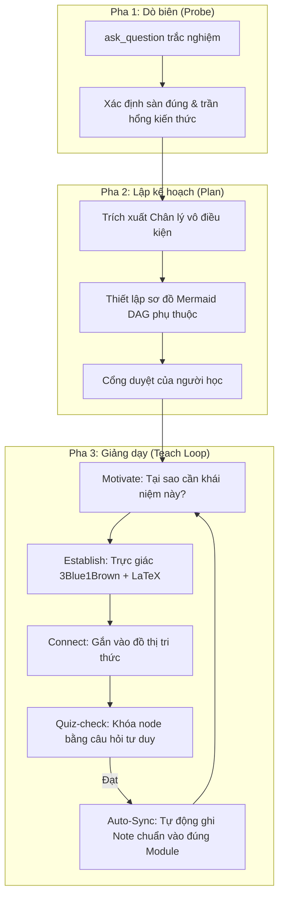

# 🧠 Computer Science & AI Engineering Master Knowledge Vault

[](https://obsidian.md)
[](https://www.markdownguide.org)
[](https://mermaid.js.org)
[](https://github.com)
[](LICENSE)

Kho lưu trữ tri thức kỹ thuật phần mềm, kiến trúc hệ thống và trí tuệ nhân tạo (AI Agents) chuyên sâu. Được tổ chức dưới dạng **Một Vault Duy Nhất (Single Master Vault trên Obsidian)** và tối ưu hóa cho phương pháp học tập từ nguyên lý gốc (**First Principles / Alvar Method**) kết hợp cùng **Antigravity CLI**.

---

## 🗺️ 1. Bản Đồ Điều Hướng Tổng (Master Knowledge Hub)

Toàn bộ 5 mảng kiến thức được kết nối trực tiếp qua trang chủ trung tâm: **[[00 - Master Knowledge Hub]]**.

| Chuyên đề                                            | Bản đồ trung tâm (MOC / Roadmap)                                                                | Lĩnh vực trọng tâm                                                                    |
| :--------------------------------------------------- | :---------------------------------------------------------------------------------------------- | :------------------------------------------------------------------------------------ |
| [**`AI-knowledge/`**](./AI-knowledge/)               | [[AI-knowledge/00 - MOC (Map of Content)\|🗺️ MOC - AI Knowledge Hub]]                           | Context RAM, Tri-Memory, PydanticAI, MCP, LangGraph, LLM-as-a-Judge, Continuous Eval. |
| [**`Database-knowledge/`**](./Database-knowledge/)   | [[Database-knowledge/00 - Maps of Content/MOC - Database Overview\|🗺️ MOC - Database Overview]] | Disk I/O, Buffer Cache, B+Tree Index, Cost Optimizer, Lock & Deadlock, MVCC.          |
| [**`DSA-learn/`**](./DSA-learn/)                     | [[DSA-learn/00 - Meta & Maps/Master MOC\|🗺️ Master MOC - DSA]]                                  | Big-O, Mental Models, Data Structures, Algorithms, Two Pointers, Sliding Window, DP.  |
| [**`Backend-full-course/`**](./Backend-full-course/) | [[Backend-full-course/Roadmap\|📋 Roadmap - Backend Engineering]]                               | TCP/IP, UDP, QUIC, BGP, WebSocket, HTTP/3, TLS/SSL, DNS, SFTP/SSH.                    |
| [**`DevOps-knowledge/`**](./DevOps-knowledge/)       | [[DevOps-knowledge/Roadmap\|📋 Roadmap - DevOps & Cloud Native]]                                | Linux Kernel, Docker Multi-stage, Kubernetes Ingress, Terraform IaC, Prometheus.      |

---

## 🤖 2. Hệ Thống AI Teaching Engine (Alvar Method)

Kho tri thức được tích hợp sẵn 3 kỹ năng AI cốt lõi trong thư mục [`.agents/skills/`](./.agents/skills/):



- **`teach` Skill (`.agents/skills/teach/SKILL.md`):** Dạy học đào sâu bản chất, không học vẹt, dùng câu hỏi trắc nghiệm dò biên và khóa kiến thức.
- **`visualize` Skill (`.agents/skills/visualize/SKILL.md`):** Tự động sinh sơ đồ quan hệ bằng Mermaid hoặc hình học trực quan hóa bài học.
- **`research` Skill (`.agents/skills/research/SKILL.md`):** Tra cứu và kiểm chứng sự thật từ tài liệu gốc, triệt tiêu hoàn toàn ảo giác (Zero Hallucination).
- **Hướng dẫn chi tiết:** Xem tại [`docs/WORKFLOW_AI_LEARNING_OBSIDIAN.md`](./docs/WORKFLOW_AI_LEARNING_OBSIDIAN.md).

---

## 📁 3. Cấu Trúc Thư Mục (Master Vault Structure)

```text
Obsidian-learn/
├── .obsidian/                  # Cấu hình tập trung toàn bộ Master Vault (Plugins, Themes)
├── .agents/                    # Bộ 3 AI Skills (teach, visualize, research)
│
├── 00 - Master Knowledge Hub.md# 🌐 Trang chủ điều hướng toàn bộ Master Vault
├── Excalidraw/                 # 🎨 Lưu trữ tập trung toàn bộ bản vẽ Excalidraw của Vault
│
├── AI-knowledge/               # [Module] AI Agents, RAG & LLMOps
├── Backend-full-course/        # [Module] Giao thức mạng & Lộ trình Backend
├── Database-knowledge/         # [Module] Nguyên lý lưu trữ & Tối ưu Database
├── DevOps-knowledge/           # [Module] Lộ trình DevOps & Infrastructure
├── DSA-learn/                  # [Module] Cấu trúc Dữ liệu & Giải thuật chuyên sâu
│
├── docs/                       # Tài liệu hướng dẫn quy trình & Workflow
│   └── WORKFLOW_AI_LEARNING_OBSIDIAN.md
│
├── .gitignore                  # Cấu hình lọc file rác, workspace state và secrets
└── README.md                   # Tài liệu tổng quan dự án
```

---

## 🚀 4. Hướng Dẫn Sử Dụng (Quick Start)

### Mở Master Vault trên Obsidian

1. Tải và cài đặt [Obsidian](https://obsidian.md/).
2. Chọn **Open folder as vault** $\to$ Trỏ vào thư mục gốc `Obsidian-learn/`.
3. Mở file **`00 - Master Knowledge Hub.md`** để làm việc trên toàn bộ đồ thị tri thức.

---

### Học tương tác cùng Antigravity CLI (`agy`)

1. Mở terminal tại thư mục gốc:
   ```bash
   cd /path/to/Obsidian-learn
   agy
   ```
2. Gửi câu lệnh học chủ đề bất kỳ (Prompt mẫu):
   ```text
   Dùng skill teach để dạy tôi về chủ đề: [Tên khái niệm/chủ đề]
   Lưu ghi chú kết quả vào thư mục: [Tên Module]/01 - Core Concepts/
   ```
3. Trả lời các câu hỏi trắc nghiệm (`ask_question`) trên Terminal và quan sát ghi chú được tự động sinh ra và hiển thị theo thời gian thực trên Obsidian.

---

## 📐 5. Quy Định Chung Khi Nạp Tri Thức (Universal Specification)

Mọi bài học mới trong bất kỳ chuyên đề nào đều bắt buộc tuân thủ 5 quy chuẩn:

### 🗂️ 5.1. Cấu Trúc Module Tiêu Chuẩn

```text
[Tên-Module]/
├── 00 - Maps of Content/          # MOC tổng, MOC chuyên đề, Dashboard
├── 01 - Core Concepts/            # Các khái niệm nguyên tử (1 note = 1 khái niệm)
├── 02 - Core Principles/          # Nguyên lý nền tảng, Mental Models & Tư duy kiến trúc
├── 03 - Practical & Case Studies/ # Tình huống thực chiến, Patterns, Lỗi kinh điển & Giải pháp
├── 04 - Reference & Learning/     # Roadmap, Bộ câu hỏi ôn tập, Spaced Repetition Flashcards
└── 99 - Attachments/              # Quản lý hình ảnh minh họa tĩnh (images/)
```

_(Lưu ý: Mọi bản vẽ tay Excalidraw được lưu tập trung tại thư mục gốc `Excalidraw/`)._

### 🏷️ 5.2. Chuẩn YAML Frontmatter Bắt Buộc

```yaml
---
title: Tên bài viết đầy đủ
aliases:
  - Tên tiếng Anh chuẩn
  - Tên viết tắt (ví dụ: TCP, B+Tree, LRU, RAG)
  - Tên không dấu hoặc từ đồng nghĩa
tags:
  - domain (backend, database, dsa, ai, devops)
  - sub-topic (indexing, networking, memory, caching...)
type: concept | principle | practical | pattern | moc | reference
status: completed | in-progress | review-needed
created: YYYY-MM-DD
updated: YYYY-MM-DD
---
```

### ✍️ 5.3. Cấu Trúc Note Chuẩn 5 Phần (Alvar Method)

- **1. Sơ đồ Mermaid DAG:** Quan hệ phụ thuộc từ Chân lý vô điều kiện $\to$ Khái niệm $\to$ Ứng dụng.
- **2. Chân lý vô điều kiện (`> [!NOTE]`):** Nêu 1-2 sự thật nền tảng không có ngoại lệ.
- **3. Trực giác Motivated Discovery (`> [!TIP]`):** Đặt vấn đề và động lực tự nhiên ra đời giải pháp (3Blue1Brown).
- **4. Phân tích kỹ thuật & $\LaTeX$:** Phân tích chi tiết cơ chế, công thức toán học và độ phức tạp ($O(\log N)$).
- **5. Spaced Repetition Quiz (`#card`):** Câu hỏi ôn tập tư duy bản chất.
- **6. Liên kết 2 chiều (`[[...]]`):** Breadcrumb dẫn về MOC cha và liên kết các bài học liên quan.

---

## 📌 6. Định Hướng Dự Án & Phạm Vi Sử Dụng (Personal Project Scope)

> [!NOTE]
>
> - Đây là **kho tri thức và ghi chú Second Brain cá nhân**, được mở công khai nhằm mục đích chia sẻ lộ trình, phương pháp học tập và hỗ trợ cộng đồng tham khảo.
> - **Chính sách đóng góp:** Vì nội dung phản ánh phong cách tư duy và tiến trình học tập cá nhân của tác giả, kho lưu trữ này **KHÔNG TIẾP NHẬN Pull Request (PR) hay Contribution từ bên ngoài**.
> - **Khuyến khích sử dụng:** Nếu bạn thấy kho tri thức này hữu ích, bạn hoàn toàn có thể tự do **Clone** hoặc **Fork** về tài khoản cá nhân để tùy biến, ghi chú và phát triển thêm theo nhu cầu riêng của bạn.

---

## 📄 7. Giấy Phép (License)

Dự án được phân phối dưới giấy phép **MIT License**. Bạn được tự do học tập, sử dụng và chia sẻ cho cộng đồng.
