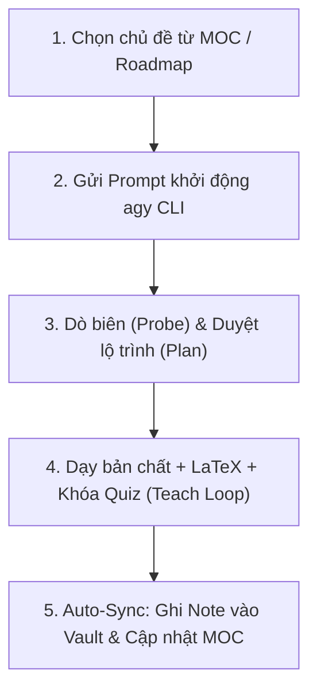

# 🔄 Hướng Dẫn Quy Trình Học Tập (agy CLI + Obsidian)

> Quy trình chuẩn hóa kết hợp **Antigravity CLI (agy)** và **Obsidian (Second Brain)** theo phương pháp **Alvar Method (First Principles & Socratic)**.

---

## 🖥️ 1. Thiết Lập Màn Hình Song Song (Dual-Window)

```text
┌─────────────────────────────────────────┬─────────────────────────────────────────┐
│  🖥️ CỬA SỔ TRÁI: TERMINAL (agy CLI)     │  📚 CỬA SỔ PHẢI: OBSIDIAN VAULT         │
│  - Chạy lệnh `agy`                      │  - Mở song song thư mục Vault tương ứng │
│  - Trả lời trắc nghiệm (Modal Popup)    │  - Quan sát file Note xuất hiện realtime│
│  - Thảo luận Socratic với AI            │  - Xem sơ đồ Mermaid & công thức LaTeX  │
│  - Duyệt lộ trình bài học (Mermaid DAG) │  - Tương tác Graph View liên kết 2 chiều│
└─────────────────────────────────────────┴─────────────────────────────────────────┘
```

---

## 🔁 2. Chu Trình 5 Bước Của Một Phiên Học



1. **Bước 1 (Chọn chủ đề):** Mở `Roadmap.md` hoặc `MOC` trong Vault tương ứng $\to$ Chọn 1 khái niệm cụ thể (ví dụ: _B+Tree Index_, _TCP 3-Way Handshake_, _Sliding Window_).
2. **Bước 2 (Khởi động):** Mở terminal tại thư mục gốc $\to$ chạy `agy` $\to$ gửi Prompt:
   ```text
   Dùng skill teach để dạy tôi về: [Tên chủ đề]. Lưu vào: [Tên Vault]/01 - Core Concepts/
   ```
3. **Bước 3 (Probe & Plan):**
   - **Probe:** AI gọi `ask_question` hiển thị popup trắc nghiệm để xác định điểm sàn (đã biết) và điểm trần (chỗ hổng).
   - **Plan:** AI hiển thị sơ đồ Mermaid DAG $\to$ bạn bấm duyệt kế hoạch qua popup.
4. **Bước 4 (Teach Loop):**
   - AI giải thích bản chất (Motivate $\to$ Establish $\to$ Connect), công thức toán $\LaTeX$ và sơ đồ Mermaid.
   - AI gọi `ask_question` kiểm tra tư duy suy luận để khóa từng node.
5. **Bước 5 (Auto-Sync):** AI tự động xuất file Note chuẩn 5 phần vào Vault và cập nhật liên kết vào MOC cha.

---

## 🎬 3. Minh Họa Phiên Học Thực Tế

```text
[Bạn]: Dùng skill teach để dạy tôi về B+Tree Index trong Database. Lưu vào Database-knowledge/01 - Core Concepts/

[AI]: (Pha 1 - Probe: Bắn popup trắc nghiệm trên Terminal)
┌────────────────────────────────────────────────────────────────────────┐
│ ? Tại sao khi tìm kiếm trên ổ cứng, người ta ít dùng Binary Search Tree?│
│ > 1. Chiều cao cây quá lớn, tốn nhiều Disk I/O                         │
│   2. Cây nhị phân không sắp xếp thứ tự các phần tử                     │
└────────────────────────────────────────────────────────────────────────┘

[Bạn]: (Chọn đáp án 1)

[AI]: (Pha 2 - Plan: Vẽ Mermaid DAG & xin duyệt)
      Disk Block (4KB) -> Fan-out cao -> B+Tree Node = Page -> O(log_B N)
      (Bắn popup: Bạn có đồng ý với lộ trình này không?)

[Bạn]: (Chọn Xác nhận)

[AI]: (Pha 3 - Teach Loop: Giảng giải bản chất + Công thức LaTeX + Khóa Quiz)
      - Motivate: Ổ cứng chỉ đọc theo Block 4KB, không đọc từng byte.
      - Establish: Mở rộng Fan-out để giảm chiều cao cây xuống 3 tầng.
      - Quiz Lock: Đưa câu hỏi kiểm tra cơ chế Leaf Node Double Linked List.

[Bạn]: (Trả lời đúng câu hỏi Quiz)

[AI]: (Pha 5 - Auto-sync: Gọi write_to_file)
      => Đã lưu bài học vào: Database-knowledge/01 - Core Concepts/B+Tree Index.md
      => [Cửa sổ Obsidian bên phải lập tức render bài giảng hoàn chỉnh!]
```

---

## 💡 4. Tổng Hợp Prompt Mẫu

| Nhu cầu học                         | Prompt mẫu gửi cho `agy CLI`                                                                                    |
| :---------------------------------- | :-------------------------------------------------------------------------------------------------------------- |
| **Học chủ đề mới từ con số 0**      | `"Dùng skill teach để dạy tôi từ đầu về [Chủ đề]. Lưu note vào [Tên Vault]/01 - Core Concepts/"`                |
| **Đào sâu khái niệm khó**           | `"Tôi đang bị mơ hồ về [Khái niệm]. Hãy dùng skill teach và First Principles để làm sáng tỏ bản chất"`          |
| **Tra cứu tài liệu gốc (Docs/RFC)** | `"Dùng skill research để tra cứu tài liệu gốc về [Giao thức/Công nghệ], sau đó dùng skill teach để giảng giải"` |
| **Ôn tập & Dò lại kiến thức cũ**    | `"Đóng vai trò giám khảo, dùng quiz dò lại kiến thức của tôi về bài [[Tên Note]] để kiểm tra điểm hổng"`        |
